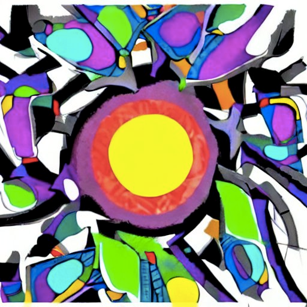
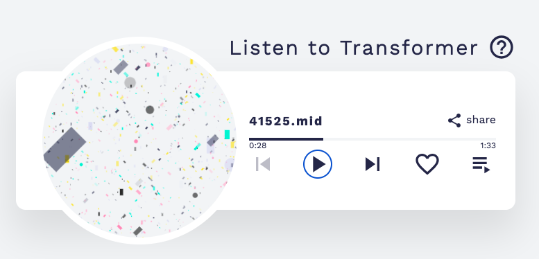
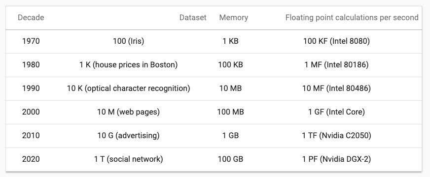

Савремена вештачка интелигенција
================================

.. infonote::

 Добродошли у узбудљиви свет вештачке интелигенције! Замислите да постоје програми који могу да yче из искуства, предвиђају будућност, 
 разумеју емоције и помажу нам да решимо проблеме које не знамо? Сви они представљају вештачку интелигенцију! Вештачка интелигенција је 
 способност рачунара или система да извршава задатке који захтевају интелигенцију и до сада су били резервисани само за људе. Ова технологија 
 омогућава рачунару да "мисли" и "учи" из примера, доноси одлуке на основу информација и предвиђа будућност. Вештачка интелигенција се заснива 
 на машинском учењу, дубоком учењу и алгоритмима који омогућавају систему да обради велике количине података и изведе закључке на основу њих. 
 Овај процес је сличан нашем учењу - кроз искуство и примере, рачунар "уочава уобичајене информације" и примењује их на нове задатке. 
 Иако вештачка интелигенција омогућава напредак у науци и технологији, она се сусреће са многим изазовима. Етичка питања као што су приватност, 
 безбедност података и слобода захтевају промишљање и претходно планирање.

Доброшлицу на курс савремене вештачке интелигенције пожелела ти је сама вештачка интелигенција! За тебе је припремила и доњу слику и музику да се 
опустиш у овој истраживачкој авантури! Свет вештачке интелигенције је довољно широк да смести све оно што осликава људску интелигенцију: учење, 
извођење закључака, решавање проблема, процене будућих исхода, креативност. Ипак, као што је програм ChatGPT навео у уводу (а ми аутори проверили 
и сагласили се), ово је област која са собом носи и много изазова. Заправо, прва је у историји која има своје правне оквире и стратегије развоја. 
О свим овим темама ћемо причати у току курса са жељом да што више тога приближимо и појаснимо.   

.. csv-table:: 
   :widths: auto
   :align: left
   
   "|uvod1|", "|uvod2|"
   "*Слика коју је нацртала неуронска мрeжа у оквиру пројекта* `Стабилна дифузија <https://stablediffusionweb.com/>`_", "*Музика коју је компоновала неуронска мрежа у оквиру пројекта* `Магента <https://magenta.github.io/listen-to-transformer/#a1_41525.mid>`_"
  
|

**Вештачка интелигенција** (енгл. *artificial intelligence*, AI) је мултидисциплинарна област чији је циљ да машине и програме учини интелигентним 
тако да могу да обављају задатке које умеју и људи. У њеној основи су рачунарство, информатика, математика, роботика, али је повезана и са свим 
другим дисциплинама које се баве разумевањем интелигенције попут неуронаука, филозофије и уметност. 

Сама интелигенција се обично описује као способност разумевања, учења, закључивања и прилагођавања новим ситуацијама. Она осликава могућност 
решавања проблема, доношења одлука, усвајања нових знања кроз искуства и у интеракцији са окружењем. Она нам омогућава и да процењујемо будуће 
исходе, да размишљамо критички, користимо логику али и истовремено будемо креативни. Захваљујући њој људи пролазе кроз комплексну и изазовну 
свакодневицу, усавршавају се временом и боље разумеју свет. 

Прве идеје о интелигентним програмима јавиле су се из чисте нуачне радозналости, са уверењем да се бављењем овим проблемима може ближе прићи 
разумевању интелигенције људи. Зато су оне биле и помало претеране: размишљало се одмах о аутономним возилима и програмима који могу да ћаскају 
са корисницима. Ове идеје пратила је и жеља да машине буду боље и са више могућности. Тек касније се почело са размишљањем о проблемима који нису 
могли успешно да се реше класичним техникама програмирања а које су подразумевале писање прецизних алгоритама и пажљиво кодирање. Савремена 
вештачка интелигенција нам највише помаже у том сегменту. 

.. quizq:: 

    .. mchoice:: p11
	:multiple_answers:
        :correct: a, d, e
        :answer_a: Програм који самостално паркира аутомобил. 
        :answer_b: Програм који одржава температуру просторије на задату, рецимо, 23 степена. 
        :answer_c: Програм који израчунава попуст на каси. 
        :answer_d: Програм који преводи текст са енглеског на шпански језик.
        :answer_e: Програм који затамњује позадину приликом видео позива.
        :feedback_a: Одговор је тачан. 
        :feedback_b: Одговор није тачан. 
        :feedback_c: Одговор није тачан. 
        :feedback_d: Одговор је тачан.
        :feedback_e: Одговор је тачан.
       
        Да ли је, по твом мишљењу, неки од следећих програма интелигентан? Можеш да обележиш више одговора. 

Можемо рећи да су за статус вештачке интелигенције каква је данас заслужне две важне околности: велика количина достпуних података и супериоран 
хардвер. 

Услед потребе да се пословни процеси дигитализују и оптимизују, у многим делатностима се појављу велике количине података које се чувају и с 
временом расту. Тако сада информација о свакој банкарској трансакцији остаје забележена у информационом систему банке а информација о свакој оцени 
у електронском дневнику. Интернет и веб као један од његових најважнијих сервиса су омогућили и да се велика количина информација објављује и 
дели, попут вести, прича, научних радова, коментара или филмских прегледа. Ту су и друштвене мреже и кориснички генерисани садржаји који директно 
осликавају мишљења, ставове и емоције о разноразним појавама.  Интернет ствари је повезао и многе свакодневне уређаје попут пумпи за наводњавње и 
семафора са чиповима и сензорима чије активности и мерења се чувају у облаку. Све ово скупа нас доводи до непрегледне количине података коју је 
потребно разумети, искористити за уочавање неких правилности и образаца, али и за закључивање о неким будућим корацима. 

Захваљујући прогресима у свету хардвера, oве велике количине података данас можемо безбедно да чувамо и брже обрађујемо. Занимљивости ради, на 
доњој слици се може видети промена у броју FLOPS-а (броју аритметичких операција које означавају моћ процесора) процесора у период од 1970. године 
до данас, као и величине највећих скупова података у том тренутку.  

Задатак: **???** 
Поређај по величини следеће меморијске јединице: 1PB, 1MB, 1EB, 1GB, 1KB, 1TB 
Одговор: 1KB, 1MB, 1GB, 1TB, 1PB, 1EB

За развој вештачке интелигенције је посебно значајан тренутак у којем су за комплексна нумеричка израчунавања почеле да се користе графичке 
картице (енгл. *Graphical processing units*, GPU) које су до тог тренутка биле резервисане само за играње игара. Оне су омогућиле паралелизацију 
израчунавања (видећеш да их је у причи о вештачкој интелигенцији пуно!) и отвориле простор да се велике количине података значајно брже обраде. 

Ипак, околности нису увек биле на страни развоја вештачке интелигенције. У следећој лекцији ћемо се кратко осврнути на њену историју. 
