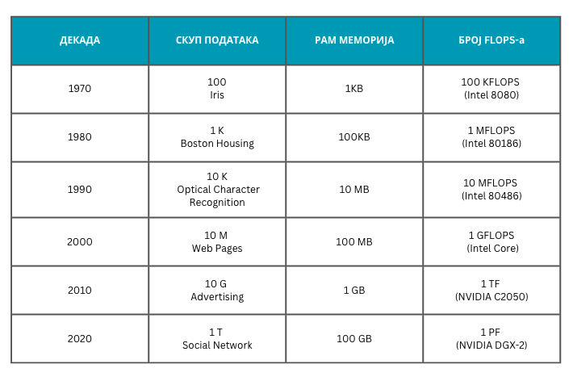

Савремена вештачка интелигенција
================================

.. infonote::

 Добродошао у узбудљиви свет вештачке интелигенције! 

Сигурно ти се десило да те је неки програм изненадио својим могућностима. Рецимо, када ти је препоручио филм који је био баш по твом 
укусу или када ти је помогао да усликану табелу са пуно врста и колона лакше пребациш у Excel документ. Сигурно си у себи помислио и 
да је баш *паметан* и запитао се како му је то успело, поготово ако волиш да програмираш (верујемо да је тако јер си овде!) и имаш осећај 
да то и нису баш тако једноставни задаци. 

|

**Вештачка интелигенција** (енгл. *Artificial Intelligence, AI*) је дисциплина која се бави развојем програма налик поменутим, који 
својим могућностима остављају утисак интелигентог понашања. Ове програме карактерише могућност уочавања комплексних веза и извођења закључака 
на основу њих. Видећемо да ове активности имају утемељење у дисциплинама као што су математика, информатика, рачунарство и роботика. 
Због своје шире распрострањености, област је повезана и са свим другим дисциплинама које се баве разумевањем интелигенције попут неуронаука, 
филозофије и уметности и њених утицаја на друштво попут социологије, права и етике.

|

Важно је нагласити да не мора сваки програм који има неки облик *интелигентног* понашања да буде заснован на вештачкој интелигенцији. 
Посматрајмо програм који отвара врата приликом уласка у зграду. Ова функционалност може бити омогућена сензорима близине који детектују 
присуство или захтевати да се унесе шифра која треба да одговара очекиваној шифри. Оба ова сценарија би могли да покријемо техникама 
класичног програмирања упоређујући растојање које мери сензор са неким граничним растојањем тј. унету шифру са тачном шифром.  
Са друге стране, ако је за улазак у зграду неопходно да пратећа камера препозна наше лице, биће нам, као што ћемо ускоро видети, 
потребна помоћ вештачке интелигенције.  

|

.. questionnote::
    Размисли у којим ситуацијама је за потребе решавања следећих проблема згодно употребити вештачку интелигенцију:
    | 1. самостално паркирање аутомобила, 
    | 2. одржавање температуре просторије на задату, рецимо, 23 степена,
    | 3. превођење текста са енглеског на шпански језик,
    | 4. затамњивање позадине приликом видео позива. 

|

Можемо рећи да су за статус вештачке интелигенције каква је данас заслужне две важне околности: велика количина достпуних података и 
супериоран хардвер. 

|

Услед потребе да се пословни процеси дигитализују и оптимизују, у многим делатностима се појављу велике количине података које се чувају 
и с временом расту. Тако сада информација о свакој банкарској трансакцији остаје забележена у информационом систему банке а информација о 
свакој оцени ученика у електронском дневнику. Интернет и веб као један од његових најважнијих сервиса су омогућили и да се велика количина 
информација објављује и дели, попут вести, прича, научних радова, коментара или видео садржаја. Ту су и друштвене мреже и кориснички генерисани 
садржаји који директно осликавају мишљења, ставове и емоције о разноразним појавама. Интернет ствари је повезао и многе свакодневне уређаје 
попут пумпи за наводњавње и семафора са чиповима и сензорима чије активности и мерења се чувају у облаку. Све ово скупа нас доводи до непрегледне количине 
података коју је потребно разумети, искористити за уочавање неких правилности и образаца, али и за закључивање о неким будућим корацима.

|

Захваљујући прогресима у свету хардвера, oве велике количине података данас можемо безбедно да чувамо и знатно брже обрађујемо. За развој 
вештачке интелигенције је посебно значајан тренутак у којем су за комплексна нумеричка израчунавања, уз процесоре са више језгара, почеле 
да се користе и графичке картице (енгл. *Graphical processing units, GPU*) које су до тог тренутка биле резервисане само за приказе сложене 
тродимензионе графике укључујући видео игре. Оне су омогућиле паралелизацију израчунавања (видећеш да их је у причи о вештачкој интелигенцији пуно) 
и отвориле простор за бржу обраду. У великим рачунским центрима на располагању су и суперрачунари, посебно дизајнирани рачунари са великим бројем 
процесора, чије моћи обраде досежу и до неколико стотина пета FLOPS-a. 

.. suggestionnote::

    FLOPS (енгл. *FLoating-point Operations Per Second*) je јединица којом се изражава брзина рада рачунара мерена број операција над бројевима 
    у покретном зарезу. Тако, рачунар са брзином рада 1GFLOPS-а може да изврши једну милијарду (:math:`10^9`) операција у секунди. Да човек 
    обавља једну од ових операција у секунди било би му потребно око 32 године за рачунање. Тренутно најбржи суперкомпјутер на свету је 
    *Frontier* са брзином рада до 1,67 EFLOPS-a и ценом око 600 милиона долара.

.. parsonsprob:: por11

    Поређај по величини следеће меморијске јединице:
    -----
    1KB
    1MB
    1GB
    1TB
    1PB
    1EB

Занимљивости ради, на доњој слици се може видети промена у броју FLOPS-а процесора у период од 1970. године до данас, 
као и промене редова величина скупова актуелних података.  

Околности нису увек биле на страни развоја вештачке интелигенције. У следећој лекцији ћемо се кратко осврнути на њену историју. 
