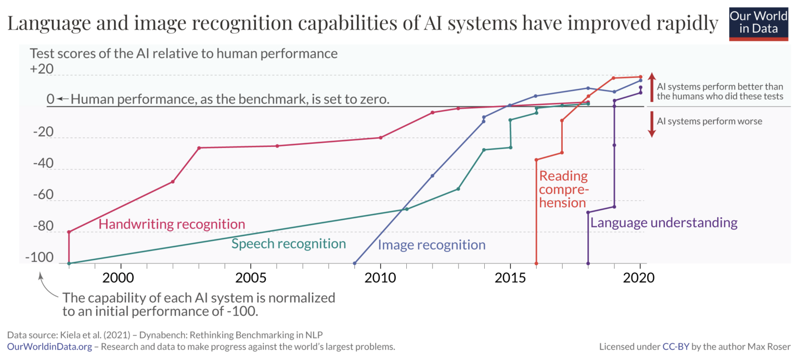

Да ли машина може да мисли?
===========================

.. infonote::

 Занимљиво је да је развој вештачке интелигенције био пун препрека. 

Питањем ”Да ли машина може да мисли?” 1950. године, енглески математичар Алан Тјуринг наговестио је почетак развоја области која је данас позната 
као вештачка интелигенција. Неколико година након ове велике идеје, 1956. године, еминентни научници Џон Макарти, Марвин Мински, Натанијел 
Рочестер и Клод Шенон окупили су се на конференцији у Дартмуту која је трајала чак месец дана са жељом да дефинишу истраживачке циљеве и протоколе 
у овој области. Она је тада добила и своје званично име и први пут заиста представљена као вештачка интелигенција.  

У време када су започете приче о вештачкој интелигенцији рачунари су били значајно другачији него данас. Били су много мањих капацитета и брзина 
а много веће цене. Зато је истраживање у овој области захтевало и званичнију подршку и зависило од стабилних извора финансирања. 

У првом таласу развоја вештачке интелигенције који је трајао до почетка 70тих година, појавили су се многи интересантни програми. Први међу њима 
је био програм Logic Theorist написан 1956. године који је испитивао капацитете математичке логике и извођења закључака. Овај програм је успео да 
докаже 38 од првих 52 теореме кojе су наведене у чувеној књизи Принципи математике. Ту је и програм ELIZA који је могао да симулира конверзацију 
са корисницима пратећи једноставна правила и конструкције у енглеском језику. Мотивација за истраживања у пољу комуникације дошла је са предлогом 
Алана Тјуринга да се интелигентним прогласе машине које могу да воде комуникацију на начин које човеку не одају утисак да разговара са машином. 
Овај тест је данас познат као Тјурингов тест.

У периоду до почетка 70тих година појавиле су се и многе идеје које ће касније бити искоришћене за пробоје савремене вештачке интелигенције. 
Једна таква идеја је идеја о перцептрону, основи данашњих неуронских мрежа, коју је 1957. године увео Франк Розенблат. У оптимистичним изјавама 
овог истраживача перцептрон је имао моћ да учи, доноси одлуке и преводи језике али је морало да прође пуно времена да се ово и потврди. 

Услед недостатка финансирања, након првог таласа развоја вештачке интелигенције наступила је и такозвана прва зима вештачке интелигенције. За 
овакав статус су делимично заслужни и амбициозни пројекти чији су резултати изостали услед ограничених капацитета рачунара и мањка расположивих 
података.

Један од занимљивих и подстицајних догађаја у историји вештачке интелигенције десио се 1997. године када је систем DeepBlue компаније IBM успео да 
победи у игри шах светског велемајстора Гарија Каспарова. Систем DeepBlue је представник класе такозваних експертских система (енгл. *expert systems*), 
система који су на основу базе која садржи мноштво правила облика ако-онда применом логичких правила могли да опонашају закључивање доменских 
експерата и дају коректан резултат. Сличан ефекат на развој вештачке интелигенције је имао и систем AlphaGo компаније DeepMind скоро 20 година 
касније, 2016. године, када је победио светског шампиона Ли Седола у игри го. 

Капацитет машина да пронађу одговор на питање постављено на енглеском језику је 2011. године  приказао систем Watson копманије IBM у квизу *Ко 
жели да постане милионер?*. Систем Watson је победио своја два противника, победнике претходних издања квиза, тако што је најбрже давао тачне 
одговоре на постављена питања. У изворима који су писали о овом догађају је наведено да je Watson могао да обради 500GB у секунди тј. око милион 
књига.  

Са друге стране, капацитет машина да препознају и разликују објекте на сликама демонстрирао је 2012. године Google X тим који је креирао програм 
који може да преознаје мачке на сликама. Овај програм је видео преко 10 милиона слика за 3 дана и научио да распознаје мачке. До данас, капацитет 
система за препознавање је значно унапређен и иде изнад перформанси просечног човека. На доњој слици се може видети тренд развоја система за 
распознавање руком писаног текста, препознавање говора, препознавање слика, а два новија резултата се изузетним растом могућности се односе 
на задатке разумевања језика.
 

(слика је преузета са https://ourworldindata.org/brief-history-of-ai)

-------

Ова постигнућа су представљала и увод у далеко светлији наставак развоја вештачке интелигенције. Као што смо рекли, пре свега, због доступности 
интернета и веба, веће количине података и рачунара чија је процесна моћ неупоредиво већа од рачунара 50тих година. 

Прича о развоју вештачке интелигенције везана је и за појаву робота. Амерички научник Клод Шенон је 1950. године осмислио миша који је могао да 
пронађе пут и изађе из лавиринта. У духу Грчке митологије, миш је назван Тезеј. Прво аутономно возило ALVINN (акроним од  енглеског *Autonomous 
Land Vehicle In a Neural Network*) на којем је радио тим истраживача са Универзитета Карнеги Мелон конструисано је 1989. године које је успешно 
прешло 145 километара возећи брзином 110 километара на сат међу другим аутомобилима. 