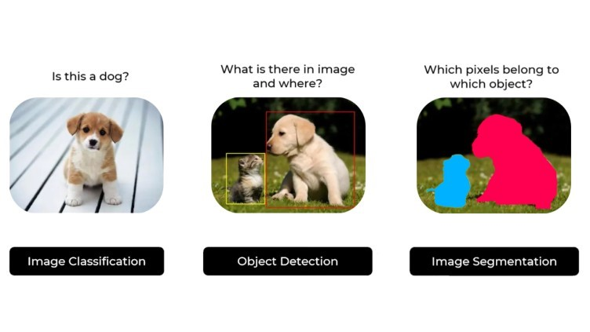
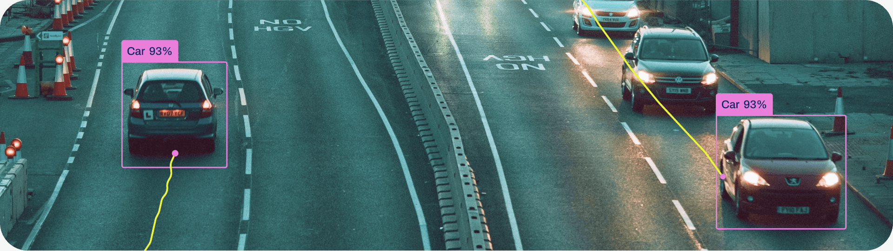
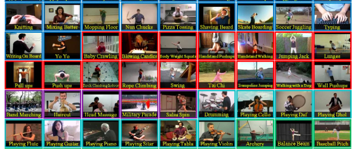
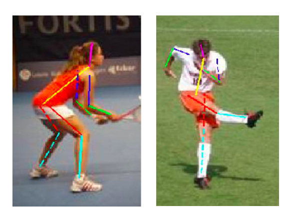
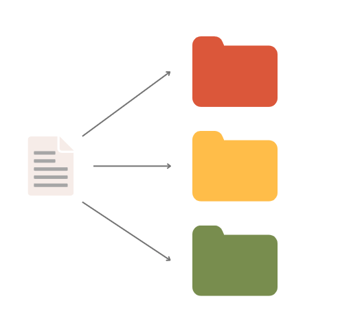
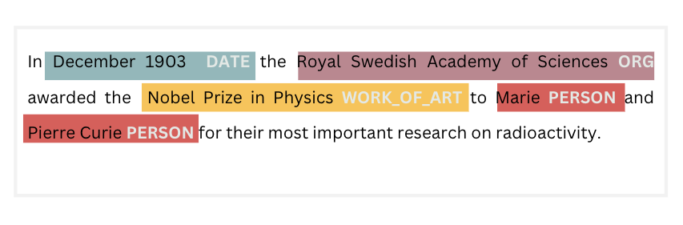
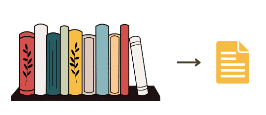
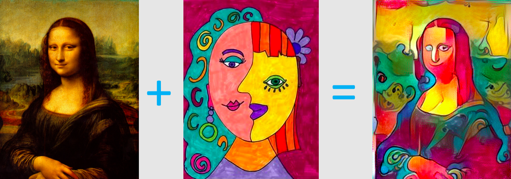
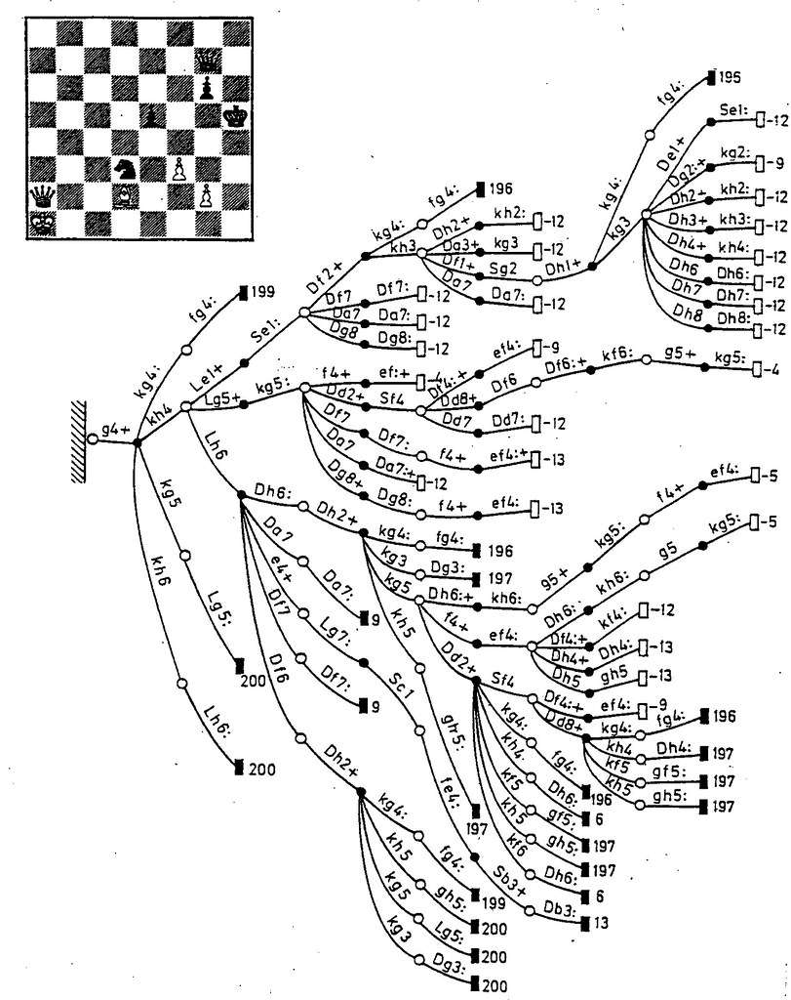

Области вештачке интелигенције
==============================

.. infonote::

 У овој лекцији приказаћемо неке области вештачке интелигенције. Границе између њих нису строге и често технике које се користе у решавању 
 задатака једне области могу бити од помоћи приликом решавања задатака друге области. Права моћ вештачке интелигенције ће заправо бити у 
 повезивању свих области. 

Рачунарски вид
~~~~~~~~~~~~~~

**Рачунарски вид** (енгл. *computer visiоn*) је област вештачке интелигенције која се бави развојем алгоритама и алата који рачунарима дају 
могућност да визуелни свет разумеју попут људи. Такви су, на пример, задаци препознавања објеката на сликама, разумевања њихових односа, 
препознавање боја и текстура, затим препознавање покрета, радњи и њихових карактеристика. Како се ова област примарно бави анлизом слика и видео записа, упознаћемо и пар најчешћих задатака ове области. 

|

Задатак **класификације** слика (енгл. *image classification*) је да одреди која врста објекта је присутна на слици. На пример, утврђивање да ли се 
на слици налази пас или не је задатак класификације слика. Задатак **детекције објеката** (енгл. *object detection*) је задатак локализовања објеката и 
одговара на питање где се тачно објекти налазе на слици. Такав је, рецимо, задатак уоквиравања пса и мачке који се налазе на доњој слици. 
Задатак **сегментације** слика (енгл. *image segmentation*) је да одреди тачан облик објеката који се појављују на слици. Тако је, сада, финије 
издвајање контура пса и мачке на трећој слици један пример сегментације. 

*Три основна задатка рачунарског вида у раду са сликама*

(слика је преузета са https://www.linkedin.com/pulse/object-segmentation-vs-detection-which-one-should-you-ritesh-kanjee/)

-------

Сви ови задаци су врло применљиви у многим дисциплинама попут аутономне вожње, анализе медицинских слика или анализе сателитских снимака и 
омогућавају нам да слике лакше претражујемо и организујемо.  

.. questionnote::

 Којим задацима препадају следећи проблеми:

 - утврђивање да ли се на слици налази пешак,

 - издвајање контура семафора, коловоза и пешака на слици,

 - утврђивање где се на слици налази саобрађајни знак? 

|

Када је реч о обради видеа, најчешћи задаци су задаци праћења објеката, препознавање акција и одређивања положаја. 

|

Задатак **праћења објеката** (енгл. *оbject tracking*), како само име каже, омогућава праћење објеката у видеу у реалном времену. На пример, праћење 
суседног аутомобила приликом аутономне вожње и праћење кретања играча у току меча су примери праћења објеката. 

*Праћење објеката*

(слика је преузета са https://docs.ultralytics.com/modes/track/)

-------

Задатак **препознавања акција** (енгл. *action recognition*) је да препозна и именује акцију која је присутна на видеу, на пример, скок у воду или 
затварање прозора. Ови задаци нам помажу да боље разумемо видео садржаје и да их ефикасније претражујемо. 

*Неки примери препознавања акција у видеима*

-------

**Одређивање позе** (енгл. *pose estimation*) је задатак који се бави препознавањем фигура људи у видеима у реалном времену и издвајања 
свих кључних тачака њиховог скелета. То су најчешће коориднате очију, носа, уста, рамена, лактова, струка, шака, колена и стопала. Ови задаци нам 
помажу у интерактивним анимацијама, моделовању проширене реалности и разним другим применама. 

*Задатак препознавања положаја објекта: слике из скупа података Leeds Sports Pose*

-------

.. questionnote::

 Који задатак треба да решимо да бисмо могли да:

 - анализирамо да ли правилно седимо,

 - препознамо излазак у двориште кућног љубимца, 

 - пратимо кретања потрошача у продавници? 

Нешто касније ћемо стићи и до скупова података који се корсте у задацима рачунарског вида и конволутивних мрежа, специјалног типа неуронских 
мрежа које се користе у задацима обраде слике и видеа. 

Обрада природних језика
~~~~~~~~~~~~~~~~~~~~~~~

**Обрада природних језика** (енгл. *Natural Languge Processing, NLP*) је област вештачке интелигенције која се бави задацима везаним за разумевање 
и генерисање природног језика. Као што знамо, постоји преко седам хиљада језика и сваки од њих има неке своје особености у погледу вокабулара, 
граматичких правила и значења. У наставку ће бити описани неки чести задаци који се сусрећу у обради природних језика. 

Баш као и у задацима класификације слика, у задацима **класификација текстова** (енгл. *text classification*) покушавамо да закључимо да ли текст 
припада некој категорији или не. На пример, да ли је то новински чланак на тему спорта, да ли је написан шпанским језиком, да ли је позитиван тј. 
садржи неки похвални коментар, да ли је истинит или лажан и слично. 

*Класификација текста*

-------

**Препознавање именованих ентитета** (енгл.*named entiti recognition*) је задатак који се односи на препознавање неких делова текста који су 
релевантни за његову даљу анализу. То су обично имена људи који се у њему појављују, датуми, геолокацијска имена или у неким стручним текстовима, 
на пример у области медицине, симптоми или имена болести. Једним именом те делове текста зовемо ентитетима. 

*Пример обележавања именованих ентитета*

-------

Задатак **машинског превођења** (енгл. *machine translation*) је да развије алате који нам омогућавају да садржај са једног језика квалитетно 
преведемо на садржај другог језика. Сложићемо се да је овај задатак основа за успешну комуникацију и доступност информација, али и да је 
компликован јер сваки језик и свака култура коју језик представља има неке своје особености попут фраза, идиома, сленгова или сарказма које је 
врло изазовно превести (како превести *пусти мозак на испашу?*). 

|

**Упитнички системи** (енгл. *question-answering systems*) се баве питањем како пронаћи конкретан одговор на задато питање. Они представљају 
уопштење класичних система за претраживање информација и омогућавају нам да лакше стигнемо до потребних информација. 

|

Зажимање свих важних информација из више различитих извора је познато као задатак **сумаризације** (енгл. *summarization*). Баш као и у претходном 
задатку, сижеи који се добијају у задацима сумаризације треба да нам олакшају пролаз кроз већу количину садржаја или нас подсете на важне 
информације и детаље садржаја које смо прочитали. 

*Сумаризација*

-------

Осим задатака који се тичу текста и текстуалних садржаја, обрада природних језика се бави и анализом говора. Ту се посебно издвајају два задатка: 
**записивања говора у форми текста** (енгл. *speech-to-text*) и обратно, **генерисања говора на основу текста** (енгл. *text-to-speech*). 
Ове две групе задатака су посебно важне за развој персоналних асистената, програма као што су Siri, Cortana или Alexa, које могу да разумеју 
гласовнe порукe и у складу са њима обаве тражени задатак, на пример, подесе аларм или позову некога из именика.

.. questionnote::

 Којим задацима препадају следећи проблеми:

 - издвајање имена организација у тексту,

 - утврђивање ко је аутор текста,

 - проналажење значења речи *netizen*? 

Генеративна вештачка интелигенција
~~~~~~~~~~~~~~~~~~~~~~~~~~~~~~~~~~

**Генеративна вештачка интелигенција** (енгл. *generative AI*) је област вештачке интелигенције која се бави генерисањем садржаја попут слика, текста, 
аудио или видео записа. У последњих пар година, пробоји у овом пољу су импресивни. 

|

ChatGPT је програм који је направио пробој у области генерисања текстуалних садржаја. Он, у складу са инструкцијама корисника, такозваним 
промптовима, може да генерише одговарајући текстуални садржај. Треба имати на уму да овако генерисани текстови не морају бити апсолутно тачни, да могу да садрже погрешне 
податке, измишљене референце или увредљиве садржаје. Због тога пре употребе треба проверити све што је програм генерисао. Уколико отвориш налог 
на адреси `chat.openai.com <http://chat.openai.com/>`_, можеш и сам да пробаш како функционише програм ChatGPT. Иза програма ChatGPT стоји заједница OpenAI. 

|

Програм StableDiffusion, за разлику од ChatGPT-a који генерише текст, на основу инструкција генерише слике. Рецимо, све слике које су наведене 
ниже је генерисао овај програм. Он је отвореног типа и уз пратећи код се може преузети са званичног `GitHub репозиторијума <https://github.com/Stability-AI/stablediffusion>`_. Сам модел можеш да 
тестираш на адреси `https://stablediffusionweb.com/ <https://stablediffusionweb.com/>`_. Имај на уму да овај сервис користи велики број људи бесплатно и да некада није доступан. 
Само име програма представља једну популарну технику која се користи у овој области.

*Примери слика које је генерисао програм StableDiffusion*

-------

Често приликом гриликом генерисања слика може да се одабере и жељени стил нове слике. Ова техника је позната као **трансфер стила** (енгл. *style transfer*). 
Један такав пример можеш да видиш на доњој слици. 

-------

Осим слика и текста, вештачка интелигенција може да генерише и аудио садржаје. На `овом линку <https://huggingface.co/spaces/facebook/MusicGen>`_ можеш да тестираш програм MusicGen компаније Мета 
тако што ћеш описати речима какву врсту музике желиш да генеришеш и оставити евентулно узорни пример за трансфер стила. Потом можеш да послушаш 
свој садржај. Можеш да се опробаш и са програмима који врше трансфер стила приликом генерисања гласа (опонашају глас неке друге особе) или сами 
компонују музику на основу онога што су већ ”чули” у подацима. Један такав отворенои пројекат је Магента. До њега ће те одвести линк `https://magenta.github.io/listen-to-transformer/ <https://magenta.github.io/listen-to-transformer/>`_.  

.. questionnote::

 1.	Питај програм ChatGPT да ти направи тест са питањима на тему области вештачке интелигенције па потом провери на колико питања можеш да одговориш!
 2.	Покушај да задаш инструкције програму StableDiffusion или програму Dalle-mini које ће ти генерисати слику налик овој:
 
 .. image:: ../../_images/oblasti9.png
    :width: 200
    :align: center

.. suggestionnote::
 
 Програм DALL-E компаније OpenAI, такође, генерише слике на основу смерница корисника. Програм dalle-mini је јавно доступна верзија овог 
 програма. Она је доступна на адреси `https://huggingface.co/spaces/dalle-mini/dalle-mini <https://huggingface.co/spaces/dalle-mini/dalle-mini>`_.

Играње игара
~~~~~~~~~~~~

Један од првих задатака у којем је опробана вештачка интелигенција је игра шах. Зхваљујући победи над велемајстором Гаријем Каспаровим, ова област 
истраживања је добила пуно симпатија и подршке на страни вештачке интелигенције. Иако имају прецизан сет инструкција и правила, игре карактерише 
својство комбинаторне експлозије - велики број могућих избора акција након одређеног броја корака. То даље значи да игре не дозвољају проналажење 
решења применама уобичајених техника програмирања у неком разумном времену. Уз игру шах, вештачка интелигенција се прославила и у иги го програмом 
AlfaGo, затим игрању Атари видео игрица и стратегија као што су Dota, Starcraft и друге. На крају курса ћеш научити нешто више и о области која се 
зове учење поткрепљивањем која се активно примењује у овој области. 

*Комбинаторна експлозија у игри шах*

(слика је преузета са https://www.umphyries.top/ProductDetail.aspx?iid=182002895&pr=42.88)

-------

.. questionnote::

 Провери да ли игрица коју волиш у неким својим сегментима примењује вештачку интелигенцију. 

Роботика
~~~~~~~~

Вештачка интелигенција неретко треба да унапреди понашања и могућности физичких објеката као што су роботи, индустријске машине, аутомобили, 
дронови, кућни апарати или медицинска помагала. Информације о свету до ових објеката стижу кроз гласовне инструкције, снимке камера или мерења 
сензора и њихов задатак је да их обраде и трансформишу у одлуку. Улога вештачке интелигенције у овој сфери је да унапреди могућности објеката и 
помогне им да усвоје интелигентно понашање. 