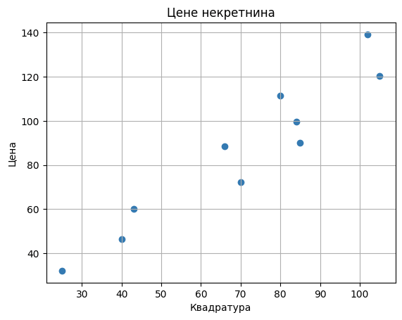
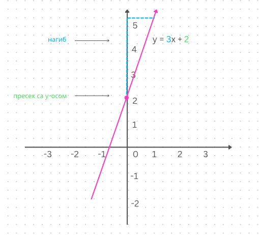
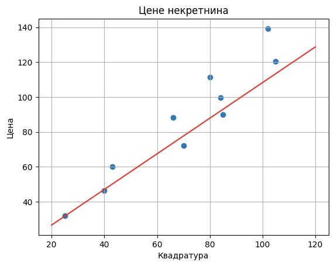
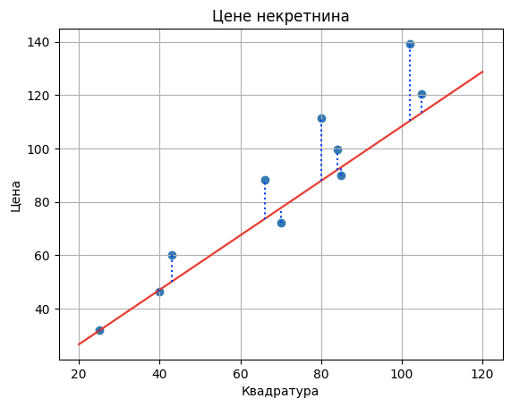
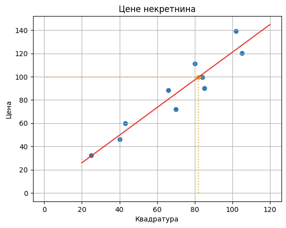

Програмирање вођено подацима
============================

.. infonote::
    Иако су многобројни и врло разноврсни, за све модерне системе вештачке интелигенције једно је заједничко: развијају се на основу података. 
    У овој лекцији ћемо приближити шта то заправо значи и увести пример програмирања вођеног подацима. 

Замислимо да располажемо скупом података о некретнинама у којем за сваку некретнину постоји информација о квадратури и цени. 
Уколико за појединачне некретнине из скупа на x-oси забележимо информацију о квадратури, а на y-оси информацију о цени, можемо да 
добијемо и графички приказ овог скупа података. Замислимо да он изгледа баш као на доњој слици. Јасно је да у реалности цена некретнине 
зависи и од многих других параметара, попут локације, спрата, броја соба, удаљености од школе и слично, али ћемо искористи овај једноставни 
пример да приближимо смисао и главне изазове програмирања вођеног подацима. 

-------

Наш задатак ће бити да на основу расположивих података осмислимо решење које ће за нову некретнину проценити колика треба да буде њена цена. 
Рецимо, када се појави нова некретнина чија је квадратура 82m\ :sup:`2`, желимо да проценимо њену цену. Вођени искуством које имају, агенти некретнинама 
свакодневно обављају овај задатак процењивања. Можеш да застанеш и размислиш како би ти процењивао цене некретнина само на основу квадратуре, 
а онда да наставиш даље да читаш. 

|

На основу графичког приказа можемо да приметимо да подаци прате замишљену дијагоналу квадранта, можда мало спуштену наниже. 
Овакве везе у подацима које можемо да прикажемо правим линијама зовемо **линеарним** и често ћемо их помињати у току курса. 
Са часова математике је познато да једначином ``y = kx + n`` представљамо праву у равни, где параметар ``k`` одређује нагиб праве а параметар ``n`` тачку 
пресека y-осе и праве. Зато можемо да покушамо да пронађемо линеарну форму решења за наш проблем, тј. да везу између квадратуре некретнине и 
цене прикажемо једначином ``цена = k x квадратура + n`` где су ``k`` и ``n`` непознати параметри чију тачну вредност треба да одредимо. 

*Смисао параметара k и n*

-------

Невоља је што решења у облику који смо замислили, у облику правих, има бесконачно много - свака комбинација параметара ``k`` и ``n`` нас доводи до новог 
решења!  Зато је добро да се запитамо да ли постоји још неко својство које решење треба да испуни како би било најпожељније и тиме сузимо избор 
вредности за параметре ``k`` и ``n``. Критеријум који се често поставља у оваквим дилемама је **критеријум најмање грешке** и који каже да од решења 
очекујемо да што ближе прати информације присутне у скупу података. Интуитивно говорећи, у нашем случају, пратећи овај принцип, треба да тражимо 
параметре ``k`` и ``n`` тако да права коју одређују прође што ближе тачкама у скупу података. 

*Пример једног решења облика цена = k x квадратура + n*

-------

Да бисмо могли да одредимо решење које задовољава критеријум најмање грешке, тј. да нађемо један такав пар ``k`` и ``n``, треба нам и неки прецизан 
начин да измеримо колико заправо грешимо. То можемо да урадимо на много начина, али нека буде да у нашем случају пратимо појединачне разлике између 
тачних цена и цена које израчунава одабрано решење и све их сумирамо. Пошто је ово једна комплексна реченица, те разлике су на доњој слици обележене 
плавим испрекиданим линијама. Неки другачији избори мерења грешке би нас довели до другачијих решења па у том смислу и оно утиче на избор 
финалног решења. 

*Грешке предвиђања цена*

-------

Увођењем појма грешке смо избор непознатих параметара ``k`` и ``n`` свели на избор оних параметара ``k`` и ``n`` за које је вредност грешке најмања. 
За сада о избору ових параметара можемо да размишљамо као опробавању неколико различитих комбинација ``k`` и ``n`` и задржавању оне за коју се добија 
најмања грешка. У наставку курса ћемо видети да постоје математичке технике, такозване технике оптимизације, које нам омогућавају да прецизније 
одредимо вредности ових параметара. 

|

Када одредимо вредности параметара ``k`` и ``n`` можемо да прогласимо решавање задатка готовим. На пример, нека су то вредности ``k=1,19`` и ``n=2,056``. 
Тиме је форма решења одређена једначином  ``цена = 1,19 x квадратура + 2,056``.

|

Када је потребно одредити цену нове некретнине, рецимо оне коју смо помињали чија је квадратура 82 m\ :sup:`2`, потребно је да заменимо вредност за 
квадратуру у једначини решења и израчунамо вредност цене: ``цена = 1,19 x 82 + 2,056 = 99,636``.

*Примена решења и израчунавање цене нове некретнине*

-------

Пример који смо видели је пример програмирања вођеног подацима и све одлуке које смо донели су биле искључиво условљене подацима. 
Верујемо да након овог примера имаш много питања: 

- Шта бисмо радили да је скуп података богатији и да имамо и друга својства некретнина? 
- Како да знам да треба да одаберем баш линеарни облик решења? 
- Да ли грешку могу да мерим на било који начин? 
- Како да будем сигуран да је решење добро? 
- Да ли вредности параметара које сам израчунао нешто значе? 
- И да ли би све пало у воду да је скуп података нешто другачији? 

Сва ова питања су природна и баш права која треба да се поставе на једном курсу који спаја податке, машинско учење и савремене системе 
вештачке интелигенције. 
