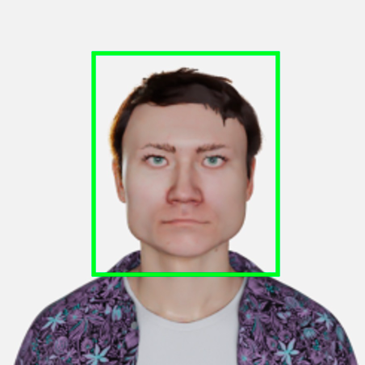

Зашто нам је потребно програмирање вођено подацима?
===================================================

.. infonote::
   У претходној лекцији смо увели појам програмирања вођеног подацима. У овој лекцији ћемо видети зашто нам је оно заправо потребно.

Ову причу започећемо једном мозгалицом. Покушај да на основу бројева које имаш у левој колони (зваћемо их **улазима**) закључиш у каквој су 
вези са бројевима који се налазе у десној колони (њих ћемо звати **излазима**). 

.. csv-table:: 
   :header: "**Улаз**", "**Излаз**"
   :widths: auto
   :align: left
   
   "1, 9, 5, 4", "19"
   "3, 8, 11", "22"
   "6, 7, 9, 2, 2", "26"
   "2, 3, 6", "11"

Претпостављамо да те овај задатак није много намучио и да си већ у другом или трећем реду табеле дошао на идеју да бројеви у другој колони, тј. излази, 
представљају збир бројева који се налазе у левој колони, тј. на улазу. За овај задатак знаш и да напишеш алгоритам (и то жмурећи!) који те доводи 
до решења. Рецимо, у програмском јeзику *Python* збир елемената низа [1, 9, 5, 4] можемо израчунати тако што ћемо у старту збир прогласити нулом 
а затим му додавати један по један елемент све док не стигнемо до краја низа: 

.. code-block:: Python

   niz = [1, 9, 5, 4]
   zbir_elemenata = 0 
   for element in niz: 
       zbir_elemenata = zbir_elemenata + element 

(Уграђена функција ``sum`` ово брзо израчунава за нас и њу заправо чешће користимо.) 

|

Опробај се сада у следећој мозгалици у којој опет треба да закључиш на који начин су повезани улази и излази. Улази су сада фотографије животиња, 
а излази бројеви 0 или 1. 

.. csv-table:: 
   :header: "**Улаз**", "**Излаз**"
   :widths: auto
   :align: left
   
   "|tp1|", "1"
   "|tp2|", "0"
   "|tp3|", "0"
   "|tp4|", "1"
   "|tp5|", "0"
   

Овде си вероватно имао много идеја! И врло је могуће да су све валидне! Ипак, како су јединице поред фотографија на којима се налазе мачке, а 
нуле поред преосталих фотографија животиња, хтели смо да закључиш да је реч о задатку у којем треба препознати да ли се на фотографији налази 
мачка или не. Ако је на улазу фотографија мачке, на излазу је 1, и супротно, ако на улазу није фотографија мачке, на излазу је 0. Видећеш нешто 
касније да се овај задатак назива задатаком бинарне класификације и да је веома чест у области машинског учења. 

|

Да ли можемо да напишемо алгоритам којим се решава овај задатак препознавања? Сложићеш се да нам је важно да умемо да разликујемо шта је на 
фотографијама јер тако можемо олакшати њихово претраживање и анализу. Можеш да пробаш да направиш списак десетак правила којима закључујеш да 
ли је на слици мачка или не. Не заборави да узмеш у обзир и позадину, осветљење, угао сликања и чињеницу да постоји преко 50 различитих врста 
мачака! 

|

Оваквих проблема у којима чак и ако се баш потрудимо (наведемо 1000 правила!) нисмо у могућности да напишемо алгоритме који их прецизно решавају, 
има заправо баш много. Још неки примери су превођење са једног језика на други и обележавање лица на фотографијама. Сложићеш се да су нам и ови 
задаци важни јер омогућавају да разумемо садржај написан на неком језику који не говоримо или унапредимо безбедност. Зато овакве проблеме описујемо 
**скуповима података**, паровима улаза и очекиваних излаза, и решавамо техникама програмирања вођеним подацима.  У случају задатка препознавања 
мачака (али и било којих других објеката) подесни скуп података може да буде организован налик нашем, са сликама на улазима и вредностима 0 или 
1 на излазу. У случају задатка превођења, то могу да буду парови реченица на једном и другом језику, док код задатка обележавања лица то могу да 
буду парови слика, једна без обележених лица као улаз и једна са обележеним лицима као излаз. Ево и примера. 

.. csv-table:: 
   :header: "**Улаз**", "**Излаз**"
   :widths: auto
   :align: left
   
   "|tp6|", "|tp7|"
   "", ""

-------

Скупови података које можемо да искористимо за описивање проблема могу настајати кроз свакодневне активности. На пример, лекар након што прегледа 
пацијента у електронском здравственом картону забележи податке о пацијенту као што су старосна доб, пол, симптоми, алергије на лекове (све ове 
вредности су улази) и кôд који одговара његовој дијагнози (излаз). Слично, на аеродромима, за сваки лет су познати подаци попут времена полетања, 
авио-превозника, типа авиона и слично (све ове вредности су улази) и информација да ли је тај лет каснио или не (излаз). 

|

Скупови података се могу креирати и наменски за потребе решавања неког специфичног задатка. Рецимо, скуп података који смо користили за 
препознавање мачака могао је да креира тим добровољаца који је погледао слике којима располажемо и у складу са нашим смерницама, на пример, 
уколико се на слици налази мачка, напиши 1, у супротном напиши 0, унеo 1 или 0 у колону за излазе. За доменске скупове података, на пример, 
препознавање промена на рендгенским снимцима, морали би да се ангажују медицински експерти који имају одговарајуће вештине и знања за доношење 
одлука. Нешто касније ћеш научити више о томе како се креирају скупови података.

|
 
Вероватно се сада питаш: али како учимо везу између улаза и излаз у скупу података? Баш као што постоји област која се бави развојем алгоритама 
класичног програмирања и анализирањем њихових особина, постоји и област која се бави развојем алгоритама вођених подацима и испитивањем њихових 
својстава. Њу називамо **машинско учење** (енг. *machine learning*) и она је у основи свих модерних области вештачке интелигенције јер је уско везана 
за податке и начине извођења знања из података. Машинско учење ће већ у наредној лекцији одговорити на питање које те интересује. 

|

Важно је нагластити да постоје и друге области које се баве подацима. Међу њима је свакако најстарија **статистика** (енг. *statistics*), грана 
математике која се бави прикупљањем података, њиховим описивањем и анализирањем, као и самим извођењем закључака из података. Зато су статистичке 
технике у основи многих алгоритама машинског учења. **Наука о подацима** (енг. *data science*) је дисциплина која се појавила као резултат немогућности 
појединачних дисциплина да одговоре на многа занимљива питања. На пример, свака компанија се сусреће са питањем како да унапреди своје услуге. 
Да би то могла да уради, компанија може да анализира коментаре корисника на друштвеним мрежама или сајтовима продаје. Да би се коментари обрађивали, 
потребно је скупити их на једно место и сачувати их у бази података, затим их организовати, на пример, 
издвојити позитивне и негативне коментаре, а потом и сваки од ових скупова некако финије анализирати да би се установило шта је то 
што корисници процењују као негативно или позитивно, на пример, неки конкретан модел производа или нека функционалност. Ове информације даље 
треба поделити са руководством компаније да би могли да одлуче шта даље да предузму. Одговор на полазно питање је, примећујеш, дуг 
и захтева познавање и рад са алатима за преузимање садржаја са веба (такозваним скрејперима), рад са базама података, 
обраду природних језика, као и технике приказа података које би доменским експертима биле најинформативније. 
И у овом и у другим примерима примене науке о подацима, машинско учење је неизоставни део сазнајног пута.

|

Пре него ли наставимо даље, сумирајмо како изгледа решавање проблема класичним програмирањем и програмирањем вођеним подацима. 

|

Када решавамо неки задатак техникама класичног програмирања, на пример, проналажење највећег елемента у низу бројева, прво промислимо о проблему 
и просторним и временским ограничењима које имамо, потом осмислимо алгоритам којим се он решава (на пример, сортирање спајањем)  а затим га и 
испрограмирамо у неком програмском језику и сачувамо кôд. Тачност имплементације проверимо на неколико насумичних уноса док се не уверимо да 
све ради баш како очекујемо. Када нам треба да сортирамо неки нови низ, можемо да искористимо програм који смо написали, покренемо га и добијемо 
одговарајуће решење. 

|

Када се ослањамо на програмирање вођено подацима у старту располажемо само подацима, на пример, хиљадама парова улаза и излаза. Опет је паметно да 
прво промислимо о проблему. То сада радимо тако што упознајемо скуп података. У томе нам помажу технике експлоративне анализе о којима ћемо 
говорити у наставку курса а које нам могу дати идеју у ком облику да тражимо решење. Затим, уместо да осмислимо алгоритам којим се решава задатак, 
осмишљавамо **алгоритам којим се учи како да се решава задатак**. То би значило да ако треба да научимо везу између улаза и излаза и променимо скуп 
података, овај алгоритам опет може да пронађе најбољу везу између њих. Веза која постоји између улаза и излаза зависи од података (није статична!) 
и зато нам је потребно да је учимо, а не некако директно наведемо.  Када осмислимо и испрограмирамо један овакав алгоритам, потребно је да опет, 
коришћењем података, проверимо колико добро он ради. Уколико нисмо задовољни резултатима, потребно је да се вратимо корак уназад и поправимо 
алгоритам или се вратимо чак на сам почетак и проверимо да ли постоји још нешто у подацима што нам може бити важно за решавање проблема. 
За разлику од класичног програмирања, ова итеративност је врло присутна у програмирању вођеним подацима. 

.. quizq:: 

    .. mchoice:: p22
	:multiple_answers:
        :correct: b, e
        :answer_a: препознавање нерегуларних банкарских трансакција
        :answer_b: сортирање низа бројева
        :answer_c: аутоматско превођење
        :answer_d: откривање спам поште
        :answer_e: проналажење најмањег елемента у стаблу
        :feedback_a: Пошто банкарске трансакције могу да буду нерегуларне из многих разлога, боље је да се ослонимо на учење на основу података. 
        :feedback_b: Одговор је тачан. 
        :feedback_c: Пошто не можемо таксативно да наведемо сва правила превођења, боље да се ослонимо на учење на основу података.
        :feedback_d: Пошто су аутори спам поште врло досетљиви, боље је да се ослонимо на учење на основу података.
        :feedback_e: Одговор је тачан.

        Класичне алгоритме је пожељно да искористимо за (можеш обележити више одговора):

.. questionnote::

 Покушај да се сетиш још неког проблема који није тако једноставно описати и испрограмирати на класичан начин. 