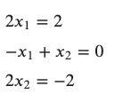

Основни појмови машинског учења
===============================

Појмови које ћемо увести у овој лекцији представљају основне појмове машинског учења. Они ће ти помоћи да лакше пратиш теме о којима ће бити 
речи у наставку а о сваком од њих ћеш још научити. 

Уобичајено је да се у терминима машинског учења колекцију података којом располажемо зове **скуп података** (енгл. *dataset*). То може бити нека 
фина табеларна евиденција, налик онима које сусрећемо у базама података или Excel датотекама, али и нека скупина сателитских снимака или 
аудио клипова. Један конкретан елемент скупа података се зове **инстанца**. Значи, један одређени ред у табели са евиденцијама или један одређени 
сателитски снимак су примери инстанци. Број инстанци у скупу података може да одређује избор алгоритма учења јер неки алгоритми захтевају више 
података од других. 

У инстанцама фигуришу **атрибути**, својства којима описујемо податке. Ако замислимо да је табеларна евиденција о појавама земљотреса, у њој као 
атрибути могу да се јаве датум и време настанка, географска ширина, географска дужина, јачина земљотреса, ниво разорности и други важни подаци. 
Атрибуте равноправно називамо и **карактеристикама** (енгл. features). Нешто касније ћеш научити какве све врсте атрибута постоје и о чему морамо 
да водимо рачуна. Оне атрибуте на основу којих треба да научимо да решавамо задатак називамо **улазним променљивама** (енгл. input variables), а 
оне које треба да научимо **излазним променљивама** (енгл. output variables). Тако, датум и време настанка земљотреса, његове гео координате и 
јачина могу да буду улазне променљиве у задатку одређивања разорности земљотреса. Разорност земљотреса је као атрибут, такође, присутна у 
скупу података па би била **излазна променљива**. Некада ћемо користити и мање формалне термине попут улаза и излаза. Важно је да приметиш да је 
задатак тај који диктира шта ће нам бити улазне а шта излазне променљиве.  

-------

.. questionnote::
 
 Шта би могли да буду атрибути једног сателитског снимка?

.. reveal:: r23
    :showtitle: Прикажи одговор
    :hidetitle: Сакриј одговор

    Сложићеш се и да сателитске снимке можемо да уведемо атрибуте попут локације, датума и времена настанка. Можемо да увдемо и 
    атрибуте који описују сателит који га је снимио. Ипак, ни један од ових атрибута не описује директно шта сателитски снимак садржи. 
    Размисли о овој теми док не стигнемо до лекције која је покрива. 

Рекли смо да је циљ алгоритама машинског учења је да одреде пресликавање задатих узлаза у задате излазе. Сада можемо бити прецизнији и рећи 
да је циљ машинског учења да одреде пресликавања задатих улазних променљивих у задате излазне променљиве. Таква пресликавања зовемо **моделима**.  

.. quizq:: 

    .. mchoice:: p231
        :correct: b
        :answer_a: скалар
        :answer_b: функцију
        :answer_c: тетраедар 
        :feedback_a: Одговор није тачан. 
        :feedback_b: Одговор је тачан. 
        :feedback_c: Одговор није тачан. 

        Који математички појам везујемо за пресликавање?

Појам који везујемо за пресликавање је функција. На часовима математике си чуо пуно тога о функцијама као пресликавањима улаза у излазе. 
На пример, функција једне променљиве y = 2x + 4 пресликава улаз x=5 у вредност y=14, док функција више променљивих y = 2x1 - 3x2 + x3 + 5 
пресликава улаз (x1, x2, x3)=(1, -1, 3) у вредност y=13. Променљиве које се појављују у функцијама везујемо за вредности атрибута. 
Тако x у првој функцији може да представља квадратуру некретнине, док, редом x1, x2, x3 у другој функцији могу да представљају вредности 
атрибута као што су географска ширина, географска дужина и јачина земљотреса. На часовима математике чуо си да  постоје и различите класе функција 
(линеарне, полиномијалне, тригонометријске, експоненцијалне, логаритамске) као и да сваку од њих карактеришу нека посебна својства попут 
непрекидности, монотоности или конвексности. Сва ова знања су добродошла приликом трагања за правим моделом. 

.. quizq:: 

    .. mchoice:: p232
        :correct: c
        :answer_a: 2, 3, 1
        :answer_b: 2, 1, 3
        :answer_c: 3, 2, 1
        :feedback_a: Одговор није тачан. 
        :feedback_b: Одговор није тачан. 
        :feedback_c: Одговор је тачан. 

        Задатак за тебе је да поређаш следеће функције по комплексности: 

        1. log(sin(x) - 2*𝜋*e\ :sup:`-4x+0.5`) + 1

        2. sin(-x+0.3)

        3. 2x+3

*Комплексност* функције је нешто што нећемо формално уводити. Јасно ти је да су неке функције једноставније од других ”кобасица”. 
Једноставне функције су захвалније за рад и лакше их разумемо али нам не дају пуно слободе да опишемо неке неуобичајеније везе између 
самих атрибута и излаза. Са друге стране, комплексне функције су са разлогом комплексне па нам може бити тешко да испратимо нека њихова 
математичка понашања која могу да утичу на учење. Када тражимо моделе покушавамо да направимо баланс између комплексности и онога што знамо о 
подацима и што желимо да научимо.  

У моделима, као што смо видели у уводном примеру одређивања цена некретнина, могу да се појављују **параметри** као што су *k* и *n*. Такве моделе 
називамо **параметарским моделима** и задатак одређивања правог модела сводимо на задатак одређивања најбољих вредности параметара. У линеарном 
моделу у задатку одеђивања цена некретнина појавила су се само два параметра, док модерни модели, они који се заснивају на неуронским мрежама, 
имају милионе или милијарде параметара. Видећемо да постоје и нешто другачији **непарметарски модели** чије форме су другачије изражене.  

Процес проналажења модела назива се **тренирање** или **обучавање** (енгл. *model training*). Уколико у моделу фигуришу непознати параметри, у току 
тренирања треба да одредимо њихове вредности. То нам је циљ.

У скупу података који се користе за обучавање модела могу да се нађу и нетачне, непрецизне или опречне вредности. Зато модели никада нису 
апсолутно тачни. То нас доводи до још једног важног појма у теорији машинског учења: **функцијe грешке** (енгл. loss function). Функција грешке 
треба да нам да информацију о томе колико модел греши. Њене вредности активно користимо у току обучавања модела и тежимо оним конфигурацијама 
модела које нас воде до најмање вредности функције грешке. У случају параметарских модела, а то је био случај и у уводном примеру са некретнинама, 
циљ је да одредимо оне вредности параметара за које је вредност функције грешке најмања. 

**Скривена картица: (???) како треба да се организује ово, шта да буде сакривено?**

Посматрајмо систем једначина 

Он нема тачно решење јер из прве једначине следи да је x1=1, из последње да је x2=-1, a из друге да је x1=x2 што је контрадикција. 
Ипак, овај систем има много приближних решења, на пример, пар (x1, x2)=(0.6, -0.6). Приближно решење је и пар бројева (x1, x2)=(0.35, -0.8) 
али нам се оно ипак чини нешто лошијим у односу на прво: одступања од очекиваних вредности 2, 0 и -2 су нешто већа. На сличан начин модел мора 
да се снађе са опречним или непрецизним информацијама у подацима - мора да направи баланс између свих инстанци и направи што је могуће мању грешку.  

Када обучимо модел машинског учења, треба да проценимо колико је он заправо добар за примену у пракси. Томе нам служе такозване **мере квалитета** - 
свака од њих је прилагођена специфичном задатку учења и домену у којем ће се примењивати модел. Важно је нагласити да се, у општем случају, 
функција грешке и мере квалитета разликују. Обе имају за циљ да нам дају информацију о томе колико је модел добар с тим што функција грешке 
то ради у току обучавања модела док мере квалитета то раде након обучавања модел. Функција грешке је уско везана за модел док се мере квалитета 
дизајнирају тако да могу да их разумеју и корисници и доменски експерти. Уколико се не добију одговарајуће вредности мера квалитета модел мора 
да се поправи. У наставку ћемо причати шта то заправо значи и како може да се постигне. Цео процес испитивања квалитета модела и израчунавања 
његових мера квалитета назива се **тестирање модела** (енгл. *model testing*). 
 
Уобичајено је да се вредности које израчунава и генерише обучени модел називају **предикцијама** (енгл. *prediction*). 
Тако су цена за нову некретнину или оцена разорности земљотреса примери предикција модела. Због овог термина се прича о предвиђањима у 
свету вештачке интелигенције. Јасно ти је да ова предвиђања никако нису насумична већ врло основана и утемељена на подацима. Сама примена 
модела се назива и **закључивање** (енгл. *inference*).

Сви појмови који су наглашени су важни појмови машинског учења и провлаче се увек у литератури о машинском учењу и применама. Зато је важно да 
ти буду јасни и да разумеш какву улогу играју у развоју једног модела. 
