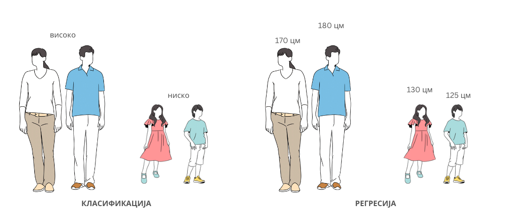

Врсте машинског учења
=====================

.. infonote::

 У овој лекцији ћемо увести основне врсте машинског учења: надгледано машинско учење, ненадгледано машинско учење и учење поткрепљивањем. 
 Све оне се крију иза задатака као што су предвиђање падавина, препорука филмова за гледање или играња игрица. О свакој од ових области ће бити више речи у 
 наставку курса. Говорићемо и о неким актуелним правцима истраживања као што је учење преносом знања. 

Надгледано машинско учење
~~~~~~~~~~~~~~~~~~~~~~~~~

Највећи број примера које смо видели до сада су заправо примери **надгледаног машинског учења** (енгл. *supervised machine learning*). Надгледано машинско 
учење обухвата алгоритме који се у потпуности уклапају у оно о чему смо до сада говорили и помажу нам да научимо пресликавања једног скупа вредности у други. 
Зато је неопходно да у скупу података над којим се примењују уз вредности атрибута познајемо и вредности циљне променљиве. 

|

Два основна задатка надгледаног машинског учења су **регресија** (енгл. *regression*) и **класификација** (енгл. *classification*). И у задацима регресије и у задацима класификације желимо да научимо да 
предвиђамо вредности с тим што у регресионим задацима вредности могу да буду произвољне а у случају класификације из неког унапред дефинисаног коначног 
скупа вредности. Тако су регресиони задаци подесни за предикцију вредности температуре, цене неког производа (задатак одређивања цене некретнине који смо 
сусрели у уводном делу је пример регресионог задатка), разорности земљотреса и слично. Са друге стране одређивање да ли је пошта непожељна или пожељна или 
одређивање жанра филма су класификациони задаци јер је скуп вредности које имамо на другој страни коначан - пошта може били или пожељна или непожељна 
(две вредности) док жанр може бити, рецимо, комедија, драма, акција или трилер (четири вредности). Нешто касније ћемо увести и прецизнију дефиницију сваког 
од ових задатака. 

*Класификација и регресија*
*Одређивање да ли је неко висок или низак је задатак класификације*
*Одређивање тачне висине је задатак регресије*

-------

Ненадгледано машинско учење
~~~~~~~~~~~~~~~~~~~~~~~~~~~

Технике **ненадгледаног машинског учења** (енгл. *unsupervised machine learning*) користимо у задацима који треба да испитају структуру скупа података. 
На пример, уколико анализирамо куповине потрошача једне продавнице, може бити интересантно да уочимо производе који се често купују заједно као би их 
финије распоредили у продавници, унапредили понуду, али и профит. На исти начин могу да се анализирају и групишу кориснички коментари и да се увиђају 
услуге или својства о којима корисници говоре. Задаци овог типа, у којима желимо да уочимо групе међу подацима, називају се **кластеровање** (енгл. *clustering*). Нешто касније у 
току курса упознаћеш алгоритам к-средина, најпознатији алгоритам кластеровања.

*Кластеровање*

-------

Уочавање инстанци међу подацима које се на неки начин разликују од других такође потпада под задатке ненадгледаног машинског учења. Тако, уочавање атипичних 
мерења сензора једне фабрике може бити сигнал за покретање додатних сигурносних процедура. Слично, уочавање атипичних банкарских трансакција, на пример са 
неког удаљеног места или у неком неуобичајеном износу, могу бити наговештаји преваре. Овај задатак ненадгледаног машинског учења се зове **детекција аномалија** (енгл. *anomaly detection*).

.. figure:: ../../_images/vmu3.png
    :width: 300
    :align: center

*Детекција аномалија*

-------

Ненадгледано машинско учење се бави и задацима **редукције (смањења) димензионалности**. Често нам је за потребе графичког приказа података потребно да са већег 
броја атрибута пређемо на мањи број атрибута, на пример, два или три. Јасно је да се приликом ове трансформације губе неке информације полазног скупа података, 
али се, са друге стране, добија могућност приказа података и можда бољег увида у неке законитости. Мања димензионалност података (мањи број атрибута) је 
пожељан и због бржег извршавања алгоритама и мање меморијске захтевности, што посебно може бити важно ако имамо ограничене ресурсе за рад. Неки од често 
коришћених алгоритама за редукцију димензионалности су анализа главних компоненти (енгл. *principal component analysis, PCA*) и t-SNE. 

*Смисао смањења димензионалности: два квадра и њихове пројекције из тродимензионог у дводимензиони простор*

-------

Занимљиво је да за задатке ненадгледаног машинског учења није потребно да познајемо вредности циљне променљиве. Кластеровање, уочавање аномалија и редукцију 
димензионалности вршимо само на основу вредности атрибута. 

Учење поткрепљивањем
~~~~~~~~~~~~~~~~~~~~

Сигурно си пуно пута видео како се дресира пас. Када му се зада неки задатак, на пример, да донесе лоптицу са другог краја дворишта, награда у виду кексића 
када је донесе ће мотивисати пса да следећег пута овај задатак још успешније и радосније обави. Ова идеја лежи и у основи учења поткрепљивањем. **Учење 
поткрепљивањем** (енгл.  *reinforcement learning*) је област машинског учења која се користи у задацима као што су играње игара или аутономна вожња. За њега 
је карактеристично постојање окружења које има своја стања, агента који може да обави одређени скуп акција и концепт награде. Циљ је да агент у задатом 
окружењу, чија се стања мењају, одабере (научи) онај низ акција који му омогућава највећу награду. У контексту уводног примера, двориште је окружење. 
Његова стања могу бити лоптица на крају дворишта или комшијска мачка на дрвету.  Пас је агент, а скуп акција које може да преузме је да потрчи, да седне, 
да оде да спава. Награда може бити неки број кексића или ништа. Уколико пас на промену окружења, на пример, појаву лоптице, одабере прави низ акција 
(потрчи, пронађе је и врати је) успеће да освоји највећу награду. 

Више о овој врсти учења ћеш сазнати при крају курса. 

Нови правци учења 
~~~~~~~~~~~~~~~~~

Када треба да савладамо нови задатак, на пример, да научимо да возимо тротинет, ми не почињемо од ”нуле”. Сва знања и вештине које смо стекли у неким 
другим задацима, на пример, игрању кошарке, вожњи бицикла, па и истрајност и стрпљење у задацима који нам нису били омиљени попут сређивања подрума, 
нам помажу да га боље савладамо. Ова идеја је основа **учења преносом знања** (енгл. *transfer learning*). Зато често можеш чути да се говори о моделима који 
су искоришћени као основа за развој неког другог модела. Такви модели се прво обуче на неким општим скуповима података и задатака, а после дотренирају тј. 
профине тако да могу да решавају и неки врло специфичан задатак. На пример, за развој модела ChatGPT искоришћен је као основа језички модел GPT који се пре 
тога добро показао у задацима генерисања сажетака, скраћених верзија текста, и одговора на питања. 

*Идеја учења преносом знања*

-------

Технике преноса знања се могу комбиновати са свим претходно поменутим врстама учења. Посебно су нам важне када скупови података за обучавање неког специфичног 
задатка нису довољно велики или када развијамо модел за неки специфични домен. 

