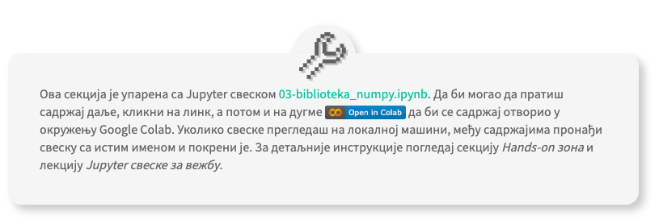

Jupyter свеске за вежбу
========================

.. |open| image:: ../../_images/algk2.png
            :width: 100px

    
.. infonote:: 

    Да би приближили идеје иза неких занимљивих и важних концепата рада са подацима и самог машинског учења, један број лекција на курсу 
    прате и материјали са кодовима. У овој лекцији ћеш пронаћи смернице како да користиш поменуте материјале и припремиш окружење за рад. 

У заједници која се бави анализом података и машинским учењем, комбинација програмског језика Python и Jupyter свески је врло заступљена. 
Зато ће те пратити и на овом курсу. За анализу података ћемо користи библиотеку *Pandas*, популарну библиотеку за рад са табеларним подацима, 
и библиотеку за визуелизације *Matplotlib*. О анализи података си већ имао прилике да чујеш нешто више на курсу 
`Анализа података у Џупитеру и технике програмирања за други разред гимназије <https://petlja.org/kurs/478/0>`_ 
који ти може послужити и да се брзо подсетиш неких битних појмова. За имплементацију алгоритама машинског учења користићемо библиотеку 
*NumPy*, специјализовану библиотеку за брза нумеричка израчунавања, док ћемо рад са неким занимљивим програмима упознати кроз библиотеке 
*TensorFlow* и *Transformers*. О свакој од ових библиотека ће бити још речи у наставку.

|

Сви материјали који ће се користити за вежбу у току курса налазе се на репозиторијуму `https://github.com/Petlja/specit4_ai_radni <https://github.com/Petlja/specit4_ai_radni>`_.
Као што смо рекли, у питању су Jupyter свеске са фрагментима Python кода. Број у називу свеске одговара редном броју секције у којој се материјал користити, 
док име одговара имену лекције.  

|

Уколико желиш да ове материјале извршаваш на локалној машини, најлакше је да инсталираш окружење *Anaconda*. Верзију окружења подесну за свој 
оперативни систем можеш да пронађеш на званичној `страни за преузимање <https://www.anaconda.com/download>`_.  Окружење *Anacoda* долази са великим бројем већ инсталираних пакета и 
алатом за руковање пакетима *conda* који ће ти омогућити лаку инсталацију свих других потребних пакета. Пакети који одговарају библиотекама *NumPy*, *Matplotlib* и *Pandas* ће бити
подразумевано инсталирани (саставни су део окружења), док ћеш библиотеке *TensorFlow* и *Transformers* морати засебно да инсталираш. 
Предлог је да за библиотеку *TensorFlow* пратиш смернице за инсталацију које су доступне на `званичној страници <https://www.tensorflow.org/install>`_ библиотеке или
на `страници conda заједнице <https://anaconda.org/conda-forge/tensorflow>`_. Смернице за инсталацију библиотеке *Transformers* можеш да пронађеш на сајту библиотеке на 
`овој <https://huggingface.co/docs/transformers/installation>`_ адреси. 

|

Материјале са репозиторијума је могуће извршавати и у облаку у оквиру платформе `Google Colab <https://research.google.com/colaboratory/>`_. Google Colab je платформа која нуди 
подешено окружење за рад, што занчи да ако се определиш за ову опцију нећеш морати да користиш локалну машину нити било шта додатно инсталираш. 
Сви материјали на репозиторијуму на самом почетку имају беџ са натписом Google Colab који изгледа овако |open|. Довољно је да кликнеш на њега да би се садржај отворио у овом окружењу. 
Да би могао да користиш окружење Google Colab, потребан ти је Google налог.

|

Лекције које су повезане са материјалима за вежбу препознаћеш по поруци налик овој:

*Порука са смерницама за коришћење материјала*

-------

У њој ћеш пронаћи име тј. линк до свеске која ће ти бити потребна за прећење лекције. Уколико се одлучиш за рад на локалном рачунару, обрати пажњу на име лекције, оно ће ти више значити. 
Ако се одлучиш за коришћење *Google Colab* платформе, довољно је да кликнеш на линк до свеске, а потом и на дугме |open| које ће те директно одвести до Google Colab окружења. 

|

У наредној лекцији ћемо представити платформу *Google Colab* и неке њене основне функционалности, док ћемо у последњној лекцији ове секције 
приближити функционалности библиотеке *NumPy* и подсетити те на коришћење библиотека *Matplotlib* и *Pandas*. 

