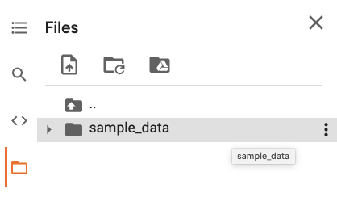
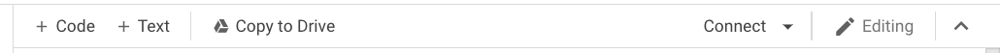
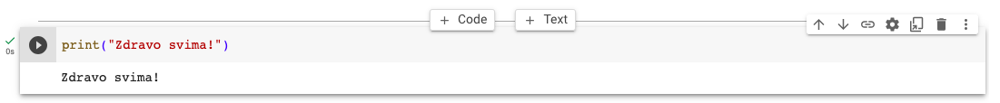
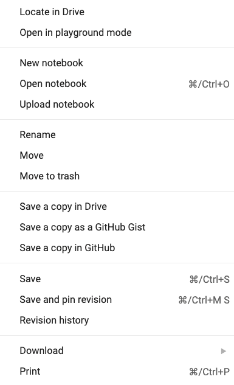
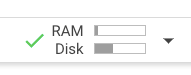
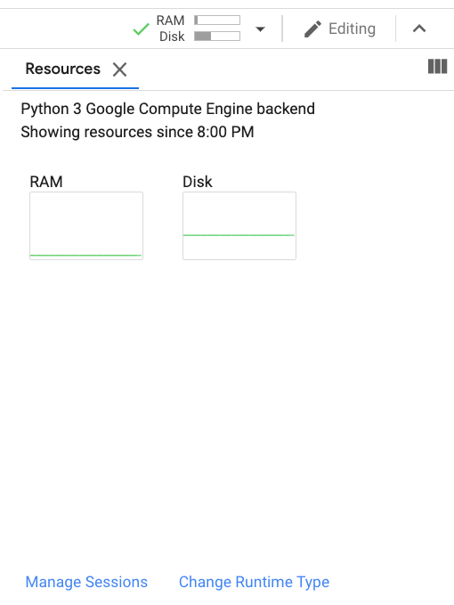
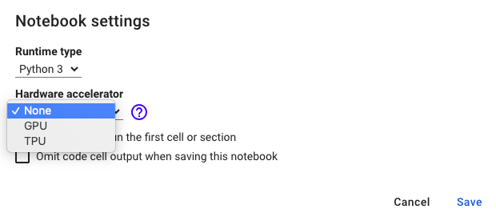

Платформа Google Colab
======================

.. |open| image:: ../../_images/algk2.png
            :width: 100px

.. infonote::

 У овој свесци ћемо приказати платформу Google Colab. Захваљујући њој можеш да обрађујеш податке и развијаш своје моделе машинског учења без пуно 
 вратоломија везаних за инсталације и подешавање рачунара. 

Потоји велики број библиотека које подржавају рад у домену вештачке интелигенције. Неке од њих су уско специјализоване, на пример користе се само у 
раду са сликама, док су друге опште и могу се користити за моделовање и решавање ширег скупа проблема. У заједници која се бави машинским учењем, 
програмски језик Python је чест избор па су библиотеке овог језика тренутно најбројније. Сигурно су ти познате библиотеке `scikit-learn <https://scikit-learn.org/stable/>`_, 
`TensorFlow <https://www.tensorflow.org/>`_, `PyTorch <https://pytorch.org/>`_ и `ЈАX <https://jax.readthedocs.io/en/latest/>`_ - све оне су отвореног кода и подржане од стране многих истраживачких заједница и компанија. 

|

У практичном раду, уз избор библиотека, увек се разматра и питање расположивог хардвера. Да би могле брже да се обраде велике количине података и 
обуче комплекснији модели, користе се **графичке картице** (енгл. *graphical processing unit, GPU*) и **тензорске картице** (енгл. *tensor processing 
units, TPU*). Зато се често може чути да се за обучавање модела користе рачунски сервиси у облаку попут платформи Amazon Web Sevices (AWS), 
Microsoft Azure, Google Cloud и других које нуде специфичне архитектуре и супериоран хардвер на коришћење уз одговарајућу новчану накнаду. 

|

Да би у току упознавања машинског учења избегли потешкоће везане за техничке конфигурације и инсталације које условљавају различити оперативни 
системи, користићемо окружење Google Colab. Ово окружење развија компанија Google и може се бесплатно користити уз постојећи Google налог. 
За окружење је карактеристичан рад са Jupyter свескама са којима си се сусрео тако да ће ти бити сасвим интуитивне и 
једноставне за коришћење. Највећи број библиотека са којима ћемо радити је већ доступан у оквиру окружења Google Colab, а све додатне инсталације 
ће бити праволинијске и извршаваће се у облаку тј. неће оптерећивати локалну машину. Свескама ћемо приступати из прегледача веба, а разменом њихових 
линкова моћи ћемо лако да делимо садржаје. Посебно, подешавањем Google Colab окружења моћи ћемо да опробамо и коришћење GPU и TPU картица.

|

Као што је било речи у претходној лекцији, пропратне материјале са кодом можеш да отвориш у Google Colab окружењу тако што ћеш пратити иконицу |open|. Клик на њу ће те директно одвести до припремљене свеске у којој ћеш моћи да извршиш 
кôд и даље експериментишеш. Окружењу Google Colab можеш приступити и директно, на адреси `https://colab.research.google.com/notebooks/welcome.ipynb <https://colab.research.google.com/notebooks/welcome.ipynb>`_ 
из прегледача који највише волиш. Страна добродошлице која ће те сачекати садржи преглед основних функционалности окружења. У наставку ћеш упознати неке од њих како би лакше могао да пратиш садржаје. 

.. infonote::

 Да би користио-користила Google Colab потребан ти је Google налог.  Њега можеш да креираш на адрси https://accounts.google.com/. 

Баш као и свеске окружења Jupyter, свеске окружења Google Colab се састоје од ћелија које се интерактивно извршавају. Разликују се ћелије у 
којима се пише кôд и ћелије у којима се пишу пропратни текстуални садржаји уз могућност додавања слика, HTML кода и LaTex анотација. Ћелија са 
кодом се креира кликом на +Code дугменце у траци испод главних опција окружења. Слично, ћелија са текстом се креира кликом на дгуменце +Text. 
Овако креиране ћелије се увек додају на крај низа ћелија тј. на крај свеске. 

*Трака са главним опцијама окружења Google Colab*

-------

*Дугмићи за креирање ћелија кода и ћелија текста*

-------

Када се дуже позиционирамо изнад постојеће ћелије, на врху ће се појавити дугмићи за креирање ћелија кода и ћелија текста које се постављају тик 
испод ћелије над којом смо позиционирани. Без обзира на начин на који су креиране, ћелије се могу премештати кликом на стрелице горе или доле 
(опција |goredole|), могу се брисати (опција |delete|), могу се коментарисати (опција |comment|) или делити линкови до ћелија (опција |link|), што је посебно корисно када 
се ради у тиму. Све ове опције се налазе са десне стране активне ћелије тј. ћелије у којој уносимо садржај. Активна ћелија се извршава кликом на 
стрелицу са леве стране (|play|) или комбинацијом тастера *Shift+Enter* што је обично брже. Да би нека ћелија постала активна, потребно је два пута 
кликнути на њу. 

*Опције за рад са појединачним ћелијама*

-------

Ако је ћелија активна, кликом на *Control+m+m* ћелија са кодом се може претворити у текстуалну ћелију, док се командом *Control+m+y* текстуална 
ћелија претвара у ћелију са кодом. Ове скраћенице ти могу олакшати и убрзати рад. Листа свих скраћеница које платформа Google Colab подржава 
се може видети одабиром опције *Keyboard shortcuts* у менију *Tools*.

|

Нова свеска се може креирати кликом на мени *File* и затим одабиром опције *New notebook*. Нова свеска ће се отворити у новом табу прегледача и 
подразумевано ће имати име *Untitled1.ipynb*. Кликом на овај текст може се унети нови наслов свеске. Екстензију свеске *.ipynb* (акроним од енглеског 
*IPython Notebook*) треба задржати приликом преименовања. Креиране свеске се подразумевано чувају у облаку, у оквиру придруженог *Google Drive* простора. 
Кликом на мени *File* па одабиром опције *Locate in Drive* може се приступити Google Drive простору и видети свеска. Већ креиране свеске је могуће пребацивати у облак 
кликом на мени *File* и одабиром опције *Upload notebook*. Често је потребно и да се свеска сачува локално. То се може постићи кликом на мени *File* и одабиром опције *Download*. 
Свеска се може сачувати у формату Jupyter свески (са екстензијом *.ipynb*) или Python датотека (са екстензијом *.py*).

*Опције менија File*

-------

Датотеке попут скупова података или слика се у окружењу Google Colab учитавају тако што се одабере опција *Files* вертикалног менија, а потом и 
оција *Upload* менија који се активира када се позиционирамо над директоријумом *sample_data* и кликнемо на тачкице са десне стране. 
Статус пребацивања датотеке се може пратити у доњем левом углу. У раду нам је често потребна и путања до ових датотека. Да би је очитали, потребно је 
позиционирати се над датотеком у директоријуму *sample_data*, активирати мени означен тачкицама са десне стране и одабрати опцију *Copy path*. 
Директоријум *sample_data* се може организовати креирањем поддиректоријума, сувишне датотеке се могу обрисати, а постојеће се могу преименовати. 
Све ове функционалности су доступне и кроз мени који се активира кликом на тачкице са десне стране док смо позиционирани над дидректоријумом 
*sample_data*.

.. csv-table:: 
   :widths: auto
   :align: left
   
   "|colab5|", "|colab6|"
   "*вертикални мени*", "*директоријум sample_data и његов мени*"

-------

Приликом рада у окружењу Google Colab придружују нам се и одређени рачунски ресурси. Информације о меморијским ресурсима можемо пратити RAM и 
диск визелизацијама у горњем десном углу. Кликом на ову иконицу можемо добити детаљан приказ. 

*Иконица за приказ расположивих меморијских ресурса*

-------

*Детаљан приказ информација о расположивим ресурсима*

-------

Опција *Change Runtime Type* омогућава коришћење GPU и TPU ресурса. Због своје природе дељења и бесплатног коришћења, окружење Google Colab ни у 
једном тренутку не може гарантовати да ће се добити ресурси у пуном капацитету. Политика додељивања и распоређивања ресурса је организационе 
природе и на њу се не може утицати. Због тога се не може одабрати ни неки специфичан тип GPU или TPU ресурса јер се њихов број и тип мењају временом. 
У документацији окружења Google Colab наведено је да се најчешће користе ресурси Nvidia K80s, T4s, P4s и P100s. Да би се користиле 
ове погодности, након клика на опцију *Change Runtime Type* потребно је променити опцију *Hardware accelerator* на *GPU* или *TPU*. Тада ће се 
појавити и додатна иконица за нови ресурс у прозору за праћење ресурса. 

*Панел за избор GPU или ТPU ресурса*

-------

Свака Google Colab свска се извршава у засебној сесији која има своја подешавања. Опција *Manage Sessions* панела са ресурсима се односи на подешавање 
Google Colab сесија. Кликом на њу се добија листа свих активних сесија. Сесија се може прекинути кликом на опцију |stop|. 
Сесија се након 30 минута неактивности аутоматски прекида, као и након 12 сати активног коришћења (то је тренутна квота окружења). 
Статус сесије се може пратити у доњем десном углу: зелени кружић означава активну, а наранџасти неактивну сесију.

