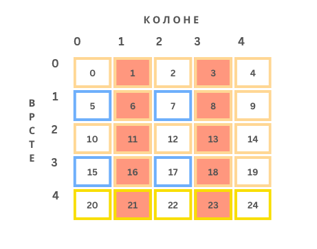
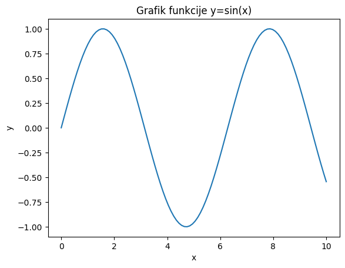
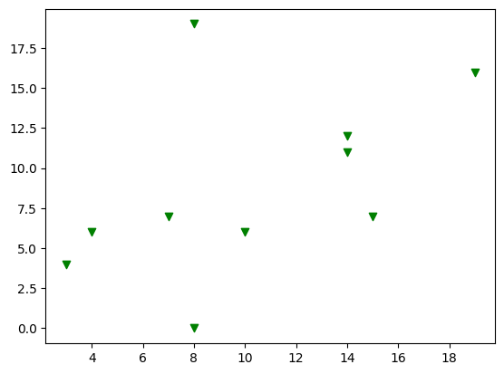

Библиотеке NumPy, Matplotlib и Pandas
=====================================

.. |open| image:: ../../_images/algk2.png
            :width: 100px

.. |mat3| image:: ../../_images/bibl8.png
            :width: 250px

.. |mat4| image:: ../../_images/bibl9.png
            :width: 250px

.. infonote::

 Да бисмо могли да приближимо како раде алгоритми машинског учења и стекнемо бољу представу о неким важним појмовима, користићемо библиотеке 
 програмског језика Python и то NumPy, Matplotlib и Pandas. Неке од њих си већ имао прилике да упознаш на другим курсевима. Овде свакако није 
 циљ да их детаљно истражимо (све три библиотеке су обимне и нуде пуно могућности), већ да упознамо неке основне објекте и функције које нам 
 могу помоћи. 

Библиотека NumPy
~~~~~~~~~~~~~~~~

Све податке којима располажемо треба да представимо помоћу бројева и неких схема које их обједињују. Тако, рецимо, спољну температуру можемо да 
представимо једним реалним бројем (кажемо и **скаларом**), док **низом** бројева можемо да представимо спољну температуру у целој недељи (дужина тог низа 
је седам). Блоком бројева, такозваним **матрицама**, можемо да представимо пикселе једне црно-беле слике. Ако је димензија слике 200x300 пиксела, 
овај блок има 200 редова и 300 колона и у пресеку сваке врсте и колоне се налази по један број који означава вредност пиксела. Зато за овакве 
структуре кажемо да су дводимензионе. Ако је слика у боји и користи RGB систем боја (о томе ћемо још говорити у делу о конволутивним неуронским 
мрежама), имамо заправо три блока бројева димензије 200x300 (за сваку од боја по једну) што можемо записати и као 200x300x3. Да ли можеш да 
замислиш како представљамо видео? Па, видео је ништа друго него један низ фрејмова (слика) у времену. Уобичајених 24 фрејма у једној секунди 
нам омогућавају да видео доживимо као природан, без прекида и сецкања. То би даље значило да један секунд видеа можемо да опишемо димензијом 
24x200x300x3. Овакве структуре су већ четвородимензионе. Уобичајено је да структуре које имају више димензија називамо **тензорима**. Заправо, 
важи и да је скалар тензор димензије нула, низ тензор димензије један а матрица тензор димензије два. Отуда и име популарне библиотеке 
ТensorFlow која се користи у машинском учењу. 

*Тензори различитих димензија*

-------

Библиотека NumPy је библиотека отвореног кода која нам омогућава да брзо изведемо многе математичке операције над овако представљеним подацима. 
Иако је скуп функционалности ове библиотеке врло богат, ми ћемо научити како да: 

- дефинишемо низове и матрице бројева,
- приступимо њиховим елементима, врстама и колонама,
- изведемо операције сабирања, одузимања и множења над њима,
- пронађемо и применимо неку математичку функцију, и
- генеришемо неке насумичне вредности. 

Кликом на дугме |open| можеш да отвориш пратећу Google Colab свеску и сам испратиш резултате рада следећих блокова. На самом почетку свеске 
дочекаће те наредба ``import numpy as np`` коју морамо да извршимо како бисмо могли да користимо библиотеку NumPy. 

|

Као што си видео у уводу, за рад са реалним подацима потребни су нам вишедимензиони низови. Основна структура библиотеке NumPy је баш вишедимензиони 
низ (енгл. *multidimensional array, ndarray*). Њу карактеришу облик који указује на димензијe вишедимензионог низа и елементи које садржи. 
Функција којом се креира вишедимензиони низ се зове ``array``.  Следећим блоком кода креира се матрица ``M`` димензија 3x2 тј. која има три врсте и 
две колоне. 

Као што смо видели, такве блокове сусрећемо приликом представљања слика али и табеларних података - појединачне колоне означавају атрибуте а врсте 
инстанце скупа.

|

Број колона и број врста вишедимензионог низа ``М`` може да се прочита својством ``shape``, па тако следећа линија кода даје као резултат пар бројева (3, 2):

code-block::

 M.shape

Вишедимензиони низови морају да садрже вредности истог типа - то могу бити цели бројеви или реални бројеви. Библиотека омогућава и коришћење бројеве 
са једноструком и двоструком прецизношћу, али нећемо залазити у те детаље. Тип елемената вишедимензионог низа можеш увек очитати користећи својство 
``dtype``. С обзиром да наша матрица садржи само целе бројеве, следећа наредба ће исписати *int64*:

code-block::

 M.dtype

Ево још неких примера креирања вишедимензионих низова: 

- низ једноцифрених бројева: ``np.array([0, 1, 2, 3, 4, 5, 6, 7, 8, 9])``
- матрица димензија 1x3 која садржи бројеве 10, 11 и 12: ``np.array([[10, 11, 12]])``
- матрица димензија 3x1 која садржи бројеве 10, 11 и 12: ``np.array([[10], [11], [12]])``

Појединачним елементима низова приступа се коришћењем одговарајућих индекса - користимо онолико индекса колико имамо димензија и водимо рачуна о 
томе да индекси почињу од нуле. Тако се са ``M[0,0]`` очитава вредност у нултој врсти и нултој колони, док се са  ``M[2,1]`` очитава вредност у другој 
врсти и првој колони. 

|

Баш као и код листи, и у библиотеци NumPy може да се користи оператор исецања ``:``.  Тако се, рецимо, у матрици ``А`` димензије 5x5 која је приказана на 
доњој слици са:

- ``А[4, :]`` издвајају сви елементи последње врсте тј. жути блок,
- ``А[ :, 1::2]`` издвајају елементи сваке друге колоне тј. црвени блокови,
- ``А[1::2, 0:3:2]`` издвајају елементи плавог блока.

Операције сабирања и одузимања над вишедимензионим низовима се изводе елемент по елемент - сабирају се тј. одузимају елементи низова који се 
налазе на истим позицијама и као резултат се добија низ истих димензија. Оператори ових радњи су, као што очекујеш, ``+`` и ``-``, а могу се користити и 
функције ``add`` и ``subtract``.

Следећим блоком кода се сабирају две матрице :math:`A=\begin{bmatrix}1&3&5\\7&9&11\\13&15&17\end{bmatrix}` и :math:`B=\begin{bmatrix}2&4&6\\8&10&12\\14&16&18\end{bmatrix}`:

.. code-block::

 A = np.array([
 [1, 3, 5],
 [7, 9, 11],
 [13, 15, 17]
 ])

 B = np.array([
 [2, 4, 6],
 [8, 10, 12],
 [14, 16, 18]
 ])

 A + B

и као резлтат се добија матрица :math:`A=\begin{bmatrix}3&7&11\\15&19&23\\27&31&35\end{bmatrix}`.

Када је реч о множењу, постоји могућност множења низова скаларима и у том случају се скаларом множи сваки елемент низа. Ту операцију означавамо 
са ``*``. Да би се извршило право матрично множење користи се функција ``dot``. Ево и примера: 

.. csv-table:: 
   :widths: auto
   :align: left
   
   "|mat3|", "|mat4|"
   "", ""

Када се примењују математичке функцију библиотеке NumPy над вишедимензионим низовима, оне се примењују над сваким њеним елементом. Тако се, рецимо, 
извршавањем следећег кода којим се примењује експоненцијална функција над елементима матрице ``М`` добијају следеће вредности: 

.. image:: ../../_images/bibl10.png
    :width: 350
    :align: center

Постоји и могућност да се функција изврши само дуж неке димензије вишедимензионог низа, на пример, само по колонама или само по врстама. Наравно, 
то има смисла само за неке функције као што су проналажење максимума, минимума, сабирање или упросечавање. Следећим кодом се врши са прво 
врши сабирање елемената матрице ``М`` по врстама, а потом по колонама. 

.. csv-table:: 
   :widths: auto
   :align: left
   
   "|mat5|", "|mat6|"
   "", ""

У раду нам често значи да брзо генеришемо низове са неким насумичним вредностима или векторе нула или јединица. Следећим позивима функција ће се генерисати, редом:

- матрица са случајним бројевима димензије 2x3:  ``np.random.random((2, 3))``
- матрица нула дизмензија 4x4: ``np.zeros((4, 4))``
- матрица јединица димензија 4x2: ``np.ones((4, 2))``
- један једнодимензиони низ са еквидистантним скупом 9 тачака из интервала од 0 до 2: ``np.linspace(0, 2, 9)``

|

Више о садржају и могућностима библиотеке NumPy можеш да пронађеш на званичном сајту `http://www.numpy.org/ <http://www.numpy.org/>`_. 

Библиотека Matplotlib
~~~~~~~~~~~~~~~~~~~~~

Matplotlib је библиотека језика Python која се користи за 2D и 3D графику. Графички прикази су нам јако корисни у раду са подацима јер нам 
омогућавају да боље разумемо податке, као и да финије испратимо нека понашања алгоритама. Упознајмо функционалности ове библиотеке кроз два 
једноставна примера: исцртавање графика функције ``sin(x)`` и приказа тачкастог графика скупа података. Клик на дугме |open| ће ти отворити пратећу Google 
Colab свеску у којој можеш да испробаш кодове који следе. 

|

Уобичајено је да кодови који користе библиотеку Matplotlib започну наредбом ``import matplotlib.pyplot as plt``  којом се учитава панел за цртање 
``plt`` и његове функције.

|

Пример исцртавања графика функције ``sin(x)`` на интервалу ``[0, 10]`` започећемо креирањем еквидистантне мреже тачака ``x`` позивом функције ``linspace`` 
библиотеке NumPy. Ова функција очекује као аргументе крајеве интервала 0 и 10 и број подеоних тачака - у нашем случају то може да буде број 100. 
Потом ћемо израчунати вредност синусне функције за зваку од ових тачака позивом функције ``sin(x)``. Њене вредности ћемо сачувати у променљивој ``y`` - 
и то ће сада бити један низ од 100 тачака јер се функција примењује над сваким елементом низа ``x``. 

|

Наслов графикона постављамо позивом функције ``title``, а обележја оса (текстове који ће објашњавати њихово значење) позивима функција ``xlabel`` и 
``ylabel``. Све ове функције су дефинисане на нивоу панела за цртање ``plt``. Сам график се исцртава позивом функције ``plot`` и задавањем вредност ``x`` и ``y`` координата 
за цртање (зато смо тим именима и назвали полазни скуп тачака и вредности синусне функције). График се приказује позивом функције ``show``.

.. code-block:: Python

    # kreiranje mreze tacaka
    x = np.linspace(0, 10, 100)
    y = np.sin(x)

    # podesavanje naslova grafika i obelezja osa
    plt.title('Grafik funkcije y=sin(x)')
    plt.xlabel('x')
    plt.ylabel('y')

    # iscrtavanje grafika
    plt.plot(x, y)

    # prikaz grafika
    plt.show()

|

Тачкасте графиконе често користимо за увид у просторни распоред података. У примеру који следи креираћемо десет парова тачака са целобројним 
вредностима координата из интервала  ``[0, 20]`` и приказати их у виду тачкастог графикона. 

|

Низ парова тачака ћемо креирати тако што ћемо креирати низовe појединачних координата ``x`` и ``y``. То ћемо урадити коришћењем функције ``randomint`` библиотеке 
NumPy чији аргументи ``low``, ``heigh`` и ``size`` омогућавају контролу доње и горње границе интервала, као и контролу броја тачака. Сам тачкасти графикон се 
креира позивом функције ``scatter`` панела за цртање ``plt``. Приликом позива овој функцији се задају вредности координата тачака, у нашем случају ``x`` и ``y``. 
Додатно се може подесити боја тачака аргументом ``color``, као и изменити сам симбол за приказ аргументом ``marker``. На графику су уместо подразумеваних 
кружића црне боје коришћени зелени троугилићи усмерени на доле. График се приказује, као и у претходном примеру, позивом функције ``show``. 

|

.. code-block:: Python

    # nizovi duzine 10 sa proizvoljnim elementima iz intervala [0, 20]
    np.random.seed(7)
    x = np.random.randint(low=0, high=20, size=10)
    y = np.random.randint(low=0, high=20, size=10)

    # generisanje tackastog grafikona
    plt.scatter(x, y, color='green', marker='v')

    # prikaz grafika
    plt.show()

|

Можемо да приметимо да смо у овом примеру на нивоу библиотеке NumPy и њеног пакета ``random`` подесили генератор случајних бројева 
(такозвано својство *seed*) на вредност 7. То ће нам омогућити да сваки пут када покренемо овај код добијемо исти распоред тачака. Ово својство 
нам је важно због могућности поновног покретања експеримената и дељења кодова. Ово својство зовемо **поновљивост** или **репродуцибилност**. 

|

Званични сајт библиотеке Matplotlib је `https://matplotlib.org/ <https://matplotlib.org/>`_, а осим ње постоје и друге библиотеке језика Python за визуелизације као што су 
`Seaborn <https://seaborn.pydata.org/>`_ и `Plotly <https://plotly.com/>`_.

Библиотека Pandas
~~~~~~~~~~~~~~~~~

Библиотека Pandas је намењена раду са табеларним подацима. Карактеришу је функције за учитавање различитих формата датотека а потом и многобројне 
функције за манипулацију над подацима. Линк до званичног сајта библиотеке је `https://pandas.pydata.org/ <https://pandas.pydata.org/>`_ а са њеним могућностима ћемо се упознати 
нешто касније, у делу са експлоративном анализом података.

