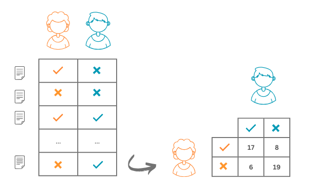
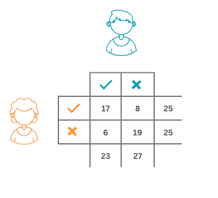
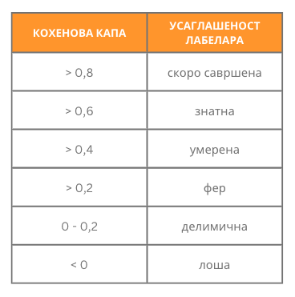

Како настају скупови података?
===============================

.. infonote::

 У овој секцији ћемо одговорити на питање које ти је сигурно пало на памет у току читања садржаја: како настају скупови 
 података?  Иако је сваки скуп података прича за себе, појмови као што су лабелирање, усаглашеност лабелaра или 
 пристрасност избора су често присутни. Зато читај даље да сазнаш више о овим појмовима!

Свака инстанца скупа података који се користи за надгледано машинско учење представљена је као пар улазних и излазних 
вредности. Иако овакви скупови података могу да настају спонтано, на пример, очитавањима улазних и излазних вредности 
са неког сензора, много чешће се за њихово креирање ангажује посебан тим који има одговарајуће вештине и знања и чије 
активности треба координисати. 

|

Креирање скупа података започиње припремама **смерница и упутстава** које јасно описују задатак који се решева, дефинишу 
изворе података, опсеге вредности, поделу података и ток комуникације унутар тима. Смернице обично садрже и опис алата 
који ће се користити у раду као и одговоре на неке честе недоумице које могу да се јаве у току креирања скупа. 

|

Да би лакше ипратили сваки од ових корака, можемо у паралели пратити креирање скупа података за задатак препознавања 
(детекције) лажних вести. Као што ти је познато, многе информације на вебу нису тачне - односе се на измишљене чињенице 
и детаље догађаја или садрже научно неутемељене тврдње и савете. Као такве могу нашкодити и појединцима и целом друштву. 
Зато је задатак препознавања лажних вести важан и неопходан у анализи електронских медија и друштвених мрежа. 
Из угла машинског учења, задатак препознавања лажних вести се може посматрати као задатак бинарне класификације, 
налик задатку класификације непожељне поште: за задати текст треба утврдити да ли је лажан или не. 

|

Креирање скупа података започиње приступом изворима података. Извори података могу бити репозиторијуми у којима се већ 
налазе делови скупа података, одређене странице са веба, кориснички-генерисани садржаји или било шта друго. 
Смернице за креирање скупа података у овом случају дефинишу линкове до извора података и све што ближе одређује преузимање 
садржаја. У примеру креирања скупа за задатак препознавања лажних вести, смернице би требало да садрже линкове до портала са којих се могу преузети новински 
чланци за анализу, временске опсеге одређене почетним и крајњим датумом, језик чланака, можда и тему чланка. Приликом преузимања садржаја, обавезно се прате 
права приступа и лиценце под којима су садржаји доступни. 

|

Након преузимања садржаја, прелази се на корак елементарне обраде података. Овај корак подразумева широк скуп радњи које се односе на додатну контролу 
квалитета преузетих садржаја, усаглашавање формата записа, елиминацију дупликата или извора који не задовољавају неки екстерни критеријум (на пример, 
новинска вест може бити превише кратка). 

|

Када се припреме садржаји, креира се тим који може да им придружи лабеле неопходне за решавање самог задатка и скуп смерница које описују њихове задатке. 
Учесници који помажу у задацима креирања скупа података називају се **анотатори** или **лабелари**. Задатак лабелара је да у складу са смерницама свакој од улазних 
вредности придруже одговарајућу излазну вредност. Тако, након што прочита вест, лабелар треба да придружи обележје које одговара тачној или лажној вести, на 
пример, у смерницама за те сврхе могу бити наведени бројеви 0 и 1. Цео поступак придруживања обележја се назива **анотација** или **лабелирање**.

|

Пожељно је да улазне податке погледа и обележи већи број лабелара. Мотивација за овакав дизајн је већа поузданост самог скупа података. На пример, уколико 
сваку вест у скупу вести прочита пет лабелара и свих пет се сложи да је вест лажна, можемо говорити о високој позданости. Уколико три лабелара кажу да је вест 
лажна а два не, онда смо мање поуздани у резултат лабелирања. Оваква поставка нам заправо може указивати и да је задатак тежак, субјективан или да смернице 
нису довољно јасне и прецизне и да би их требало допунити. 

|

Колико тачно лабелара ће бити укључено у сам процес, зависи од већег броја околности: временских рокова, распложивог буџета, поседовања одговарајућих 
компетенција (на пример, за задатак препознавања лажних вести хтели бисмо да ангажујемо студенте журналистике или новинаре). Некада и сама природа задатка 
сугерише бројност тима. Рецимо, у задацима класификације обично се бира непаран број лабелара како би увек једна група могла да ”надгласа” другу групу. 

|

Процес обележавања података може да изгледа и нешто другачије. На пример, сваку вест у скупу података може да прочита по један анотатор и придружи јој 
одговарајуће обележје, а затим поново може да је прочита контролни анотатор и коригује обележје уколико је неопходно. Контролни анотатор је обично неко 
ко има више доменског искуства и боље познаје сам проблем и који брзо може проверити коректност анотације. 

|

Како усаглашеност лабелара директно утиче на квалитет скупа података, уобичајена је пракса коришћења формалних мере за њено оцењивање. Заједнички ћемо 
упознати једну такву меру, Кохенову капу (није реч о одевном предмету који чува главу већ о грчком слову :math:`\kappa`), а самостално можеш више истражити о мерама као 
што је Клипендорфова алфа, Флесиова капа и друге. 

|
 
**Кохенова капа** је мера која се користи за проверу усаглашености обележавања између два лабелара. Треба имати на уму да провера усаглашености није исто што и 
провера тачности (када креирамо скуп података немамо референтне вредности) - два лабелара могу бити усаглашена и оба придружити погрешну лабелу. 

|

Претпоставимо да су лабелари Ана и Бранко обележавали 50 новинских вести: за 17 су се сложили да су тачне, за 19 да су лажне, док се су на преосталим вестима 
њихова мишљења мимоишла. Резултате њиховоих обележавања можемо приказати схемом као на доњој слици.  То значи да се њихова реализована усаглашеност 
(обележавамо је са :math:`p_o`) може израчунати као количник  :math:`p_o = \frac{17 + 19}{50} = 0.72` тј. као количник броја вести за које су се обележја преклопила и укупног броја 
вести.

Могло се десити и да су се обележја која су Ана и Бранко придруживали новинским вестима сасвим насумична: рецимо, могли су бацати новчић и ако падне глава 
закључити да је вест тачна, а ако падне писмо да је лажна. И у овом хипотетичком случају би опет дошло до неки преклапања. Вероватноћу једног таквог догађаја 
би могли израчунати као вероватноћу истовременог избора две тачне вести или истовременог избора две нетачне вести из скупа вести. Вероватноћа избора тачне 
вести за Ану је :math:`\frac{25}{50}`, док је за Бранка :math:`\frac{23}{50}`. Слично, вероватноћа избора лажне вести за Ану је :math:`\frac{25}{50}`, док је за Бранка :math:`\frac{27}{50}`. 
Тако се вероватноћа насумичног преклапања може израчунати као збир производа поменутих вероватноћа истовременог избора или две тачне или две нетачне вести. Ову вероватноћу зовемо насумичном 
усаглашеношћу (обележавамо је са :math:`p_e`). У нашем случају она износи :math:`p_e = \frac{25}{50} \cdot \frac{23}{50} + \frac{25}{50} \cdot \frac{27}{50} = 0.5`. 

Ово нас доводи до вредности капа коефицијента: :math:`\kappa = \frac{p_o - p_e}{1 - p_e}`. С обзиром на значење вредности :math:`p_o` и :math:`p_e` можемо 
закључити да се на овај начин мери усаглашеност анотатора у односу на насумично обележавање. Вредности овог 
коефицијента су у распону од -1 до 1, а веће вредности означавају бољу усаглашеност.

|

Заменом израчунатих вредности, за скуп вести на којима су радили Ана и Бранко добијамо да Кохенова капа износи 0,44. Ову вредност, даље можемо интерпретира у 
складу са неким устаљеним протоколима и закључити о квалитету нашег скупа података. Једна таква интерпретација је наведена ниже у табели. Како је вредност 
коефицијента већа од 0,4 али мања од 0,6 можемо да закључимо да је реч о умереној усаглашености лабелара - то даље може значити да морамо да поправимо и 
допунимо смернице или да боље обучимо лабеларе за рад. 

*Скала за интерпретацију вредности Кохенове капе*

-------

Када је реч о окружењима која се користе у задацима лабелирања, постоји јако велики број како комерцијалних тако и отврених јавно доступних алата и платформи. 
Избор је условљен и доменом па тако постоје посебне платформе за задатке рачунског вида (нпр. aлат `CVAT <https://github.com/opencv/cvat>`_), обраду природних 
језика (нпр. алат `Doccano <https://github.com/doccano/doccano>`_), 
обраду звука и видеа. Постоје и платформе општег типа као што су `Label Studio <https://github.com/HumanSignal/label-studio>`_, 
`Universal Data Tool <https://universaldatatool.com/>`_, `Prodigy <https://prodi.gy/>`_, `Appen <https://appen.com/>`_ и друге које омогућавају рад са свим врстама 
садржаја. 

|

Занимљиво је напоменути да постоје и платформе које аутоматизују цео процес креирања скупа података: од дефинисања задатака, упошљавања лабелара, придруживања 
одређеног скупа улаза лабелару, па до праћења усаглашености анотатора и извожења креираног скупа. Једна таква платформа, вероватно најпознатија, је 
`Mechanical Turk <https://www.mturk.com/>`_ компаније Amazon. 

|

Још један аспект који директно може да утиче на квалитет креираног скупа података је пристрастност. Рецимо, ако у скупу за класификацију вести има несразмерно 
више коректних вести у односу на лажне вести, многи алгоритми машинског учења неће бити у могућности да науче да разликују ове две класе вести. Слично, 
уколико се у скупу података налази несразмерно више слика белих људи у односу на слике тамнопутих људи, алгоритми за детекцију лица можда неће успети да науче 
задатак препознавања лица подједнако успешно у ове две категорије. Тенденција да скупови података садрже значајно више примерака једне класе у односу на друге 
класе назива се пристрастност избора (енгл. selection bias). У неким ситуацијама, упркос пажљивом дизајнирању скупа података, не може да се успостави баланс 
овога типа. На пример, у свету медицине постоје болести које су јако ретке па је одност броја пацијената природно несразмеран. Видећемо нешто касније да ове 
околности морамо да решавамо кроз нешто другачији дизајн алгоритама учења. 

.. questionnote::

 Креирај свој скуп лажних вести. Требаће ти и помоћ барем два пријатеља из разреда (провери, можда ће и чланови породице желети да учествују). Пронађи на вебу неколико лажних и неколико 
 коректних вести - можеш да користиш и твитове ако је лакше. Направи табелу која има две колоне, у првој упиши текстове свих вести (мало их промешај, да не 
 буду све вести из једне групе једна до друге) а другу колону остави за лабеле. Пошаљи овај фајл својим пријатељима и замоли их да обележе лажне вести. 
 Не заборави да им напишеш и прецизне смернице! Када ти врате обележене вести, споји све лабеле у једну табелу и процени квалитет свог скупа користећи 
 Кохенову капу. Да ли си задовољан резултатом?
 
 Приликом креирања табеле ће ти можда пасти на памет да одмах направиш три колоне, једну са вестима и две додатне колоне за лабеле, за сваког пријатеља по 
 једну, и да ту табелу поставиш негде у облаку тако да  је сви видите. То није добар корак јер када један анотатор може да види лабеле другог анотатора то 
 може да утиче на његову одлуку и размишљање. И то је једна врста пристрасности. Зато увек одвајамо послове анотатора и лабеле које придружују. 

