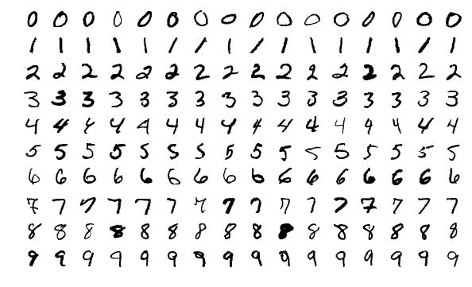
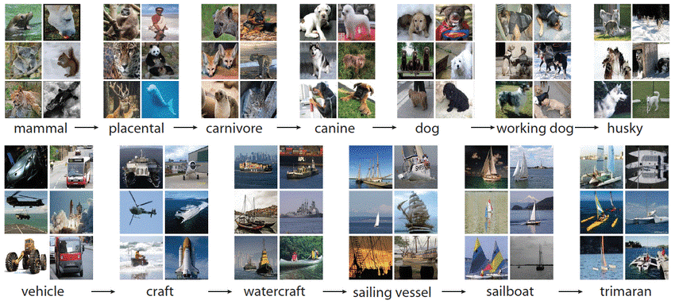
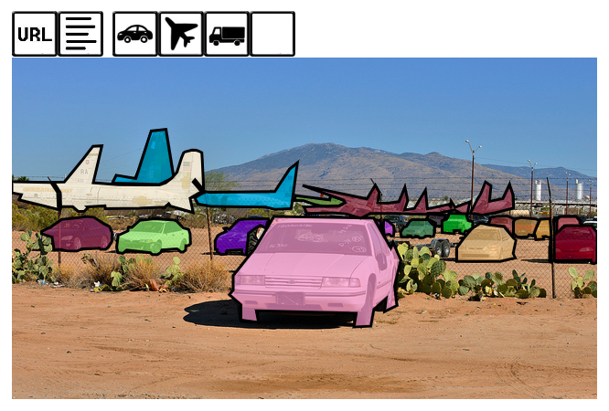
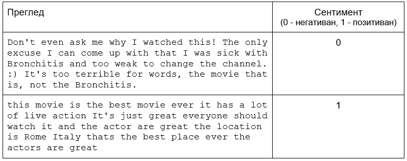
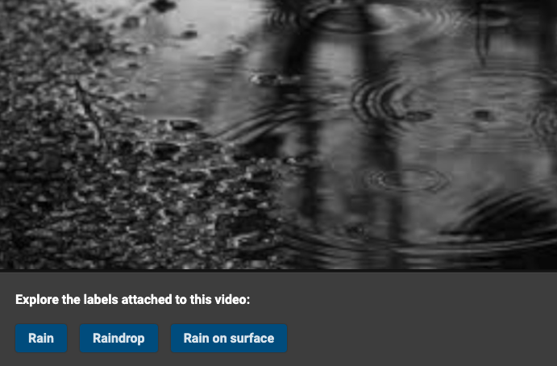
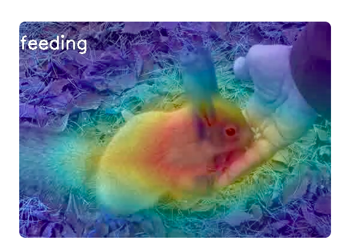

Популарни скупови података
==========================

.. infonote::

 Можда ће те изненадити, али и скупови података могу бити популарни! Неки од њих су познати по томе што се користе у првим задацима машинског 
 учења, док су неки своју популарност постигли истрајним ангажманима заједнице да их прошири и допуни. Како различити скупови података прате 
 различите домене вештачке интелигенције, овде ћемо то искористити као критеријум за груписање и њихов приказ. Наиме, упознаћемо скупове који 
 садрже слике, текстуалне податке, аудио архиве и видео-записе. Велики број библиотека које се користе у области машинског учења, омогућава брзо 
 и лако учитавање скупова о којима ћемо говорити. 

Рачунарски вид
~~~~~~~~~~~~~~

МNIST
`````

Свакако један од најпопуларнијих скупова у области рачунарског вида је МNIST, скуп слика руком писаних цифара. Његов развој је започео Национални 
институт за стандарде и технологију Америке (енгл. National Institute of Standards and Technology, NIST) још 1998. године. Све слике су формата 
28x28 пиксела, црно-беле су боје и има их укупно 70 хиљада: 60 хиљада слика чини скуп за тренирање а 10 хиљада слика скуп за тестирање. На слици 
можеш видети неке од цифара из овог скупа података



*Неке од цифара скупа МNIST*

|

Скуп МNIST се користи за обучавање вишекласних класификатора, најчешће у комбинацији са конволутивним неуронским мрежама о којима ћеш чути нешто 
више у наставку курса. 

.. questionnote::

 За сваку цифру скупа MNIST предвиђена је по једна класа. Размисли које су цифре потенцијално проблематичне за разликовање (на пример, цифре 1 и 7 
 могу јако личити једна на другу), а потом покушај да пронађеш неке примере на вебу. 

**Уколико остане времена, додати визуелизацију са редукованим димензијама:  https://colah.github.io/posts/2014-10-Visualizing-MNIST/**

ImageNet
`````````

Слике у скупу ImageNet представљају слике општих објеката: рачунара, прозора, авиона, садница, тропских животиња и разних других ентитета. 
Занимљиво је да су ове слике организоване у сродне групе (такозване синсете) између којих важи однос родитељ-дете. На пример, сви једрењаци 
припадају једној групи (једном синсету), у хијерархији испод њих се налазе групе једрилица и тримарана, док се у хијерархији изнад налазе групе 
водених пловила, пловила и возила.  На слици, у доњем реду, можеш испратити ову хијерархију: на њеном дну су тримарини, а на врху возила. У горњем 
реду су синсети који се односе на псе и неке њихове категоризације.



*Пример слика скупа ImageNet*

|

Скуп тренутно садржи око 14 милиона слика и преко 21 хиљада синсета. Користи се у разним задацима класификације слика и детекције објеката на сликама.

Званични сајт скупа ImageNet je https://www.image-net.org/index.php. На његовом развоју активно раде истраживачи са универзитета Стенфорд и Принстон.

.. questionnote::

 Покушај да пронађеш којој групи припада рачунар и које се то групе налазе у хијерархији испод и изнад
 
COCO
````
Скуп података COCO (Common Objects in Context) се користи у задацима детекције објеката, сегментације слика и аутоматског придруживања наслова 
сликама. Креирала га је компанија Мајкрософт и поделила са заједницом 2015. године.  



*Једна слика скупа COCO са означеним препознатим објектима: авионима, камионима и аутомобилима*

|

Скуп се интерактивно може прегледати на званичном сајту: за сваку слику доступан је  URL са којег је слика преузета, неколико наслова придружених 
слици, а затим и низ иконица које одговарају препознатим објектима. Број слика у скупу података је 330 хиљада и садржи 80 категорија објеката са 
преко 1,5 милиона инстанци. Линк до секције за претраживање на сајту је https://cocodataset.org/#explore.

Обрада природних језика
~~~~~~~~~~~~~~~~~~~~~~~

IMDB
````

Ако волиш да гледаш филмове и серије, биће ти занимљив скуп података IMDB који садржи прегледе корисника са популарне платформе IMDB. 
За сваки преглед у овом скупу података позната је и информација да ли је он позитиван или негативан тј. да ли примарно садржи нешто похвално и 
добро о филму или неку критику и замерку. Када је реч о скуповима података који садрже текстуалне садржаје, увек је важно нагласити на ком језику 
су написани. Скуп података IMDB садржи прегледе који су на енглеском језику и то укупно 50 хиљада прегледа, 25 хиљада позитивних и 25 хиљада 
негативних прегледа. Испод можеш да видиш по један позитиван и негативан унос у овом скупу података.



*Једна слика скупа COCO са означеним препознатим објектима: авионима, камионима и аутомобилима*

|

Скуп података IMDB се користи у задацима анализе сентимената - подсетимо се да су то задаци у којима је потребно препознати емоцију или став 
присутан у тексту. Како скуп садржи само информацију да ли је преглед позитиван или негативан, задатку анализе сентимената у IMDB скупу приступамо 
као проблему бинарне класификације. У општем случају, скала за изражавање сентимента може да буде финија и садржи оцене попут врло позитивно, 
позитивно, неутрално, негативно или врло негативно. 

Обрада звука
~~~~~~~~~~~~

AudioSet
````````

AudioSet је скуп података који садржи исечке видеа са платформе YouTube у трајању од 10 секунди. Сваком од ових исечака придружена су обележја 
звукова који се у њима чују. Скуп је креирала компанија Google и садржи преко 2 милиона исечака у укупном трајању од 5,8 хиљада сати.



*Пример видео исечка са придруженим обележјима звукова које садржи https://research.google.com/audioset/ontology/water_1.html*

|

Званични сајт скупа омогућава преглед примера и увид у организацију скупа. Користе се 632 различите категорије попут звукова музичких инструмената, 
звука ветра, човековог гласа, буке и слично. Можеш да посетих адресу https://research.google.com/audioset/index.html и преслушаш још неке примере. 
Сам скуп је креиран са идејом да подржи развој алгоритама за препознавање звукова. 

Обрада видеа
~~~~~~~~~~~~

Moments in Time
```````````````

Moments in Time је скуп података који се развија са идејом да помогне системима вештачке интелигенције да нуче да препознају радње и догађаје. 
Овај скуп тренутно садржи милион видеа у трајању од 3 секунде у којем су обележене активности. Видеи садрже људе, животиње, објекте и природне 
појаве.  Само неки од догађаја који су покривени су плесање, вежбање, пењање на дрво, скок у воду и спавање.

Скуп Moments in Time развија тим са Масачусетског института технологије (МИТ) и на званичном сајту пројекта можеш да видиш још неке примере 
видеа и препознатих радњи. Линк до званичног сајта је http://moments.csail.mit.edu/. 



*Видео у којем је препознато да човек храни зеца*

|
