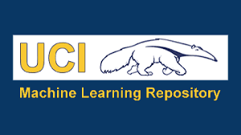
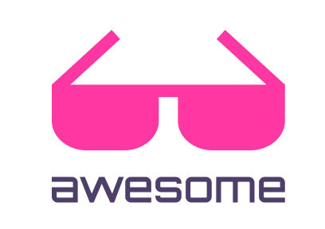

Јавно доступни скупови података
===============================

.. infonote::

 Због популарности дисциплина које су засноване на подацима, постоји велики број јавно доступних скупова података. Ипак, као и у другим 
 областима, и овде је пожељно да водимо рачуна о релевантности извора, квалитету података и лиценцама које прате њихову употребу. У наставку 
 се налази листа репозиторијумима који могу бити од користи у процесу учења. 

UCI
~~~

Један од првих репозиторијума за дељење података у заједници која се бави машинским учењем је репозиторијум Универзитета у Калифорнији Ирвин 
(енг. *University of California, Irvine*, UCI). Овај репозиторијум је креиран још 1987. године и садржи око 600 скупова података који се користе 
у почетним задацима машинског учења. Скупови података су разврстани по областима (друштвене науке, рачунарство, бизнис и слично), задацима за које 
су погодни (регресија, класификација, кластеровање), типовима атрибута које садрже (нумерички, категорички, комбиновани), као и по броју инстанци. 
Званични линк репозиторијума је `https://archive.ics.uci.edu/ <https://archive.ics.uci.edu/>`_. 

.. questionnote::

 Упознај скупове *Iris* и *Breast Cancer Wisconsin*, два врло популарна скупа података, који се користе у задацима класификације. 

*Лого репозиторијума UCI*

-------

Kaggle
~~~~~~

Платформа *Kaggle* окупља професионалце и ентузијасте у свету машинског учења и науке о подацима. На овој платформи можеш пронаћи велики број јавно 
доступних скупова података који су организовани по различитим критеријумима (домен примене, тежина задатка, врста задатка и слично). У највећем броју 
случајева можеш да видиш и примере експеримената у форми Jupyter свезака које их прате, што може бити врло корисно у процесу учења и упознавања 
технологија. На платформи *Kaggle* можеш и да отвориш налог и да користиш Jupyter свеске у облаку. Овај начин рада има погодности јер олакшава 
инсталацију пропратних алата и подешавање окружења, баш као и платформа *Google Colab*. Занимљиво је и да се платформа *Kaggle* користи за организовање такмичења и заједнички рад на 
важним проблемима. Један такав пример је креирање модела који могу да предвиде стања пацијената инфицираних ХИВ-ом. 

Линк до платформе *Kaggle* је `https://www.kaggle.com/ <https://www.kaggle.com/>`_. 

.. questionnote::

 Пронађи и упознај скуп података *Boston Housing*, који се врло често користи као почетни скуп у регресионим задацима.

*Лого платформе Kaggle*

-------

Awesome Public Datasets
~~~~~~~~~~~~~~~~~~~~~~~

Још један занимљив извор података је репозиторијум *Awesomе Public Datasets* на платформи *GitHub*. Репозиторијум тренутно има преко 55.000 звездица и 
представља нешто неформалнији извор квалитетних отворених скупова података које одржава заједница. На репозиторијуму су скупови података 
систематизовани по областима као што су спорт, едукација, агрикултура, биологија, здравство, астрономија, музеологија и многе друге. Највећи број 
скупова података је и бесплатан. Линк до репозиторијума је `https://github.com/awesomedata/awesome-public-datasets <https://github.com/awesomedata/awesome-public-datasets>`_. 

*Лого репозиторијума Awesomе Public Datasets*

-------

.. questionnote::

 Пронађи и упознај неки скуп података из области које волиш и промисли да ли би и ти укључио сличне атрибуте. 

Портал отворених података Републике Србије
~~~~~~~~~~~~~~~~~~~~~~~~~~~~~~~~~~~~~~~~~~

Република Србија од 2018. године учествује у  програму отворених података, који подразумева дељење података, без угрожавања поверљивости и 
приватности, у поседу државних органа Републике Србије. Ту се убрајају Влада, министарства, регулаторна тела, локалне самоуправе и 
многе друге организације. Овакви подаци се деле са идејом да се транспарентно укаже на све активности државних органа, као и да се створи 
креативан простор за унапређивање квалитета постојећих услуга и информисанијег формулисања и спровођења јавних политика.

|

Линк до портала отворених података је `https://data.gov.rs/sr/ <https://data.gov.rs/sr/>`_ и на њему можеш пронаћи скупове података о квалитету ваздуха, 
промету и потрошњи лекова, свим студијским програмима на универзитетима и многе друге. 

.. questionnote::

 На порталу отворених података постоји и секција ”Примери употребе”. Истражи апликације које су развијене коришћењем отворених података и одабери 
 свог фаворита. 

