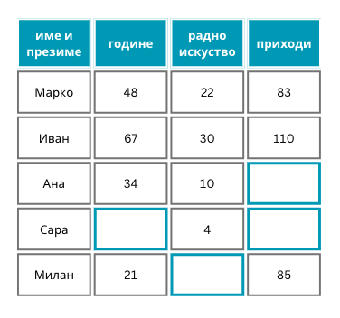

Експлоративна анализа скупа података
====================================

.. infonote::

 Сусрет са новим скупом података је попут излета у ново место. Потребно је да га пажљиво истражиш, откријеш где се шта налази и какве везе постоје 
 између различитих делова. У овој секцији ћеш упознати пар техника које ће ти помоћи у овој авантури са подацима.  

Сваки задатак машинског учења започињемо упознавањем скупа података. Ако користимо табеларне податке, интересује нас који се то атрибути 
појављују, какве вредности имају и да ли су можда неки од њих повезани. Када радимо са другим типовима података, рецимо текстуалним, 
обично нас интересује да ли су сви текстови написани на истом језику и колика је њихова дужина. Пошто ни један скуп података није савршен, 
у анализама покушавамо да пронађемо и потенцијалне дупликате и неке атипичне уносе. Све ове задатке једним именом зовемо **експлоративна анализа скупа података** 
(енгл. *Exploratory Data Analysis*, EDA). Њен циљ је да нам кроз разноврсан скуп задатака помогне да што боље упознамо скуп података 
и да информисаније донесемо даље одлуке које се тичу припреме података. С обрзиром на важност података у даљим корацима (сетимо се изреке 
”ђубре на улазу, ђубре на излазу”), трудимо се да експлоративној анализи скупа података посветимо довољно времена и да пређемо на следећи корак 
тек када смо сигурни да разумемо податке.

.. figure:: ../../_images/ea1.png
    :width: 780
    :align: center

*Задаци експлоративне анализе података*

-------

Анализа атрибута
~~~~~~~~~~~~~~~~

С обзиром да се атрибути користе да опишу најразличитија својства, њихови типови и опсези вредности се разликују. Две велике групе атрибута које 
сусрећемо су **нумерички** (квантитативни) и **категорички** (квалитативни) атрибути. Нумерички атрибути имају, како се наслућује из имена, 
нумеричке вредности. Такви су, на пример, висина играча, удаљеност од аеродрома, број кућних љубимаца, спољна температура, број продатих 
сладоледа, концентрација глукозе у крви и многи други. За овакве атрибуте приликом анализе обично пратимо опсеге вредности, највећу и најмању 
вредност, просечну вредност, медијану, као и саму дистрибуцију. Све ове анализе зовемо **дескриптивним анализама** јер нам помажу да опишемо величину 
којој је придружен атрибут. 

*Примери неких дескриптивних анализа атрибута скупа података Ирис*

-------

Категорички атрибути су врста атрибута који могу да имају коначан скуп вредности. Такви атрибути су, рецимо, боја аутомобила, врста одевног 
предмета, пол пацијента, тренутно годишње доба и други. Ови атрибути се обично представљају нискама (стринговима) или еквивалентним нумеричким 
кодовима. Рецимо, месец у години можемо навести као име ”фебруар” или као број два (јер је фебруар други месец у години). Важно је да приметимо 
да, чак и ако користимо нумеричке кодове за представљање ових атрибута, нема смисла рачунати вредности као што су просек или максимум јер ове 
вредности нису у својој бити нумеричке. За њих обично анлизирамо које све вредности могу да узму и колико често се појављују и те закључке 
приказујемо помоћу графикона.  

*Пример анализе атрибута age у скупу Титаник*

-------

Унификовање вредности
~~~~~~~~~~~~~~~~~~~~~

У току анализе података можемо да откријемо да вредности атрибута нису униформно задате. На пример, може се десити да су имена боја писана 
неконзистентно, некада малим а некада великим словима, или да су датуми задати у различитим форматима као дан-месец-година и година/месец/дан. 
Да бисмо задатак анализе могли коректно да спроведемо, пожељно је да ове вредности унификујемо тј. сведемо их на исти начин представљања. 
Обично постоји неки начин који је пожељнији или кориснији, али је се често може десити и да су избори сасвим равноправни. 

Недостајуће вредности
~~~~~~~~~~~~~~~~~~~~~

Приликом анализе скупа података можемо да приметимо да вредности неких атрибута недостају. То може бити последица непажње приликом уноса података 
или просто недоступности информације. Такве вредности у скупу података називамо недостајућим вредностима (енгл. *missing values*). 

*Пример скупа са недостајућим вредностима*

(слика је преузета са https://gallery.azure.ai/Experiment/Methods-for-handling-missing-values-1)

-------

Најједноставнији корак који можемо да предузмемо када приметимо недостајуће вредности је да обришемо или атрибуте (колоне скупа података) или 
инстанце (врсте скупа података) у којима се оне појављују. На пример, уколико за више од 50% инстанци неког скупа података не знамо вредност 
атрибута, има смисла обрисати га. Ако, са друге стране, имамо свега неколико инстанци у којима вредност атрибута недостаје, најбоље је да 
обришемо инстанце а задржимо атрибут. Одлуке овог типа, ипак, нису увек једноставне. На пример, може се десити да у различитим инстанцама 
недостају различите вредности атрибута па да на овај начин обришемо и занемаримо значајан број инстанци, што може бити проблематично ако не 
располажемо великим скупом података. Зато има смисла размотрити још неке могућности у раду са недостајућим вредностима.

Уколико је атрибут који недостаје нумерички, на пример, удаљеност до аеродрома или висина играча, недостајуће вредности можемо заменити просечном 
вредношћу познатих вредности. Аргумент који имамo за овакав избор је да ћемо искористити информације које већ постоје у скупу података и да 
нећемо пуно променити нека друга својства атрибута.  Са друге стране, ако је реч о категоричким атрибутима као што су боја аутомобила или земља 
производње, који могу имати коначан скуп вредности, недостајућу вредност можемо заменити најчешћом вредношћу. Још једна могућност која је валидна 
и за нумеричке и категоричке атрибуте је коришћење насумичних вредности - тако недостајућу боју можемо заменити насумичном бојом из могућег скупа 
боја а недостајућу висину играча неком вредношћу из опсега најмање и највеће висине у скупу. У свим случајевима морамо бити пажљиви јер промене 
података могу да утичу на успешност модела и резултате које добијамо. Врло је важно и у ком тренутку вршимо ове поправке. О томе ће још бити речи 
у наставку.

Дупликати
~~~~~~~~~

Присуство дупликата у скупу података може да утиче на моћ генерализације модела.  Зато је увек згодно да проверимо да ли међу подацима има оних 
који се понављају или су јако слични. Када је реч о табeларним подацима, дупликате можемо пронаћи директним упоређивањем вредности атрибута. 
У раду са другачијим типовима података обично су нам потребне напредније технике. Рецимо, слике дупликати могу да буду симеричне као у огледалу, 
било хоризонтално било вертикално. Слично је и са текстуалним подацима. Две новинске вести могу да садрже исту објаву (преносе неке новинске 
агенције) уз нешто другачије наслове па су у смислу директног упоређивања карактера различите а ипак исте. 

Уочавање изузетака
~~~~~~~~~~~~~~~~~~

Уочавање података који су на неки начин другачији од преосталих нам омогућава да уочимо грешке у подацима или откријемо неке нова, атипична, 
понашања. Такве податке зовемо изузецима или одударајућим подацима (енгл. outliers). Удаљеност од аеродрома која износи -1.2км би била одударајући 
податак јер очекујемо да удаљеност буде нека позитивна вредност. Тако бисмо могли да уочимо грешку и исправимо је. Са друге стране, температура 
чија је вредност 45℃ је, такође, нека неуобичајена вредност али реална услед климатских промена и можда врло корисна као информација за 
предузимање неких корака и радњи. 

*Графички приказ одударајућег податка*

-------

Одударајући подаци могу да утичу и на резултат алгоритама машинског учења. Зато је, након што се уоче и обраде, важно одлучити да ли их треба 
задржати или обрисати. 

Корелација атрибута
~~~~~~~~~~~~~~~~~~~ 

Атрибути између себе могу да буду повезани. Повезаност можемо да приметимо уколико нацртамо график који дуж x-осе има вредност једног атрибута а 
дуж y-осе вредност другог атрибута. На пример, можемо да пратимо парове атрибута спољна температурапа и број продатих сладоледа, спољна 
температура и потрошња струје и спољна температура и број књига у библиотеци. Нека сваком од ових парова одговара график као на доњој слици. 
Можемо да приметимо да пораст температуре прати и пораст броја продатих сладоледа. Уколико пораст вредности једног атрибута прати пораст вредности 
другог атрибута за њих кажемо да су позитивно корелисани. На графику можемо да приметимо и да је ова зависност линеарна тј. да прати неку 
замишљену праву која пролази кроз скуп тачака. Са друге стране, делује да је ситуација са спољном температуром и потрошњном струје нешто 
другачија тј. да пад температуре прати већа потрошња струје, вероватно услед коришћења грејних тела. За атрибуте код којих пораст вредности 
једног атрибута прати пад вредности другог атрибута кажемо да су негативно корелисани. Са графика можемо да закључимо, опет, и да је ова врста 
корелисаности линеарна. Трећи график који приказује спољну температуру и број књига у библиотеци не указује на неку, барем не очигледну, 
законитост између атрибута. Свакако можемо да закључимо да ови атрибути нису линеарно корелисани.  

*Графици повезаности атрибута*

-------

За мерење линеарне повезаности атрибута можемо да користимо и различите врсте коефицијената који су устаљени у домену математичке статистике. 
Један такав коефицијент је Пирсонов корелациони коефицијент. Његове вредности се крећу у распону од -1 до 1 и указује истовремено и на правац и 
на јачину повезаности. Вредности коефицијента које су ближе броју -1 указују на негативну корелисаност, вредности коефицијента ближе броју 1 
указују на позитивну корелисаност, док вредности око нуле указују на одсуство линеарне корелисаности.

Уобичајено је да се вредности корелационих коефицијената између атрибута приказују графички у форми такозване топлотне мапе. Сваки квадратић у 
овој мапи одговара једном пару атрибута и његова боја је прилагођена вредности корелационог коефицијента. Стубић који се налази са стране ове 
мапе повезује вредности и нијансе боја. Посматрајући ову мапу можемо лако да уочимо повезаности у подацима. На доњој слици су приказани парови 
атрибута једног скупа података који обједињује информације о запосленима. Иако мало знамо о овом скупу, можемо да закључимо да искуство 
(атрибут *experience*) и број година (атрибут *age*) најбоље прате вредности зараде (атрибут *salary*). Такође, можемо да приметимо да постоји 
повезаност између број година (атрибут *age*) и искуство (атрибут *experience*).

.. figure:: ../../_images/ea7.png
    :width: 600
    :align: center

*Топлотна мапа са вредностима корелационог коефицијента*

-------

Уочавање атрибута који су повезани нам омогућава да, пре свега, боље разумемо домен на који се подаци односе. Неке повезаности могу бити очекиване 
док нам неке могу донети нова сазнања. Брисањем атрибута који су повезани, можемо да смањимо димензионалност скупа података. На тај начин можемо 
убрзати рад неких алгоритама и лакше разумети резултате. Постоје и алгоритми машинског учења који се не понашају добро уколико у скупу података 
постоје повезаности - брисањем атрибута за које ово важи може да се унапреди успешност алгоритма. 

