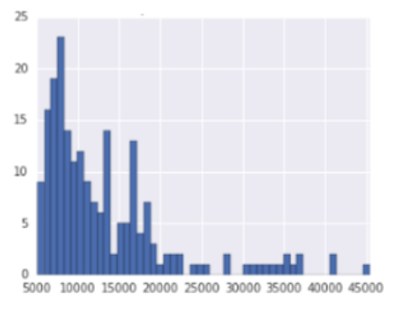
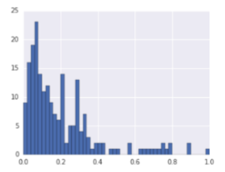
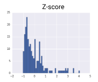
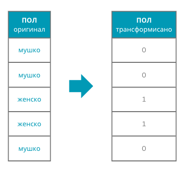
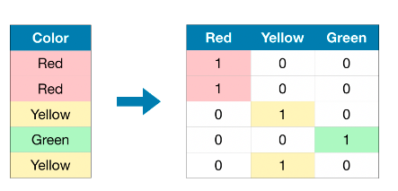

Креирање репрезентације скупа података
======================================

.. infonote::

 Након експлоративне анализе скупа података можемо да донесемо одлуке о томе које атрибуте и инстанце да одбацимо. Преостали скуп података 
 треба да припремимо тако да над њиме можемо да применимо неки од алгоритама машинског учења. У зависности од типа атрибута и скупа вредности 
 које садржи у наставку можеш да прочиташ о неким техникама припреме. У наредној лекцији ћеш научити када је заправо идеални тренутак да то урадиш.

Припрема нумеричких атрибута
~~~~~~~~~~~~~~~~~~~~~~~~~~~~

У раду са нумеричким атрибутима сусрећемо се са величинама које се изражавају на различитим скалама вредности. Рецимо, у једном скупу медицинских 
података могу постојати лабораторијске анализе са вредностима у распону од 0 до 1 и информација о висини пацијента изражена у центриметрима која 
је значајно већа, од 100 до 250. Многи модели машинског учења су осетљиви на приство оваквих атрибута па им због тога треба више времена да 
пронађу решење. Додатно, није лако интерпретирати резултате који се добијају у оваквој поставци. Зато у раду са нумеричким подацима користимо 
технике нормализације које нам поможу да скуп вредности атрибута доведемо на исте опсеге вредности.  

|

Једна таква нормализација је *min-max* нормализација. Да бисмо појаснили како се спроводи,  претпоставимо да треба да нормализујемо вредност 
атрибута :math:`X` којим се изражава висина пацијената.  Нека :math:`X_{max}=180` означава највећу висину пацијената а :math:`X_{min}=110` најмању. Нормализација min-max се 
спроводи тако што се над сваком вредношћу атрибута :math:`x` примени формула :math:`\frac{x - X_{min}}{X_{max} - X_{min}}`. Ако је :math:`x=165`, нова нормализована вредност ће износити 
:math:`x'=\frac{165 - 110}{180 - 110}=0.786`. На овај начин вредност атрибута сводимо на опсег од 0 до 1.   

|

Посебан вид нормализације је стандардизација. Она подразумева центрирање вредности атрибута око нуле и скалирање на јединичну варијансу. Да бисмо 
појаснили како се спроводи, можемо опет претпоставити да треба да нормализујемо вредност атрибута :math:`X` којим се изражава висина пацијената. Нека је 
сада :math:`X_{mean}=153.2` просечна висина у скупу података и :math:`\sigma=40.23` стандардна девијација. Стандардизација се спроводи тако што се над сваком вредношћу 
атрибута :math:`x` примени формула :math:`\frac{x - X_{mean}}{\sigma}`. Нова стандардизована вредност за пацијента чија је висина :math:`x=165` сада износи :math:`x'=\frac{165 - 153.2}{40.23}=0.293`. 

.. csv-table:: 
   :widths: auto
   :align: center
   
   "|repr1|", "|repr2|", "|repr3|"
   "оригинални скуп", "min-max нормализација","стандардизација"
  
*Eфекат нормализације и стандардизације на скуп података*

Припрема категоричких атрибута 
~~~~~~~~~~~~~~~~~~~~~~~~~~~~~~

С обзиром да алгоритми машинског учења могу да се примене само над бројевима,  категоричи атрибути захтевају посебну припрему.  За њих смо 
рекли да представљају величине које имају коначан број вредности и да се често појављују у форми ниски. Неки од примера које смо поменули су 
име боје, пол пацијента и месец у години. 

|

Уколико атрибут има само две вредности, на пример, представља пол пацијента, његове вредности обично мапирамо у бројеве 0 или 1. Рецимо вредност 
”женско” можемо мапирати у број 1, а вредност ”мушко” у број 0. Овакве атрибуте иначе зовемо бинарним атрибутима.

*Пример мапирања вредности*

-------

За атрибуте који могу да имају већи број вредности користимо *one-hot* кодирање. Да бисмо појаснили његово значење, можемо посматрати атрибут који 
представља боју и који може имати три вредности: црвено, жуто и зелено. Идеја је да полазни атрибут боја представимо користећи три нова атрибута 
од којих ће сваки одговарати по једној од вредности коју боја може да узме: црвено, жуто и зелено (баци поглед на слику, ово је била компликована 
реченица). То даље значи да ћемо сваку од вредности полазног атрибута трансформисати у тројку вредности и то вредност *црвeна* у тројку *1*, *0*, *0*, 
вредност *жута* у тројку *0*, *1*, *0* и вредност *зелена* у тројку *0*, *0*, *1*. Тројке се, као што видимо, састоје од нула и тачно једне јединице у колони која 
одговара вредности атрибута. 

*Пример one-hot кодирања*

-------

Репрезентација скупа података
~~~~~~~~~~~~~~~~~~~~~~~~~~~~~

Након корака трансформације атрибута стижемо до финалног облика података који можемо да искористимо за покретање алгоритама учења. Тај финални 
облик зовемо репрезентацијом скупа података. У причи до сада смо покрили, пре свега, како се стиже до репрезентације табеларних података. 
И за све друге врсте података као што су слике, аудио-записи, текст, видео садржаји, али и комплексне структуре као што су графови, потребно 
је да креирамо одговарајуће репрезентације. У делу са неуронским мрежама упознаћемо још неке начине креирања репрезентација. 

