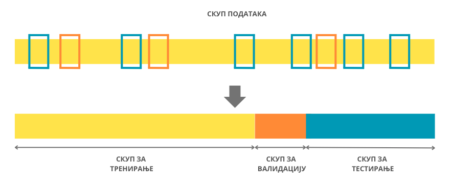
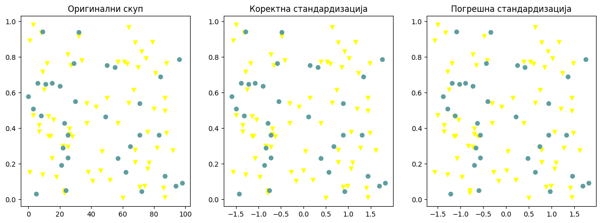
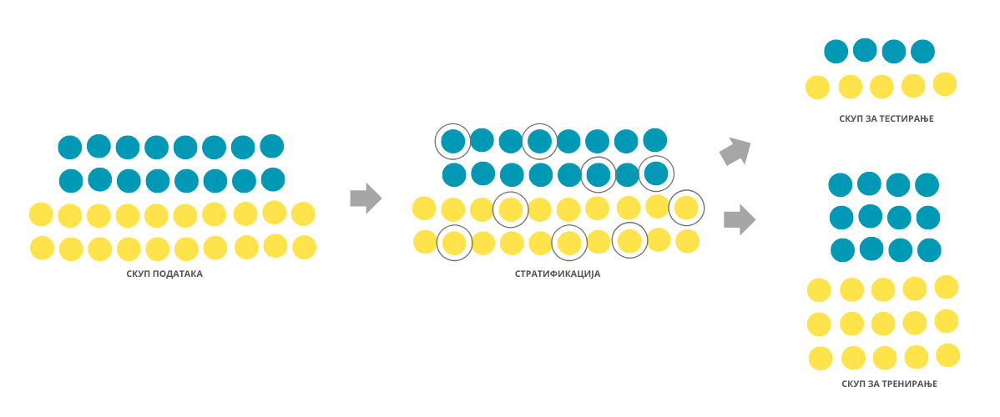

Скупови за тренирање, валидацију и тестирање
============================================

.. infonote::

 У овој лекцији ћеш упознати скупове за тренирање, валидацију и тестирање. О скупу за тренирање можеш да размишљаш као о литератури из које модел 
 машинског учења учи, док скуп за тестирање можеш да замислиш као контролни задатак који проверава колико добро је модел научио и разумео потребно 
 градиво. Скуп за валидацију се користи у процесу учења модела и можеш да га замислиш као скуп мањих тестова којима се проверава колико је модел 
 заправо спреман за контролни и на основу чијих резултата модел може да поправи начин и успешност учења.

Након што се анализирају подаци и одаберу одговарајуће инстанце и атрибути, скуп свих података се дели на **скуп за тренирање** 
(енгл. *training set*) и **скуп за тестирање** (енгл. *test set*). Као што се може наслутити из имена скупа, скуп за тренирање се користи за 
тренирање самог модела машинског учења. Над њим се примењује одабрани алгоритам и креира сам модел. Скуп за тестирање се користи за тестирање 
модела тј. израчунавање подесних мера квалитета модела. Захваљујући њему може објективно да се оцени колико добро је модел научио потребни 
задатак. Обично један део података полазног скупа користимо и за креирање **скупа за валидацију** (енгл. *validation set*). Скуп за валидацију се 
користи за праћење процеса тренирања модела и одређивање неких конфигурација модела које доводе до бољих мера квалитета. О овим темама ће још 
бити речи у наставку курса. 

*Подела скупа података на скуп за тренирање, скуп за валидацију и скуп за тестирање*

(слика је преузета са https://towardsdatascience.com/how-to-split-data-into-three-sets-train-validation-and-test-and-why-e50d22d3e54c)

-------

Скупови за тренирање, валидацију и тестирање се по правилу креирају насумичном поделом полазног скупа података. Прво дефинишемо колико велики 
треба да буду ови скупови, а потом насумично бирамо инстанце које ће се наћи у сваком од њих. Обично је скуп за тренирање највећи док су скупови 
за тестирање и валидацију мањи јер желимо да имамо довољно података да обучимо модел али и довољно података да адекватно оценимо његове 
перформансе. Пракса је да се односи величина ових скупова изражавају пропорцијом. На пример, често ће се наћи однос скупа за тренирање и однос 
скупа за тестирање изражен као 2:1 што би значило да две трећине полазног скупа чини скуп за тренирање а једна трећина скуп за тестирање. Слично, 
пропорција 2:1:1 би значила да се две четвртине (тј. једна половина) полазног скупа користе као скуп за тренирање а по једна четвртина као скуп за 
валидацију и тестирање.  

Иако је згодно што се скупови за тренирање, валидацију и тестирање креирају насумично, ипак би значио и неки увид у то како је ова подела 
извршена. На пример, када желимо да поновимо експеримент или омогућимо другима да га самостално изведу (ово је важно својство експеримената и 
зове се репродуцибилност), пожељно је да се користе исти скупови за тренирање, валидацију и тестирање. Слично, када решавамо задатак, нисмо баш 
одмах сигурни шта је најбоље урадити па испорбавамо већи број алгоритама и креирамо већи број модела. Због коректности упоређивања значило би да 
све моделе креирамо над истим скупом за тренирање и оцењујемо над истим скупом за тестирање. Зато је добро на нивоу библиотеке са којом се ради 
подесити параметар који утиче на случајност поделе (обично се зове random seed и има исту сврху као подешавање семена код генератора случајних 
бројева) или просто у старту извршити поделу података и надаље је конзистентно користити. Неки често коришћени скупови података имају ове 
предефинисане поделе на скуп за тренирање, валидацију и тестирање (на пример, можеш да погледаш скуп *MNIST*). 
 
Важно својство које треба да испуне скупови за тренирање, валидацију и тестирање је да буду дисјунктни. То значи да свака инстанца полазног скупа 
података приликом креирања скупова за тренирање, валидацију и тестирање мора припасти тачно једном од ових скупова, не смеју постојати пресеци и 
заједничке инстанце. Подсетимо се да се од модела машинског учења очекује да добро генерализују тј. да се добро понашају за нове инстанце које 
модел није имао прилике да сусретне у скупу за тренирање. Уколико се скупови за тренирање и скупови за тестирање преклапају, нећемо бити у 
могућности да објективно оценимо да ли модел заиста учи или меморише тј. памти информације из скупа за тренирање. Слично важи и за однос скупа за 
тренирање и скупа за валидацију: функција скупа за валидацију је да помогне у одабиру конфигурација које ће учење учинити што успешнијим. Уколико 
се ови скупови преклапају, нећемо бити у могућности да објективно и непристрасно оценимо понашање модела и одаберемо подесне конфигурације. 

Услов да скупови за тренирање, валидацију и тестирање треба да буду дисјунктни значи и да се информације из једног од скупова никако не смеју 
преливати на друге скупове. Ово је посебно важно приликом примене техника претпроцесирања и припреме скупова. Размотримо следећи пример. Поменули 
смо да се због осетљивости модела машинског учења на вредност атрибута често врши стандардизација нумеричких атрибута. Неко може приступити овој 
трансформацији тако што ће на основу целог скупа израчунати средњу вредност и стандардну девијацију, а затим је искористити, редом, за 
стандардизацију скупова за тренирање и тестирање. Како не би дошло до преливања информација, коректан редослед ових корака је заправо следећи:

1. подела скупа података на скуп за тренирање и тестирање, 
2. израчунавање средње вредности и стандардне девијације само на скупу за тестирање, 
3. трансформација скупа за тренирање користећи израчунате вредности, 
4. трансформација скупа за тестирање користећи овако израчунате вредности.

Због жеље да не погреши, неко може размишљати и на следећи начин: након што поделим полазни скуп података на скуп за тренирање и скуп за 
тестирање, извршићу посебно стандардизацију скупа за тренирање и скупа за тестирање. И овај приступ, иако опрезнији, није коректан јер доводи до 
модификације скупа за тестирање.  На доњој левој слици црвени троуглићи представљају инстанце скупа за тренирање, а плави кругови инстанце скупа 
за тестирање.  Слика у средини представља ове инстанце након коректне стандардизације (можеш пажљиво да упредиш слике и распоред тачака - скала 
дуж x-осе се променила услед стандардизације, све друге је остало исто). На десној слици можеш да видиш инстанце након што се стандардизација 
засебно изврши над скупом за тренирање и скупом за тестирање - просторни распоред се сада прилично променио.  

*Примери коректне и погрешне стандардизације*

-------

Приликом поделе полазног скупа података било би идеално да очувамо пропорције у односу на вредности атрибута и вредност циљне променљиве. 
На пример, уколико је у скупу медицинских података однос мушких и женских пацијената 4:5, било би идеално да, након поделе, у скупу за тренирање 
и у скупу за тестирање однос пацијената буде приближно 4:5. Технике које омогућавају овакву врсту поделе називамо техникама **стратификације**. 
Ипак, због броја атрибута и њихових комбинација, у пракси ово често није реалистичан захтев па се најчешће инсистира на пропорционалности у 
односу на вредности циљне променљиве.  О овој теми ћемо посебно разговарати у контексту задатка класификације.

*Стратификовани скупови за тренирање и тестирање*

(слика је преузета са https://www.baeldung.com/cs/ml-stratified-sampling)

-------

.. questionnote::

 Шта мислиш, да ли присуство дупликата може да утиче на коректност креирања скупова за тренирање, валидацију и тестирање?

.. reveal:: 531
    :showtitle: Прикажи одговор
    :hidetitle: Сакриј одговор

    Дупликати, поготово ако су многоброни, могу да утичу на коректност протокола учења зато што се дуплиране инстанце могу појавити и у скупу за 
    тренирање и у скупу за тестирање и утицати на објективност оцене. 

.. questionnote::

 Да ли имаш идеју шта би била коректна подела временских података на скупове за тренирање, валидацију и тестирање?

.. reveal:: 532
    :showtitle: Прикажи одговор
    :hidetitle: Сакриј одговор

    Сви подаци у скупу за тренирање би требали да претходе свим подацима из скупа за валидацију, а сви они заједно подацима из скупа за тестирање.

