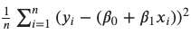
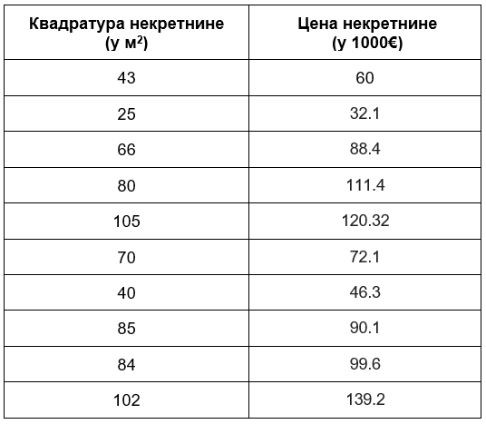
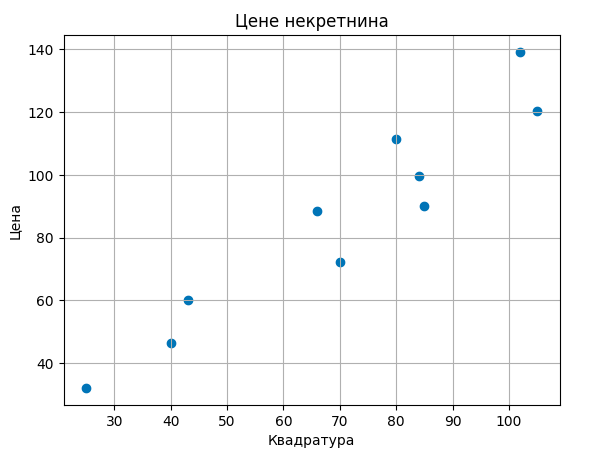
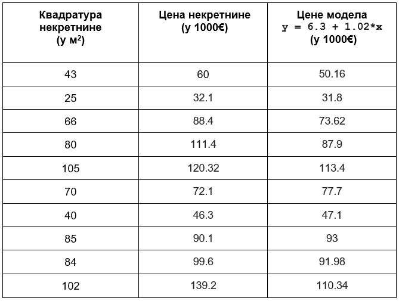
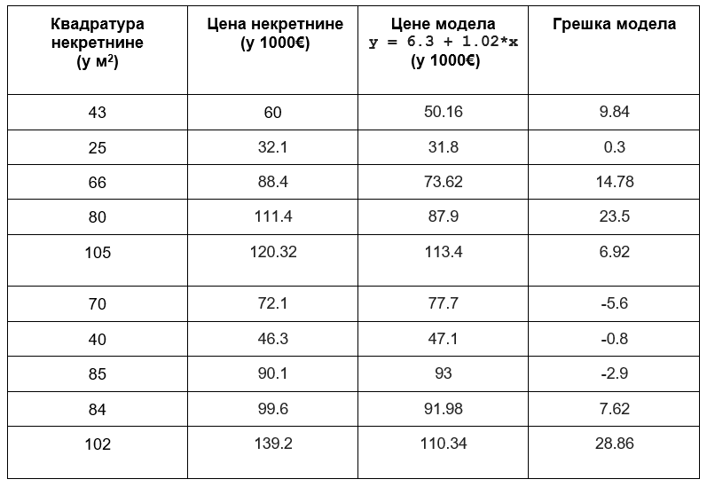
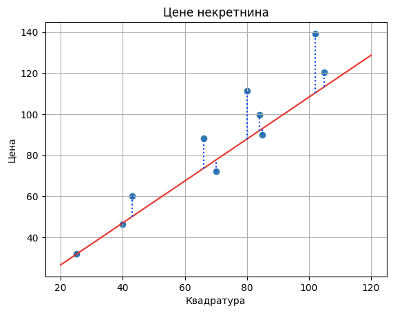

Линеарна регресија
==================

.. |open| image:: ../../_images/algk2.png
            :width: 100px

Вратимо се сада на пример који смо користили за упознавање парадигме програмирања вођеног подацима. У скупу података имали смо информације о 
квадратури некретнина и њиховим ценама, а наш задатак је био да научимо везу између ових вредности тако да можемо да процењујемо цене за нове 
некретнине. 

Једноставности ради, нека буде да располажемо скупом за тренирање који садржи 10 инстанци које су пописане у доњој табели: 

Ове инстанце можемо да прикажемо и графички. Дуж x-осе ћемо поставити вредности квадратура, дуж у-осе вредности цена некретнина и парове вредности 
обележити плавим кружићима. 

Одаберимо за модел функцију која повезује квадратуре некретнина x  и цене некретнина y једначином y = ꞵ0 + ꞵ1x где ꞵ0 и ꞵ1 представљају непознате 
параметре. Ово је такозвани **линеарни модел** а пошто га користимо за решавање задатка регресије зовемо га и **моделом линеарне регресије**. 
Приметимо да је ово заправо једначина праве y=kx+n где је коефицијент правца праве обележен са ꞵ1 а слободни члан са ꞵ0. Мотивација за увођење 
овог модела лежи у томе што тачке прате замишљену дијагоналу квадранта, можда мало спуштену ниже.

Твој задатак је да сада отвориш Google Colab свеску кликом на дугме |open| и одабереш вредности параметара ꞵ0 и ꞵ1 за које мислиш да најбоље одговарају 
овим подацима. Можеш их фино подешавати померањем слајдера лево и десно. Запамти вредности које си одабрао и које идеје су те водиле приликом 
одређивања параметара! 

Вероватно си се трудио да приликом избора параметара добијеш праву која прилази што ближе задатим тачкама и прави што мања одступања. Неким 
изборима параметар си био  подједнако задовољан док су неки били баш лоши. И из угла машинског учења покушавамо да пронађемо вредности параметара 
ꞵ0 и ꞵ1 за које правимо најмању грешку с тим што морамо прецизно да дефинишемо шта је то заправо грешка. Ево како ћемо то урадити.

Претпоставимо да су одабране вредности ꞵ0=6.3 и ꞵ1=1.02. Проширимо сада табелу са подацима колоном са вредностима које је израчунао овај модел линеарне регресије за вредности квадратура којима располажемо. Њих из угла модела представљамо величином x.

Разлика вредности које су очекиване (познате у скупу података) и вредности које смо израчунали (не заборави да њих зовемо предикцијама) представља 
грешку. Израчунајмо сада све грешке и забележимо их у табели. 

Да би лакше могли да испратимо понашање грешака, на доњој слици су њихове вредности приказане плавим испрекиданим линијама.

Да бисмо добили представу о укупној грешци модела није мудро сабирати појединачне грешке пошто су неке вредности грешака позитивне а неке вредности 
негативне. Зато можемо да их квадрирамо па саберемо - ово ће нам  пренети и јачу информацију о величини грешке без обзира да ли је позитивна или 
негативна. Уколико овако добијени збир поделимо бројем инстанци у скупу,  добићемо представу о просечној грешци модела. 
У нашем случају то је: (9.84\ :sup:`2` + 0.32\ :sup:`2` + 14.782\ :sup:`2` + 23.52\ :sup:`2` + 6.92\ :sup:`2` + (-5.6)\ :sup:`2` + (-0.8)\ :sup:`2` + (-2.9)\ :sup:`2` + 7.62\ :sup:`2` + 28.86\ :sup:`2`)/10 = 184.687

Овако израчуната грешка модела линеарне регресије се зове средњеквадратна грешка (енгл. mean squared error, MSE). За фиксиране вредности параметара
ꞵ0 и ꞵ1 поступак израчунавања који смо описали можемо скраћено приказати формулом |linregf|. У њој парови (xi, yi) одговарају појединачним 
инстанцама, кдвадратурама некретнина xi и њиховим ценама yi, а бројем n je означен укупан број инстанци. То је 10 у нашем случају. Израз који 
фигуришу у суми представља разлику очекиваних yi и израчунатих ꞵ0 + ꞵ1xi вредности.

Средњеквадратна грешка је грешка коју увек упарујемо са моделом линеарне регресије и коју желимо да што више смањимо избором правиx параметара ꞵ0 и 
ꞵ1.  Из искуства подешавања параметара си видео да то и није баш лак задатак. Срећом, постоје математичке технике које нам у томе могу помоћи. 
Да бисмо открили како то да урадимо, пређимо на следећу лекцију о градијентном списту.

