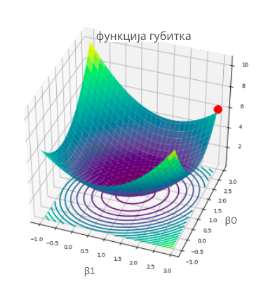
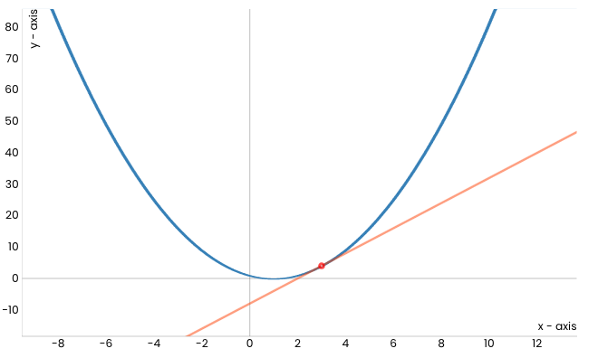
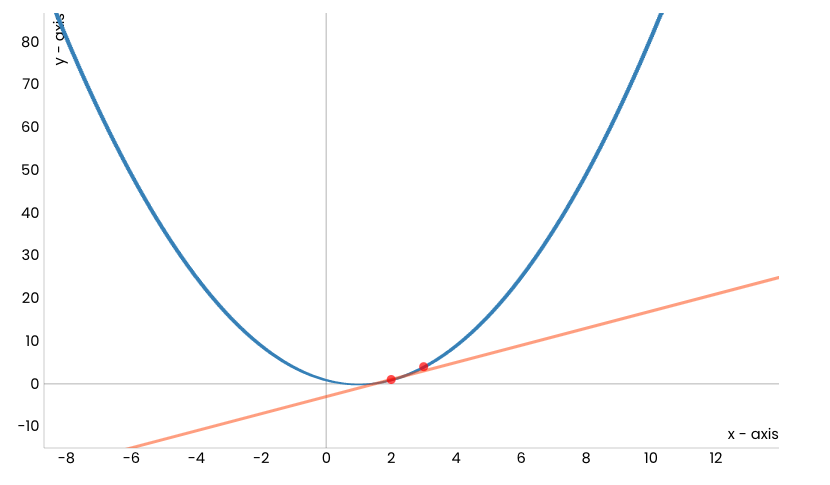
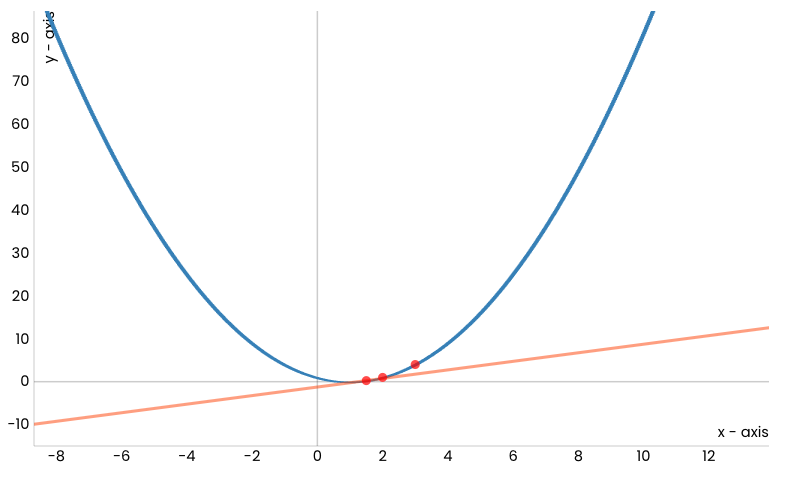
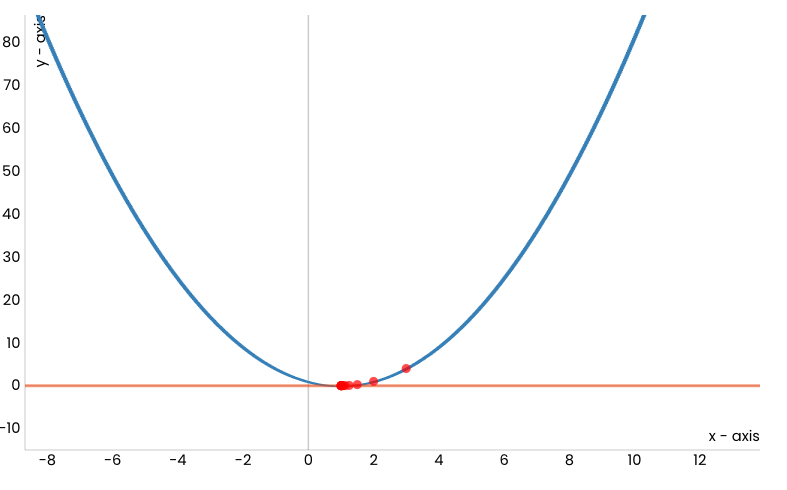
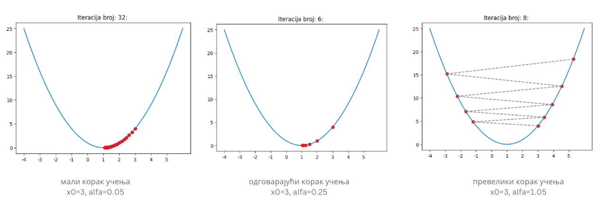
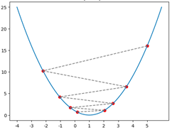
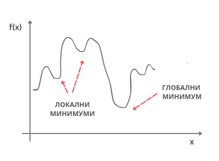

Градијентни спуст
=================

.. |open| image:: ../../_images/algk2.png
            :width: 100px

.. infonote::

 У овој лекцији упознаћемо градијентни спуст, технику која нам помаже да пронађемо параметре за које функција средњеквадратне грешке има најмању 
 вредност. Ову технику можемо, под одређеним условима, да применимо и на друге функције.

Опет ћеш морати нешто да замислиш - овога пута да се налазиш на врху једне лепе планине. То и не пада тако тешко! Невоља је што сада следи задатак: 
да се брзо спустиш до подножја! Један начин да то урадиш је да прво погледаш око себе и провериш дуж ког правца у твојој околини је планина 
најстрмија - имај на уму да треба баш брзо да се спустиш! Онда можеш да направиш један пажљиви корак у том правцу па да застанеш и опет погледаш 
око себе. Опет можеш да приметиш дуж ког правца је планина најсртрмија у твојој околини, направиш корак у том правцу и застанеш. Јасно ти је да 
овај редослед осматрања, избора правца и искорака можеш да наставиш да понављаш све док не стигнеш до подножја. Ту те чека освежење за успешно 
обављени задатак!  

-------

Мало физичке активности у сред приче о линеарној регресији није на одмет, али наслућујеш да постоји још нешто. Функција средњеквадратне грешке 
зависи од избора параметара :math:`\beta_0` и :math:`\beta_0` - за различите комбинације вредности :math:`\beta_0` и :math:`\beta_1` добијамо различите вредности грешке. 
Ако нацртамо график ове функције, на пример, дуж x-осе забележимо вредности :math:`\beta_0`, дуж y-осе забележимо вредности :math:`\beta_1`, а дуж z-осе вредности грешке, добићемо график који 
изгледа као на доњој слици. Ако црвеном тачком обележимо неки насумични избор параметара :math:`\beta_0` и :math:`\beta_1`, да бисмо стигли до тачке за коју је вредност 
грешке најмања заиста морамо да се спустимо у подножје ове површи. Зато је ”техника” коју смо развили у претходном примеру врло релеванта. 
Потребно је само да осмислимо како да тражимо најстрмије правце спуста. У томе ће нам помоћи изводи функција. 

*График функције средњеквадратне грешке*

-------

.. infonote::

 Најмања вредност једне функције се зове минимум. 

Посматрајмо сада квадратну функција :math:`f(x) = (x-1)^2` чији је график приказан на доњој слици и покушајмо да техником спуста стигнемо до њеног минимума - 
он је у тачки :math:`x=1` и износи 0.  

Уочимо и црвену тачку која одговара вредности :math:`x=3` (насумично смо је одабрали) и која означава стартну позицију кретања ка минимуму ове функције. 
Делује да је наранџастом линијом обележен најстрмији правац дуж кога можемо да започнемо спуст. Занимљиво је да ова линија заправо представља 
тангенту наше функције у тачки :math:`x=3`. Ако дуж овог правца направимо корак, наћи ћемо се у новој тачки. Обележимо и њену вредност црвеном бојом и 
прикажимо је на графику. Она је мало ближе очекиваном минимуму.

Сада можемо да поновимо поступак: нацртајмо тангенту у новој тачки, а потом и направимо корак дуж тог правца. 

Након одређеног броја корака, овај поступак ће нас довести до минимума функције тј. до тачке :math:`x=1`.

.. technicalnote::
    
    Ова секција је упарена са Jupyter свеском `06-gradijentni_spust.ipynb <https://github.com/Petlja/specit4_ai_radni/blob/main/06-gradijentni_spust.ipynb>`_. 
    Да би могао да пратиш садржај даље, кликни на линк, а потом и на дугме |open| да би се садржај отворио у окружењу Google Colab. 
    Уколико свеске прегледаш на локалној машини, међу садржајима пронађи свеску са истим именом и покрени је. За детаљније инструкције 
    погледај секцију *Hands-on зона* и лекцију *Jupyter свеске за вежбу*.

У свесци која прати овај материјал можеш и сам да покренеш анимацију и увериш се да је тако.

|

Пре него што детаљније прођемо кроз поступак који смо описали, подсетимо се какве су то праве тангенте.  За неку фиксирану тачку :math:`x` коефицијент 
правца тангенте у тачки :math:`x` једнак је вредности првог извода извода функције у тачки :math:`x`. Први извод наше функције је функција :math:`f'(x) = 2x-2` и у 
почетној тачки :math:`x=3` вредност извода је :math:`f'(x) = 4`.  То значи да тангента има једначину :math:`y = 4x - 8` (број -8 смо добили из услова да ова права 
мора да садржи тачку (3, 4)).  Зато можемо и да кажемо да тангента има правац који одговара изводу функције у некој тачки, а за само кретање 
у том правцу да је кретање дуж правца извода у тој тачки.  Сада је дилема, да ли се крећемо уз или низ  тј. да ли пратимо правац извода или 
његов супротан правац? Па, пошто желимо да се спуштамо ка минимуму треба да пратимо правац супротан правцу извода функције. 

|

Ако сада са :math:`x_0` oбележимо почетну тачку, нову тачку :math:`x_1` добили смо тако што смо направили корак дуж правца извода функције у тачки :math:`x_0`. Ако са :math:`\alpha` 
обележимо дужину корака, вредност нове тачке  :math:`x_1` израчунавамо као :math:`x_1 = x_0 - \alpha f'(x_0)`. Пошто поступак понављамо, вредност тачке :math:`x_2` израчунавамо 
као :math:`x_2 = x_1 - \alpha f'(x_1)` и настављамо редом са израчунавањима :math:`x_3 = x_2 - \alpha f'(x_2)`,  :math:`x_4 = x_3 - \alpha f'(x_3)`, ...  Поступак понављамо све док за две 
узастопне вредности, рецимо за :math:`x_{34}` и :math:`x_{35}`, вредности функције нису довољно близу тј. док апсолутна вредност разлике :math:`f(x_35) - f(x_34)` није мања од неке 
унапред задате течности, рецимо 0.001. Тако рачунски можемо да се приближимо појму конвергенције у математици. 

|

Вредност :math:`\alpha` коју смо увели се зове **корак учења** (енгл. *learning rate*) и представља врло важан параметар алгоритма који смо описали. 
Уколико су вредности за :math:`\alpha` много мале, требаће нам пуно времена да стигнемо до минимума. Са друге стране ако су вредности за :math:`\alpha` много велике, може се десити да прескочимо минимум или 
западнемо у цик-цак замку сталним скакутањима око њега! Погледај доњу слику!

*Утицај избора корака учења*

-------

*Цик-цак замка*

-------

Оба ова понашања обавезно провери и сам у пратећој свесци користећи различита подешавања за корак учења у анимацији. 

|

Алгоритам који смо описали се зове **градијентни спуст** (енгл. *gradient descent*) и упркос својој једноставности представља један од најважнијих 
алгоритма у машинском учењу јер омогућава проналажење најмање вредности функције грешке. Постоји много детаља у вези са овим алгоритмом у које 
ми нећемо залазити а који се тичу особина функција на које овај алгоритам може успешно да се примени, нумеричког израчунавања извода и избора 
корака учења. Сви они се морају размотрити приликом практичне примене алгоритма. 

|

Сам алгоритам није неугодно испрограмирати па ћемо се упустити у авантуру. Потребна нам је функција ``f`` која ће да рачуна вредност задате функције и 
функција ``f_izvod`` која ће да израчунава вредност извода задате функције. Потребно је да дефинишемо и корак учења ``alfa`` и зауставне критеријуме: 
поступак ћемо обуставити када вредности функције у двема узастопним итерацијама буду довољно близу (разлика њихових вредности је мања од неке 
унапред задате тачности ``epsilon``) или када достигнемо неки коначан број итерација ``max_broj_iteracija`` (морамо да се осигурамо и у случајевима 
неподесних избора корака учења).   

|

Следи блок са кодом. Алгоритам смо започели постављањем почетне тачке. Како тачка у којој се померимо алгоритмом градијентног спуста представља 
почетну тачку наредног корака, за њихово обележавање у узастопним корацима користимо ознаке ``x_staro`` и ``x_novo``. Извештај који креирамо на крају 
функције садржи информације о томе да ли се алгоритам зауставио, колико му је корака тј. итерација требало и коју вредност је пронашао. 

.. code-block:: Python

    def gradijentni_spust(f, f_izvod, x, alfa, epsilon, max_broj_iteracija):

        # postavljamo pocetnu vrednost za x
        x_staro = x

        # u svakoj iteraciji ...
        for i in range(0, max_broj_iteracija):

            # izracunavamo tekucu vrednost za x
            x_novo = x_staro - alfa * f_izvod(x_staro)

            # i potom proveravamo da li je ispunjen zaustavni kriterijum
            if np.abs(f(x_novo) - f(x_staro)) < epsilon:
                break

            # ako kriterijum nije ispunjen, pripremamo x za narednu iteraciju
            x_staro = x_novo

        # na kraju celog postupka pripremamo izvestaj sa informacijama:
        # da li se algoritam zaustavlja,
        # koliko je iteracija trajao,
        # i koja vrednost x je pronadjena
        izvestaj = {}
        izvestaj['zaustavlja_se'] = i != max_broj_iteracija
        izvestaj['broj_iteracija'] = i
        izvestaj['x_min'] = x_staro

        return izvestaj

|

Функцију коју смо разматрали и њен извод можемо дефинисати следећим Python блоковима: 

.. code-block:: Python

 def f(x):
    return (x-1)**2

 def f_izvod(x):
    return 2*x-2

Након покретања функције ``gradijentni_spust`` за вредности аргумената ``x0 = 3``, ``alfa = 0.1``, ``epsilon = 0.001`` и ``max_broj_iteracija = 100`` добијамо 
да је минимум функције број 1.0048 што можемо и да потврдимо. Кôд можеш и сам да извршиш и увериш се да се добија баш овај резултат. 
Не пропусти да испиташ и како се резултати мењају уколико се одаберу друге вредности аргумената.

|

Сада можемо да се вратимо и на проблем проналажења параметара :math:`\beta_0` и :math:`\beta_1` линеарне регресије за коју вредност средњеквадратне грешке треба да има 
најмању вредност. Функција средњеквадратне грешке је функција двеју променљивих - зависи и од вредности параметра :math:`\beta_0` и од вредности параметра :math:`\beta_1`. 
Када радимо са функцијама више променљивих, у општем случају са :math:`n` променљивих :math:`x_1`, :math:`x_2`, :math:`x_3`, ..., :math:`x_n` , извод који смо користили у алгоритму градијентног 
спуста уопштавамо вектором извода - за сваку од променљивих израчунавамо појединачно изводе. Рецимо, за функцију :math:`\frac{1}{2}(x_1^2+10x_2^2)`, извод по променљивој :math:`x_1` се 
добија тако што се променљива :math:`x_2` прогласи константом па потом примене стандардна правила за рачунање извода којa нас доводе до :math:`\frac{1}{2} \cdot 2 \cdot x_1 = x_1`. 
Са друге стране, извод по променљивој :math:`x_2` се рачуна тако што се променљива :math:`x_1` прогласи константом па примене стандардна правила за рачунање 
извода. Сада добијамо :math:`\frac{1}{2} \cdot 10 \cdot 2 \cdot x_2 = 10\cdot x_2`. Сада добијамо да је вектор извода по појединачним променљивама (такве изводе зовемо парцијалним) 
вектор :math:`[x_1, 10 \cdot x_2]`.  У математици, па и у машинском учењу, ови вектори се зову **градијенти** па отуда долази и име самог алгоритма. 
За обележавање градијената се користи симбол троуглић надоле :math:`\nabla` који се зове набла. Тако би прецизан запис градијента полазне функције 
:math:`f'` био :math:`\nabla f(x_1,x_2) = [x_1, 10\cdot x_2]` и омогућавао би нам да пратимо дуж којих праваца извода појединачно треба да се крећемо приликом спуста. 

|

Остали кораци алгоритма градијентног спуста се не разлику пуно за случај функција више променљивих: очекујемо да се алгоритам заустави након што се 
оствари жељена тачност или након што се изврши одређени број итерација.

|

Сада када разумемо и како градијентни спуст функционише за функције више променљивих вратимо се на израчунавање параметара :math:`\beta_0` и :math:`\beta_1`. 
Рекли смо да је једначина средњеквадратне грешке :math:`\frac{1}{N}\sum_{i=1}^N{(y_i - (\beta_0 + \beta_1x_i))^2}`. Пошто је то функција за коју треба да пронађемо минимум, ако засучемо рукаве па проверимо, 
добићемо да је извод средњеквадратне функције по  :math:`\beta_0` баш :math:`\frac{2}{N} \sum_{i=1}^{N}(\beta_0 + \beta_1x_i - y_i)` и извод по :math:`\beta_1` баш :math:`\frac{1}{N} \sum_{i=1}^{N}(\beta_0 + \beta_1x_i - y_i)\cdot x_i`. 
Ови изводи нам указују дуж којих правада треба да се крећемо и 
колико треба да коригујемо вредности за :math:`\beta_0` и :math:`\beta_1` у сваком кораку итерације градијентног спуста.

|

У свесци можеш да видиш и како се ове вредности израчунавају кроз кôд, а потом и да прођеш кроз цео поступак прилагођеног градијентног спуста. 
За скуп о некретнинама који смо увели, стићи ћемо до вредности :math:`\beta_0=2.056` и :math:`\beta_0=1.198`.

|

Рекли смо да постоје одређени предуслови које функција треба да задовољи да би њен минимум могао да се пронађе техником градијентног спуста 
(потребно је да функција буде диференцијабилна). Важно је да знаш и да се у општем случају на овај начин 
достиже неки *локални минимум*. Рецимо, функција на доњој слици има неколико локалних минимума и само један *глобални минимум*. У неким случајевима, 
рецимо када је функција конвексна, локални и глобални минимум се поклапају па увек стижемо до жељеног решења, глобалног минимума. Функција 
средњеквадратне грешке је конвексна по параметрима :math:`\beta_0` и :math:`\beta_1`.

*Локални и глобални минимум*

-------

Област математике која се бави проналажењем максималних и минималних вредности функција (једним именом их зовемо оптимумима) зове се **математичка оптимизација**. 
Градијентни спуст је само један алгоритам из палете ове области. 
