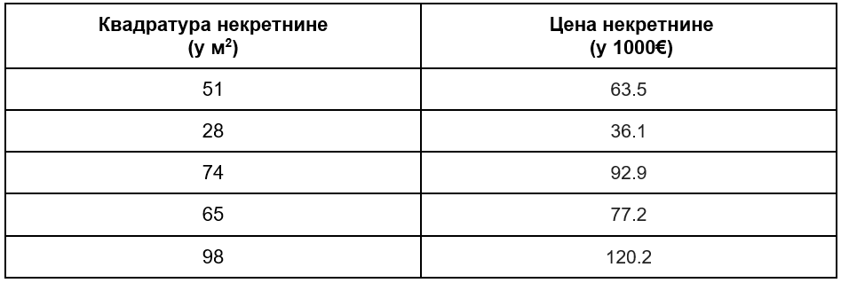
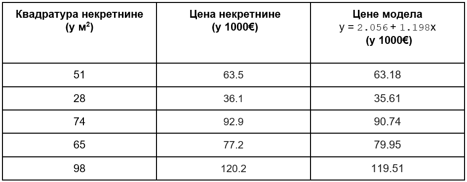

Оцењивање модела линеарне регресије
===================================

.. infonote::

 У овој лекцији ћеш научити како да оцениш колико добро ради модел линеарне регресије. Тај корак нам је јако важан за практичну примену модела.  

Када обучимо модел линеарне регресије тј. oдредимо вредности параметара  :math:`\beta_0` и :math:`\beta_1`, треба да оценимо колико заправо он добро ради. 
То оцењивање спроводимо на **скупу за тестирање**. Претпоставимо да се наш скуп за тестирање састоји од 5 инстанци које су наведене у табели ниже. 

|

Као што смо радили приликом увођења појма средњеквадратне грешке, овој табели можемо да додамо колону у којој ћемо забележити вредности које 
израчунава модел :math:`y = \beta_0 + \beta_1x` за свако :math:`x`. Користићемо вредности параметара које смо израчунали у претходном примеру тј. :math:`\beta_0=2.056` и :math:`\beta_1=1.198`. 

|

Како за сваку инстанцу у скупу за тестирање знамо тачну вредност некретнине (наше циљне променљиве :math:`y`) можемо да израчунамо разлике тачних 
(очекиваних) вредности и вредности предикција (вредности које је модел израчунао).

|

За оцењивање модела линеарне регресије користимо најчешће мере квалитета: **средњеквадратну грешку** (коју смо увели у уводној причи), **средњу апсолутну 
грешку** и **коефицијент детерминације**. Све мере, нагласимо још једном, израчунавамо на скупу за тестирање.

|

Видели смо да средњеквадратна грешка упросечава квадрате разлика очекиваних вредности и предикција. Научили смо да то можемо скраћено да запишемо и 
као: 

.. math::

    MSE = \frac{1}{n}\sum_{i=1}^n{(y_i - (\beta_0 + \beta_1x_i))^2}.

Ознака :math:`MSE` одговара енглеском називу за средњеквадратну грешку *mean squared error*. У нашем случају она износи: 
:math:`\frac{1}{5}((63 - 63.18)^2 + (36.1 - 35.61)^2 + (92.9 - 90.74)^2 + (77.2 - 79.95)^2 + (120.2 - 119.51)^2)= 2.61`. 

Средњеквадратна грешка није стандардизована мера. Ако чујемо да је грешка модела 645.23 нисмо сигурни да ли је то мала или велика вредност јер 
њена скала зависи од величине коју представља. Ако је, рецимо, 645.23 грешка модела који барата са великим вредностима циљне променљиве, 
попут милиона и милијарди, можемо да будемо задовољни. Ако, са друге стране, вредности циљне променљиве изражавамо у хиљадама или десетинама хиљада, 
ово можда и није баш најбољи резултат. Наравно, потврда да ли је нешто довољно добар резултат или не зависи и од домена примене модела и многих 
других фактора. 

|

**Коефицијент детерминације** (енгл. *determination coefficient*) се користи за оцењивање линеарне регресије на скали у распону од (-∞, 1]. У 
том смислу нам омогућава да лакше закључујемо о успешности модела. Веће вредности коефицијента одговарају бољим моделима. Сам коефицијент 
рачунамо по формули 

.. math::

    R^2 = 1-\frac{\sum_{i=1}^n{(y_i - (\beta_0 + \beta_1x_i))^2}}{\sum_{i=1}^n{(y_i - y_{avg})^2}}

и можемо га интерпретирати као капацитет модела да се понаша боље од најпростијег линеарног модела тј. оног који ће увек придруживати средњу 
вредност циљне променљиве (изнад разломачке црте је сума свих квадрата грешака, а испод разломачке црте сума свих квадрата одступања од средње 
вредности). Сада, када за неки модел линеарне регресије чујемо да је коефицијент детерминације 0.98 имамо одмах представу да је реч о добром моделу. 

Он за наш модел износи 0.996 што и није тако лоше!

|

Трећа мера квалитета коју смо поменули је **средња асполутна грешка** (енгл. *mean absolute error*). Њу рачунамо слично као што рачунамо и квадратну 
грешку с тим што не пратимо квадрате грешака већ њихове апсолутне вредности (рекли смо да због тога што неке грешке могу да буду позитивне а 
неке негативне није мудро сумирати их да би добили укупну оцену грешке). Зато је формула по којој рачунамо ову грешку облика

.. math::
    
    MAE = \frac{1}{n}\sum_{i=1}^n{|y_i - (\beta_0 + \beta_1x_i)|}

и за наш модел износи 1.28 (обавезно провери!). Претпостављаш да ознака  MАE одговара енглеском називу за средњу апсолутну грешку *mean 
absolute error*. Баш као и код средњеквадратне грешке, потребно је да познајемо скалу циљне променљиве да би на основу ње закључили колико је 
модел добар.  

