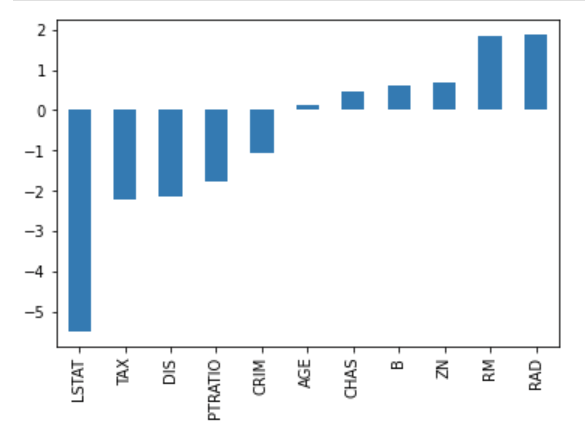

Мултиномијална линеарна регресија
=================================

У уводној причи о скуповима података видели смо да се користи већи број атрибута. Ипак, у причи о линеарној регресији смо користили само један 
атрибут (квадратуру некретнине). Вероватно се питаш шта радимо када имамо више атрибута и да ли тада можемо да применимо модел линеарне регресије. 

Модел линеарне регресије који је прилагођен овом сценарију се зове **вишеструка** линеарна регресија и има облик y = ꞵ0 + ꞵ1X1 + ꞵ2X2 + ꞵ3X3 + … + ꞵnXn. 
Немој да те овај дугачки израз збуни - сада вредности X1, X2, X3, ..., Xn представљају појединачне атрибуте а параметри ꞵ0, ꞵ1, ꞵ2, ꞵ3, …, ꞵn 
параметре модела. Иза овог уопштавања је опет идеја о линеарној зависност између појединачних атрибута и циљне променљиве.

Циљ учења је да одредимо вредности параметара ꞵ0, ꞵ1, ꞵ2, ꞵ3, …, ꞵn и тако стекнемо представу о зависностима. До њих долазимо на исти начин као и 
код просте линеарне регресије: минимизацијом средњеквадратне грешке на скупу података за тренирање. Техника градијентног спуста се може уопштити 
тако да одговара и овој поставци задатка и може нам помоћи да нађемо баш скуп вредности ꞵ0, ꞵ1,ꞵ2, ꞵ3, …, ꞵn за који је средњеквадратна грешка 
најмања. 

У случају модела линеарне регресије са једним атрибутом могли смо да замислимо и смисао који носе параметри ꞵ0 и ꞵ1: одређивали су померај и нагиб 
праве која пролази кроз скуп података. Тако су нам указивали на јачину линеарне зависност између улазне и излазне променљиве тј. на то колико се 
вредност излазне променљиве y промени када атрибут x променимо за 1. Сада, када имамо више параметара, природно је да се питамо какво значење 
можемо да им дамо. Па, и они моделују исту врсту зависности. Ако замислимо да су само ꞵ0 и ꞵ2 параметри који су различити од нуле, онда је веза 
између циљне променљиве y и атрибута x2 представљена једначином y = ꞵ0 + ꞵ2x2 тј. линеарна и исто нам указује колико ће се променити вредност за 
циљну променљиву y и у ком смеру када вредност за x2 променимо за 1. 

С обзиром да параметри за нас сумирају знања из скупа података, у случају вишеструке линеарне регресије веће вредности параметра указују на већи 
значај неког атрибута на вредност циљне променљиве. Да бисмо могли да испратимо ово својство, вредности израчунатих параметара обично исцртавамо 
графиконом са стубићима. На доњој слици приказане су вредности параметара једног модела који користи реални скуп података за превиђање цена 
некретнина (популарни Бостон скуп података о некретнинама). Без пуно улажења у детаље овог скупа, одмах можемо приметити да атрибут LSTAT утиче 
највише и то негативно на вредност циљне променљиве, док атрибути RM и RAD утичу позитивно и то оба скоро подједнако. Графике овог типа који могу 
да нам дају неку идеју о утицају атрибута називамо **графицима важности атрибута** (енгл. *feature importance graph*). 

*График важности атрибута вишеструке регресије*

|

Још један детаљ који треба на нагласимо, да те касније не би изненадио, тиче се линеарности. Модел линеарне регресије је **линеаран по параметрима**. 
То значи да би се и модел чији је облик y = ꞵ0 + ꞵ1X + ꞵ2X2 + ꞵ3X3 у којем фигуришу степени вредности атрибута водио као линеарни модел. 
Слично је и за модел y = ꞵ0 + ꞵ1log(X) у којем фигурише логаритам вредности атрибута. О овим можда неочекиваним улогама атрибута можеш да 
размишљаш као трансформацијама које поправљају линеарну зависност између атрибута и циљне променљиве. 

