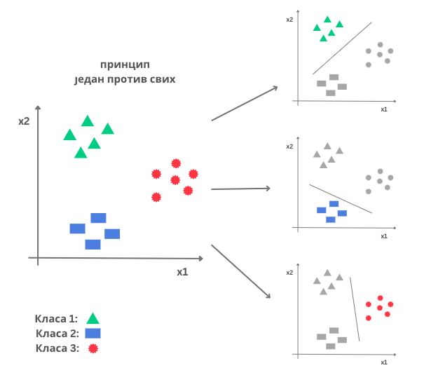
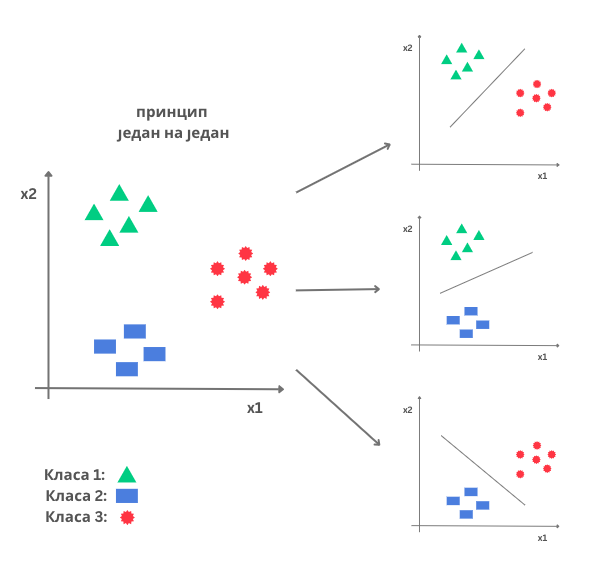

Класификација
=============

.. infonote::

 Веровао или не, до сада си се већ пуно пута сусрео са задатком класификације. Када сређујеш собу па раздвајаш папириће које ћеш да задржиш 
 или бациш или када разврставаш своје фотографије на оне са екскурзије, теткиног рођендана или излета са пријатељима, ти у ствари обављаш 
 задатак класификације: имаш на уму неке групе и када погледаш папирић или фотографију одлучујеш о томе којој групи припада. И многи 
 програми са којима се сусрећеш, обављају задатак класификације. Рецимо, твој имејл клијент разликује пожељну и непожељну пошту и 
 захваљујући овој његовој особини успеваш да избегнеш многе замке и преваре на интернету. Такође, на друштвеним мрежама често добијаш 
 препоруке за повезивање са новим особама - програм који је у позадини друштвене мреже активно процењује да ли ти је нека особа 
 потенцијални пријатељ или не (обично прати пријатеље твојих пријатеља и добија идеје). Пошто не сумњамо да си експерт у сређивању собе и 
 фајлова на рачунару, хајде да научимо како ове вештине усвајају програми!

Врсте класификације
~~~~~~~~~~~~~~~~~~~

На самом почетку је важно нагласити да нису све класификације исте. Зато ћемо прво упознати које класификације постоје и шта их то карактерише.
Примери разврставања папирића или разврставања поште су примери **бинарне класификације** зато што имамо само две групе: папириће за бацање и 
папириће за чување тј. пожељну и непожељну пошту. Групе у свету машинског учења зовемо **класама** па ћемо се надаље држати тог термина. 
Да би класе могли да разликујемо придружујемо им имена која приближавају шта заправо оне садрже. На пример, ”папирићи за бацање” и ”непожељна пошта” 
су довољно јасна имена. Имена су често одређена и лабелама које се појављују у скупу података над којим се примењује задатак класификације.

|

Ако имамо више од две класе, говоримо о задатку **вишекласне класификације**. На пример, такав је задатак разврставања фотографија по догађајима 
где сваки догађај може да представља једну класу. Можемо направити три директоријума тј. три класе, дати им имена ”екскурзија”, ”теткин рођендан” и 
”излет”, а потом сваку од фотографија придружити једној од ових класа тако што ћемо је ставити у одговарајући директоријум.

|

О различитим врстама класификације, можемо размишљати и на основу критеријума припадности. На пример, један имејл може бити или пожељан или 
непожељан, не може припадати истовремено и класи пожељних и класи непожељних имејлова. Слично је и са фотографијама и класама које смо увели. 
Са друге стране, један новински чланак може да буде истовремено и на тему културе, путовања и хране, па га можемо придружити већем броју класа - 
оној која представља културу, оној која представља путовања и оној која представља храну. Како у овом случају инстанце имају више обележја тј. 
лабела, ову врсту класификације називамо **вишелабеларном класификацијом**. Иако је врло занимљива и корисна, вишелабеларну класификацију нећемо 
покрити даљим садржајима већ ћемо се усредсредити на бинарну и вишекласну класификацију. 

.. questionnote::
 
 Шта мислиш, којој врсти класификације припадају следећи задаци:

 - разврставање ђубрета за рециклажу,
 - утврђивање исправности програма,
 - одређивање језика документа,
 - провера валидности банкарске трансакције,
 - предлог следеће речи при куцању СМС порукице?

Класификација из угла машинског учења
~~~~~~~~~~~~~~~~~~~~~~~~~~~~~~~~~~~~~

Када о задатку класификације размишљамо из угла машинског учења, интересују нас дискретна пресликавања тј. пресликавања који улазним променљивама 
могу да придруже једну од коначно много вредности. Најчешће је број класа мањи, изражен једноцифреним бројем, али се можеш присетити и скупа 
ImageNet и такмичења класификације слика у којем се користи 1000 класа. Променљиве које могу да узму коначан број вредности смо називали 
категоричким па о класификацији можемо да говоримо као о пресликавањима које карактерише категоричка циљна променљива.

.. math::
    \begin{equation}
    F(x)=
        \begin{cases}
            0 & \text{ако је } x <0\\
            \frac{1}{2} & \text{ако је } 0\le  x < 1 \\
            1 & \text{ако је } x \ge 1
        \end{cases}
    \end{equation}

*Пример једне дискретне функције*

-------

Како је класификација задатак надгледаног машинског учења, скуп података који се користи за обучавање модела садржи парове улаза и очекиваних излаза. 
Улази могу бити слике, текстуалне поруке или табеларни подаци и за њихову припрему важе све смернице које смо дискутовали у лекцији о припремама 
скупа података. Излаз увек представља име класе. Иако смо имена класа увели са циљем да лакше пратимо задатак класификације, када стигнемо до 
дела припреме података, морамо и њих  да трансформишемо у нумеричке вредности. Ту се можемо водити припремама коју смо дискутовали за рад са категоричким
атрибутима: пресликавањем скупа вредности или *one-hot* кодирањем.

Ако је реч о бинарној класификацији, обично имена класа пресликамо у вредности 0 и 1. На пример, појављивање имена класе ”непожељна пошта” 
заменимо вредношћу 0, а појављивање имена ”пожељна пошта” вредношћу 1. Често за инстанце које имају лабелу 0 каже да припадају негативној 
класи, а за инстанце који имају лабелу 1 да припадају позитивној класи.

Када је у питању вишекласна класификација, за припрему циљне променљиве користимо one-hot кодирање. На пример, за задатак разврставања фотографија 
по догађајима трансформисаћемо излазе у векторе дужине три јер имамо тачно три класе: ”екскурзија”, ”теткин рођендан” и ”излет”. Даље ћемо свакој 
од ових вредности придружити вектор који на одговарајућој позицији има јединицу, а на свим преосталим позицијама нуле. То ће, редом, бити вредности 
(1, 0, 0), (0, 1, 0) и (0, 0, 1). Oвде је важно да се доследно придржавамо одабраног редоследа класа.

У наставку ћемо упознати два алгоритма који се користе за задатак бинарне класификације. Решавању задатка вишекласне класификације можемо прићи 
кроз посебно дизајниране алгоритме, али и кроз више удружених бинарних класификатора. Приближићемо две такве технике које се зову ”један против 
свих” и ”један на један”.

Замислимо да располажемо трима класама: црвеном, зеленом и плавом.  Приступ ”један против свих” подразумева да треба да научимо три бинарна 
класификатора: један који разликује зелену класу од преосталих (уније црвене и плаве класе), један који разликује плаву класу од преосталих 
(уније зелене и црвене класе) и један који разликује црвену класу од преосталих (уније зелене и плаве класе). Када треба да класификујемо 
нову инстанцу, покрећемо сваки од три бинарна класификатора и над добијеним резултатима примењујемо принцип највеће поузданости: инстанца се 
придружује класи чији је класификатор најсигурнији.  Видећемо ускоро како се процењује сигурност класификатора.

*Приступ "један против свих"*

-------

Замислимо опет да располажемо трима класама: црвеном, зеленом и плавом.  Приступ ”један на један” подразумева да обучимо бинарне класификаторе 
који могу да разликују сваки од парова класа: црвену и зелену, зелену и плаву, и црвену и плаву. У општем случају ако имамо :math:`n` класа, број 
бинарних класификатора које треба да обучимо је :math:`\frac{n\cdot (n-1)}{2}`. Када треба да класификујемо нову инстанцу, покрећемо сваки од научених класификатора 
и над добијеним резултатима примењујемо принцип већинског гласања: инстанца се придружује класи за коју гласа највећи број класификатора. 

*Приступ ”један на један”*

-------

