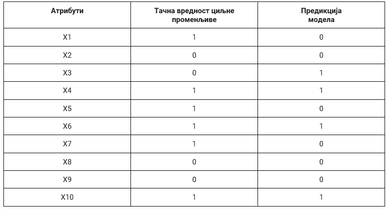
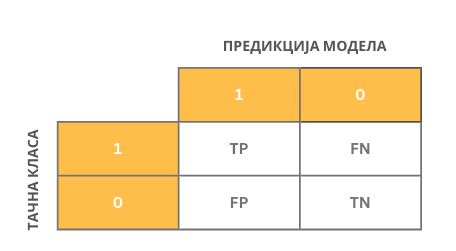
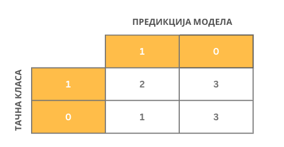
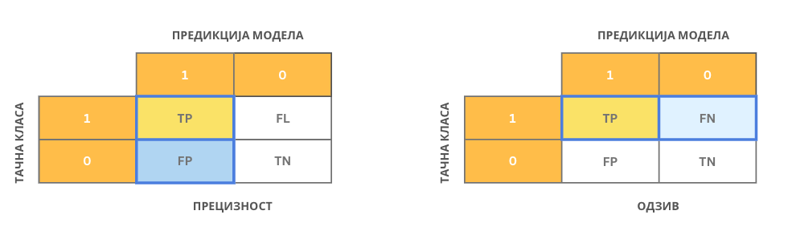
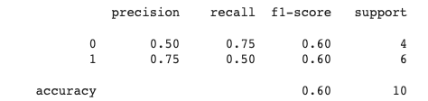

Како оцењујемо модел класификације
==================================

.. |open| image:: ../../_images/algk2.png
            :width: 100px

.. infonote::

 Сада када знамо шта је то класификација, природно је запитати се како оцењујемо колико је добар један модел класификације. У овој секцији ћемо 
 научити које мере се користе за оцењивање и како се израчунавају. Оцењивање класификације увек вршимо на скупу за тестирање. 

|

Оцењивање успешности модела машинског учења увек вршимо користећи **скуп за тестирање**. Подсетимо се да је то део скупа података којим располажемо и 
да у њему за сваку инстанцу знамо тачнe вредности атрибута и тачну вредност циљне променљиве. Нека даље :math:`X_1` означава вредности атрибута прве 
инстанце и :math:`y_1` вредност њене циљне променљиве. Да бисмо оценили како се понаша модел приликом класификације ове инстанце, можемо да му задамо 
атрибуте :math:`X_1`,  забележимо резултат који израчуна, обележимо га са :math:`\tilde{y_1}`, а затим га упоредимо са тачном вредношћу :math:`y_1`. Овај поступак можемо поновити 
за сваку инстанцу у скупу за тестирање :math:`X_1`, :math:`X_2`, :math:`X_3`, :math:`X_4`, ,... колико год да их има.  Како би оцена класификатора била објективна, важно је да 
никада не варамо и преклапамо скуп за тренирање и скуп за тестирање модела. 

|

У случају бинарне класификације, тачне вредности циљне променљиве и израчунате вредности модела (предикције) су заправо или 0 или 1 па се оцењивање 
модела своди на анализу подударања ових вредности. Претпоставимо да скуп за тестирање садржи 10 инстанци и да су у доњој табели, уз вредности 
атрибута, забележене и тачне вредности циљне променљиве и вредности израчунате од стране модела: 

Анализирајмо сада ситуације које могу да настану приликом класификације једне инстанце: 

- **Тачна вредност циљне променљиве је 0 и предикција модела је 0**. У овом случају модел класификације је израчунао вредност која се поклапа са очекиваном, тачном, вредношћу па је успешно класификовао инстанцу. Како су обе вредности једнаке нули а сам резултат класификације тачан, ову инстанцу називамо **тачно негативном** (енгл. *true negative*). Можемо приметити да у целом скупу за тестирање постоје само три тачно негативне инстанце (односе се на инстанце са индексима 2, 8, и 9). Број свих тачно негативних инстанци у скупу за тестирање обележавамо са ТN. У нашем случај важи ТN=3.

- **Tачна вредност циљне променљиве је 0 и предикција модела је 1**. У овом случају модел класификације је погрешио јер је очекивана вредност 0 а он је израчунао вредност 1. За овакве инстанце кажемо да су **лажно позитивне** (енгл. *false positive*) јер је излаз модела позитиван (1) онда када очекујемо негативну вредност (0). У целом скупу за тестирање постоји само једна лажно позитивна инстанца (она са индексом  3). Број свих лажно позитивних инстанци у скупу за тестирање обележавамо са FP. У нашем случају је FP=1.

- **Tачна вредност циљне променљиве је 1 и предикција модела је 0**. И у овом случају модел класификације је погрешио јер је очекивана вредност 1 а он је израчунао вредност 0. Овакве инстанце називамо **лажно негативним** (енгл. *false negative*) јер је излаз модела негативан (0) онда када очекујемо позитивну вредност (1). Пребројавањем закључујемо да у скупу за  тестирање имамо три лажно негативне инстанце (оне са индексима 1, 5 и 7). Број свих лажно негативних  инстанци обележавамо са FN. У нашем случају је FN=3.

- **Tачна вредност циљне променљиве је 1 и предикција модела је 1**.  У овом случају модел класификације је успешно класификовао инстанцу јер се очекивана, тачна, вредност циљне променљиве и вредност израчуната од стране модела поклапају. Како су обе вредности једнаке 1 а резултат класификације тачан, за овакве инстанце кажемо да су **тачно позитивне** (енгл. *true positive*). У скупу за тестирање имамо имамо укупно две тачно позитивне инстанце (оне са индексима 6 и 10). Број свих тачно позитивних инстанци обележавамо са TP. У нашем случају је TP=2.

|

Да би могле лакше да се испрате и анализирају израчунате вредности, пракса је да се запишу у форми блока бројева димензије 2x2:  дуж врста се налазе 
тачне вредности (оне које познајемо у скупу за тестирање), а дуж колона  вредности предикција модела. У ћелији која одговара комбинацији 1 и 1 
бележимо тачно позитивну вредност, у ћелији која одговара комбинацији 1 и 0 бележимо тачно негативну вредност, у ћелији која одговара комбинацији 
0 и 1 бележимо лажно позитивну вредност и, коначно, у ћелији која одговара кобинацији 0 и 0 тачно негативну вредности. Овај схематски приказ 
називамо **матрицом конфузије** (енгл. *confusion matrix*). Зато је у реду ако си се мало збунио. 

*Матрица конфузије*

-------

Сада можемо креирати и матрицу конфузије за посматрани скуп за тестирање. 

|

Интуитивно наслућујемо да је модел класификације бољи уколико су вредност на главној дијагонали матрице конфузије што је могуће веће тј. 
уколико се очекиване вредности и предикције модела преклапају у што већем броју случајева. Формално, модел класификације се оцењује у 
терминима мера које се зову **прецизност**, **одзив**, **тачност** и **F1 мера**. Оне се израчунавају на основу вредности садржаних у матрици конфузије 
и имају распон вредности од 0 до 1. Веће вредности мера означавају боље понашање класификатора. Сада ћемо увести сваку од њих и приближити 
шта означавају.  

|

**Тачност** (енгл. *accuracy*) је мера која представља оцену укупног броја успешно класификованих инстанци. Успешно класификоване инстанце су 
тачно позитивне и тачно негативне инстанце па се ова мера израчунава као количник збира тачно позизивних и тачно негативних инстанци и укупног 
броја инстанци у скупу за тестирање. Њу израчунавамо по формули: 

.. math::

    Acc = \frac{TP + TN}{TP + FN + FP + TN}

Тачност је врло корисна мера али у случајевима када су односи броја позитивних и негативних инстанци у скупу за тестирање драстично различити 
није довољно информативна. Рецимо, може се десити да је 99 инстанци у скупу за тестирање негативно, а само једна инстанца позитивна 
(то би могао бити скуп података који одговара некој реткој болести). Уколико креирамо класификатор који увек даје предикцију 0, тачност овог 
класификатора би била јако висока (0.99), док би он био практично неупотребљив. 

-------

**Прецизност** (енгл. *precission*) је мера која представља оцену броја тачно позитивних инстанци и даје одговор на питање: колико је међу свим 
позитивно класификованим инстанцама заиста позитивних? Као су позитивно класификоване инстанце и тачно позитивне и лажно позитивне,  њу рачунамо 
као количник броја тачно позитивних и свих позитивних инстанци. Формула коју користимо је: 

.. math::

    P = \frac{TP}{TP + FP}

-------

**Одзив** (енгл. *recall*) представља оцену броја очекиваних позитивних инстанци и даје нам одговор на питање: колико је инстанци из скупа позитивних 
инстанци заиста класификовано као позитивно? Како су све позитивне инстанце и тачно позитивне и лажно негативне, ову меру рачунамо као количник 
тачно позитивних инстанци и збира тачно позитивних и лажно негативних инстанци. Формула коју користимо је: 

.. math::

    R = \frac{TP}{TP + FN}

 

*Разлика између прецизности и одзива*

-------

**F1 мера** нам омогућава да узмемо у обзир и прецизност и одзив класификатора - рачунамо је као  хармонијску средину ове две вредности по формули: 

.. math::
    
    F_1 = 2\frac{P\cdot R}{P + R}

-------

Разлог за коришћење F\ :sub:`1` мере је тај што појединчно прецизност и одзив нису довољно информативне. На пример, ако све инстанце прогласимо позитивним, 
одзив ће имати вредност један. Слично, ако све инстанце прогласимо негативним, прецизност ће имати вредност један. У оба случаја имамо екстремна 
понашања класификатора који у пракси није употребљив. Зато је корисно, у општем случају, узети у обзир обе вредности.  

|

На основу матрице конфузије коју смо креирали у примеру можемо да израчунамо све четири поменуте мере и стекнемо представу колико добро ради наш 
класификатор. У пракси је корисно да се ове мере израчунају и за сваку класу појединачно како би испратили потенцијалну пристраност модела (о 
томе ћемо још говорити у наставку). Све израчунате мере су део такозваног сумарног  **класификационог извештаја** (engl. *classification report*). 

*Класификациони извештај за наш пример*

-------

Уколико нисмо задовољни успешношћу и оценама класификатора, можемо да проверимо да ли постоји могућност покретања истог алгоритма учења уз нешто 
другачији скуп подешавања. Можемо да испорбамо и неки други алгоритам. Ако нас ни ово не доведе до задовољавајућих побољшања, потребно је да се 
вратимо на сам почетак и проверимо да ли постоји још нешто у скупу података што бисмо могли да узмемо у обзир. Ова итеративност је врло 
карактеристична за машинско учење и рад са подацима јер чак и када све кораке спроведемо на одговарајући начин може да се деси да не добијемо 
довољно добар модел. 

