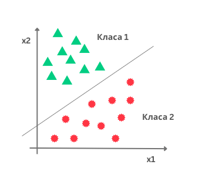

Логистичка регресија
====================

.. infonote::

 Логистичка регресија је познати алгоритам који се користи за креирање модела бинарне класификације. Он нам уз информацију о томе којој класи 
 припада инстанца израчунава и вероватноћу припадности тој класи. 

Замислимо да располажемо скупом података са два атрибута :math:`X_1`  и :math:`X_2` и да су инстанце овог скупа приказане као на доњој слици. 
Дуж x-осе је представљен :math:`X_1`, дуж y-oсе атрибут :math:`X_2`, док боја тачака означава класу којој свака од ових инстанци припада. 
Сложићеш се да би неки линеарни модел који одређује праву у равни могао да нам помогне у решавању задатка класификације тако што би раздвојио 
класе - једна би се нашла испод ове праве, а друга изнад. Да би могли да закључујемо на овај начин биће нам од користи сигмоидна функција. 

-------

Сигмоидна функција је популарна функција у причи о машинском учењу. Одређена је једначином 
.. math:: 

    \sigma(x) = \frac{1}{1 + e^{-x}} 
    
и њен график изгледа као на доњој слици.

*График сигмоидне функције*

-------

Оно што одмах можемо да приметимо је да ова функција узима распон вредности од 0 до 1. Што су вредности броја :math:`x` мање то је вредност ове функције 
ближа 0 и, слично, што је вредност броја :math:`x` већа то је вредност сигмоидне функције ближе 1. За :math:`x=0` вредност сигмоидне функције је 0.5. 
Уколико ову вредност прогласимо прагом и уведемо правила: 

1. ако је вредности сигмоидне функције већа или једнака од 0.5, придружи :math:`x` позитивној класи и 
2. ако је вредност сигмоидне функције мања од прага 0.5 придружи :math:`x` негативној класи 

добићемо једну функцију подесну за задатак класификације. 

|

Делује нам и да што су вредности броја :math:`x`, веће то је одлука да се :math:`x` придружи позитивној класи уверљивија јер значајно прелазимо изнад вредности прага. 
Делује и да што су вредности броја :math:`x` мање да је одлука да се :math:`x` придружи негативној класи уверљивија јер значајно прелазимо испод вредности прага. 
За вредности броја :math:`x` које су око нуле ови аргументи су слабији. Зато сигмоидној функцији можемо придружити и интерпретацију вероватноће припадности 
некој класи.  

|

Уколико повежемо сигмоидну функцију и једначину линеарног модела добићемо једначину модела логистичке регресије која у општем случају гласи 

.. math:: 
    
    y = \sigma(X_1, X_2, …, X_n) = \frac{1}{1 + e^{- (ꞵ_0 + ꞵ_1X_1 + ꞵ_2X_2 + ꞵ_3X_3 + … + ꞵ_nX_n) }}. 
    
Аргументи :math:`X_1`, :math:`X_2`, ..., :math:`X_n`  означавају атрибуте у скупу података, док су њене вредности :math:`у` у распону од 0 до 1 и као што смо видели смислене за задатак класификације. 
Овој једначини можемо да придружимо и следећу геометријску интерпретацију: подаци се класификују или испод или изнад ”праве” која је одређена једначином линеарне везе коју смо у старту и замислили. 

.. suggestionnote::

 Уколико имамо тачно један атрибут, ”права” коју помињемо је заиcта права. Ако имамо тачно два атрибута, ”права” је заправо раван у простору. 
 Ако имамо вишe о два атрибута, ”праве” су, математичким језиком, хиперравни. 

Унакрсна ентропија
~~~~~~~~~~~~~~~~~~

Функција грешке која карактерише логистичку регресију се зове **унакрсна ентропија**. Упознајмо прво интуицију која лежи иза ове функције, а потом 
упознајмо и њен математички облик. 

|

Рекли смо да вредност коју нам израчунава модел логистичке регресије тумачимо као вероватноћу припадности једној од класа и да се водимо правилом 
да ако та вредност преће праг 0.5 то протумачимо као припадност позитивној класи, а уколико та вредност буде мања од 0.5 то протумачимо као 
припадност негативној класи. Уколико вредност вероватноће буде баш 0.5, то тумачимо као припадност позитивној класи. 

|

Функцију грешке израчунавамо на скупу за тренирање. У њему за сваку инстанцу знамо која су тачна обележја па увек можемо да их упоређујемо са 
обележјима која је израчунао тј. придружио модел.

|

Претпоставимо да је за три инстанце које припадају позитивној класи модел логистичке регресије редом израчунао вредности 0.94, 0.56 и 0.3. 
У првом случају је вредност блиска јединици па означава сигурну одлуку модела. У другом случају је ова вредност мања и ближе прагу класификације 
али довољна за добру одлуку модела. У трећем случају је вредност испод прага па би навела модел да погреши. Приликом дизајнирања функције 
грешке желимо да више казнимо израчунавања модела која за позитивне инстанце више одступају од вредности 1 тј. да учинимо да њихови доприноси 
укупној грешци модела буду већи. Једна таква функција која задовољава тражено својство је :math:`-log(x)` чији је график приказан на доњој слици. Предзнак 
минус нам је потребан да би грешка добила позитивну вредност јер је логаритам негативан за вредности аргумента функције које су од 0 до 1. 
На графику можемо и да видимо да су вредности функције мале за аргументе ближе 1 тј. да су вредности функције веће за аргументе који су 
ближе нули. Тако ће сада, редом, доприноси укупној грешци издвојених инстанци бити :math:`-log(0.94)=0.062`, :math:`-log(0.56)=0.579` и :math:`-log(0.3)=1.203` и 
баш односа величина који смо желели. Можемо их забележити и у табели, на начин на који смо то радили и у задатку линеарне регресије. 
У првој колони ћемо сместити обележје класе (тачну вредност), у другој колони вероватноћу :math:`p` коју је израчунао модела док ћемо у трећој 
колони уписати вредност :math:`-log(p)`. Приметимо да у имену колоне стоји :math:`-y*log(p)` но како је :math:`y=1` ово је исто као и :math:`-log(p)`.

|

Одаберимо сада три инстанце негативне класе и продискутујмо очекивања која имамо од функције грешке у њиховом случају. Нека су, редом, 
вероватноће које је израчунао модел логистичке регресије 0.03, 0.48 и 0.74. Сада је у првом случају вредност модела блиска нули па означава 
сигурну одлуку о припадности негативној класи. У другом случају ова вредност је близу прагу класификације али испод њега па опет довољна да 
модел одлучио о негативној класи. У случају треће инстанце, вредност вероватноће је преко прага па ће модел погрешити и инстанцу класификовати 
као позитивну. Оно што очекујемо од функције грешке за негативне инстанце је да њихов удео у укупној грешци буде што већи што су оне даље од нуле. 
Једна таква функција која задовољава ово својство је :math:`-log(1-p)` и њен график је приказан на слици испод. Опет користимо функцију са предзнаком 
минус како би вредност грешке биле позитивна. Можемо сада записати и вредности ове функције у табели. Сада су у првој колони обележја инстанци са 
вредношћу 0, у другој колони вероватноће :math:`p` које је модел израчунао, док су у последњој колони вредности функције грешке :math:`-log(1-p)`. 
С обзиром да је :math:`y=0` за све инстанце, обележје у имену колоне :math:`-(1-y)*(1-p)` ништа не мења.

|

Укупна вредност функција унакрсне ентропије се добија када се саберу доприноси грешака свих позитивних и свих негативних инстанци 
(слично као што смо радили у задатку линеарне регресије и средњеквадратне грешке). То скраћено записујемо у облику 

.. math::
    -\sum_{i=1}^n { y_i \cdot log(p_i) + (1-y_i) \cdot log(1-p_i)} 
    
где заправо први фактор сумира доприносе грешака позитивних инстанци 
а други фактор доприносе грешака негативних инстанци. Вредност :math:`y_i` je тачно обележје класе из скупа за тренирање а  :math:`p_i` 
вероватноћа коју је израчунао модел логистичке регресије. Ова грешка се зове **унакрсна ентропија** (енгл. *binary crossentropy*). 

|

Вредности непознатих параметара :math:`\beta` у моделу логистичке регресије се проналазе тако што се бира она вредност параметара за коју 
је функција унакрсне грешке најмања. Техника градијентног спуста нам може помоћи и у овом случају.

|

Упознајмо сада један мало другачији алгоритам класификације. 

