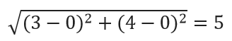
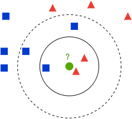
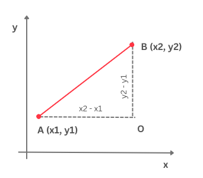
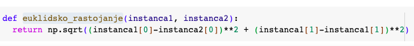
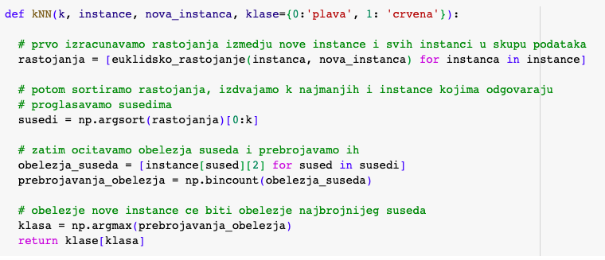

Алгоритам к-најближих суседа
============================

.. |open| image:: ../../_images/algk2.png
            :width: 100px

.. infonote::

 Поменули смо да постоје и непараметарски модели машинског учења. Модел који се добија применом алгоритма к-најближих суседа је баш такав. 
 Откријмо како он функционише!

Нека се наш скуп за обучавање састоји од парова бројева (x1, x2) и одговарајућих имена класа. Парове можемо да прикажемо као тачке у равни где прва 
координата x1 означава вредност на x-оси а друга координата x2 вредност на y-оси. У пракси вредности x1 и x2 увек вежемо за неке конкретне 
атрибуте, на пример, температуру и влажност ваздуха, али сада о њима можемо да размишљамо као о неким уопштеним вредностима. Нека сваки од 
парова бројева припада једној од двеју класа: црвеним троуглићима или плавим квадратима. Како имамо само две класе, закључујеш да је реч о 
бинарној класификацији. Замисли сада да зелени круг представља нову инстанцу, нови пар бројева, за који треба да одредимо којој класи припада: 
да ли је то црвени троугао или плави квадрат.

*Скуп за обучавање*

-------

Алгоритам к-најближих суседа је алгоритам класификације који каже да прво фиксирамо број суседа (околних инстанци) к на неку конкретну вредност и 
да затим одредимо колико међу к најближих суседа има црвених и плавих: црвени сусед је инстанца која припада црвеној класи, а плави сусед инстанца 
који припада плавој класи. Ако, на пример, број к фиксирамо на вредност 3, три најблужа суседа зеленог круга се налазе унутар  пуне кружнице. 
То су два црвена троугла и један плави квадрат.

Даље, алгоритам к-најближих суседа каже да нову инстанцу тј. нови пар тачака придружујемо класи бројнијег суседа: ако су црвени суседи бројнији 
за нову инстанцу ћемо рећи да припада црвеној класи и, слично, ако су плави суседи бројнији, за нову инстанцу ћемо рећи да припада плавој класи. 
Овај вид закључивања можеш да разумеш и као изреку ”с ким си, такав си” у свету машинског учења.

У нашем примеру, када је вредност броја к фиксирана на 3, закључићемо да зелени круг треба да придружимо црвеној класи јер имамо два црвена суседа 
и једног плавог. 

Хајде да видимо шта ће се догодити ако броја к фиксирамо на вредност 5. На слици је ово суседство приказано испрекиданом кружницом. Како се 
сада ту налазе три плава квадрата и два црвена троугла, закључак би био да зелени круг треба да придружимо плавој класи.

Кликом на дугме |open| можеш да отвориш свеску која садржи поменути скуп тачака и испиташ шта ће се догодити ако одабереш неку другу вредност броја к. 
С обзиром да алгоритам треба да одлучи којих суседа има више, мудро је да бираш непарне вредности броја к.

Приметимо да осим од броја суседа к, резултат алгоритма зависи и од начина на који меримо удаљености до суседа! Да бисмо пронашли најближе суседе 
морамо некако да измеримо растојање до њих.

До сада смо се на часовима математике сусретали са растојањем које се зове еуклидско. Подсетимо се, еуклидско растојање између тачака А и В се 
рачуна као дужина дужи која спаја тачке А и В. На пример, за тачке А=(0, 0) и В=(3, 4) еуклидско растојање се рачуна као |algksf|

*еуклидско растојање*

-------

Постоје и многа друга растојања. На пример, може ти бити заниљиво Менхетн растојање. За разлику од еуклидског растојања које рачуна ”хипотенузу” 
троугла одређеног тачкама А и В и О (ако пратимо претходну слику), Менхетн растојање рачуна збир ”катета” овог троугла. За тачке А и В вредност 
Менхетн растојања би износила \|\3-0\|\ + \|\4-0\|\ = 7. 

Које растојање ћемо одабрати зависи од природе задатка и смисла које имају атрибути са којима радимо. У општем случају можемо да опробамо више 
растојања и одаберемо оно за које добијамо најбоље резултате. О томе ћемо још говорити у наставку.

-------

Скривена порука: **(???) блок или дугме, који је наслов и докле је садржај који треба да буде сакривен?**

Да бисмо неку функцију прогласили растојањем, она мора да задовољава нека одређена математичка својства. Не може баш свака функција да буде 
растојање.

Баш као и други алгоритми машинског учења, алгоритам к-најближих суседа се обучава над скупом за тренирање. Занимљиво је приметити да се корак 
учења у овом алгоритму заправо своди само на чување скупа података. У другим алгоритмима, као што је линеарна регресија или логистичка регресија, 
видели смо да се у овом кораку израчунавају вредности неких параметара који се појављују у моделу тако што се тражи минимум функције грешке. 
Алгоритам к-најближих суседа није такав. Пресликавање које учимо није одређено неком конкретном функцијом већ самим подацима и корацима које треба 
да спроведемо. Зато је уобичајено да моделе који имају ово својство зовемо непараметарским моделима.

Алгоритам к-најближих суседа цео посао реализује у току примене тј. одлучивања о томе којој класи припада нова инстанца. Када треба класификовати 
нову инстанцу, прво израчунамо растојање нове инстанце од свих инстанци у скупу података за тренирање. Затим сортирамо ова растојања од најмањег до 
највећег. Првих к растојања задржавамо (јер су то растојања до к најближих суседа) и бирамо инстанце из скупа за тренирање на које се односе. 
Даље пратимо шта се догађа у простору њихових обележја и тражимо најбројније обележје тј. најбројнију класу. Као што смо видели у уводном примеру, 
нову инстанцу треба да придружимо класи која је најбројнија.  

Овај алгоритам је једноставно и имплементирати па засучимо рукаве и почнимо! 
Замислићемо да радимо са скупом података који смо до сада користили и да свака инстанца има облик (x1, x2, obelezje) где је obelezje вредност 0 за плаву боју или 1 за црвену. 

За мерење растојања између инстанци користићемо функцију ``euklidsko_rastojanje`` која је дефинисана следећим блоком кода: 

-------

Сам алгоритам к-најближих суседа је представљен следећим блоком кода: 

-------

У њему, као што смо дискутовали, спроводимо следеће кораке:

1. израчунавамо растојање од нове инстанце до свих инстанци у скупу података,
2. затим сортирамо растојања и издвајамо к најмањих,
3. инстанце којима одговарају издвојена растојања проглашавамо суседима,
4. у скупу издвојених суседа пребројавамо најбројније,
5. закључујемо да нова инстанца припада класи најбројнијег суседа.

Функцију kNN можеш да пробаш у пратећој свесци. На енглеском језику се алгоритам к-најближих суседа зове k-nearest-neighbours па се често сусреће 
скраћено име k-NN. Отуда и име функције.  

Остало је још да научимо како то да одаберемо баш најбољу вредност броја к. О томе ћемо говорити у следећој лекцији. 

-------

.. questionnote::

 Да ли алгоритам к-најближих суседа може да се примени у задацима вишекласне класификације?

.. reveal:: 741
    :showtitle: Прикажи одговор
    :hidetitle: Сакриј одговор

    Да, само ће бити више различитих суседа па морамо да будемо пажљивији приликом пребројавања.  

    |

.. questionnote::

 Да ли алгоритам к-најближих суседа може да се примени у регресионим задацима? 

.. reveal:: 742
    :showtitle: Прикажи одговор
    :hidetitle: Сакриј одговор

    Да. Само ће сада вредности циљне променљиве најближих суседа бити неке реалне вредности па нема пуно смисла да их пребројавамо и тражимо 
    најчешће. Треба да урадимо нешто што је смислено за задатак регресије, рецимо да упросечимо (израчунамо аритметичку средину) свих вредности. 

    |

