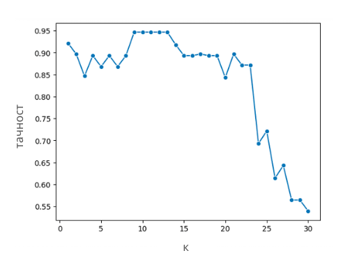

Хиперпараметри
==============

Видели смо да је у алгоритму к-најближих суседа потребно да унапред фиксирамо вредност броја к, као и да различити избори доводе до различитих 
закључака. Како да знамо коју вредност баш да одаберемо? Ово питање прати и све друге алгоритме машинског учења у којима се појављују неке 
вредности које унапред треба да дефинишемо. Такве вредности зовемо **хиперпараметрима** или **метапараметрима**. 

|

Поменули смо да приликом поделе скупа података увек издвајамо скуп за тренирање, скуп за тестирање и скуп за валидацију. Скуп за валидацију до 
сада нисмо користили. Он нам је заправо потребан кадгод у нашем алгоритму учења фигуришу неки хиперпараметри чију најбољу вредност треба да одредимо. 
Прича коју ћемо поделити важи за све алгоритме, али ћемо наставити да користимо алгоритам к-најближих суседа. 

|

Вратимо се на питање како да одаберемо најбољу вредност хиперпараметра к. Природно је да помислимо: пробаћемо више вредности, на пример, све 
бројеве од 1 до 10, па ћемо одабрати најбољу вредност! Ово ћемо заправо и урадити али ћемо јако водити рачуна о томе где опробавамо колико је 
наш избор добар. Ако то будемо радили над скупом за тестирање огрешићемо се о златно правило машинског учења о строгој раздвојености скупа за 
тестирање и развоја модела: употребићемо скуп за тестирање да одлучимо која је најбоља вредност хиперпараметра к, а онда ћемо, када обучимо модел, 
опет искористити скуп за тестирање да оценимо колико је добар! Сложићеш се да то и нема баш пуно смисла! 

|

Коректно је да урадимо следеће: испробаваћемо које вредности хиперпараметара су најбоље на скупу за валидацију. Тај скуп не дели информације ни 
са скупом за тренирање ни са скупом за тестирање па ће допринети објективности наших закључака. Сада када смо то установили, можемо да се бацимо 
на посао одређивања најбоље вредности хиперпараметра к. 

|

За сваку од вредности хиперпараметра к коју желимо да пробамо, посебно ћемо обучити модел на скупу за тренирање и израчунати његову меру квалитета 
на валидационом скупу. Нека то у нашем случају буде тачност. Добијене вредности можемо да прикажемо графички тако што ћемо дуж x-осе поставити различите вредности 
параметра к, а дуж y-осе вредности тачности. Вредност хиперпараметра к за коју добијамо најбољу вредност мере квалитета 
на валидационом скупу је вредност хиперпараметра коју тражимо. То се на графику обично види у облику пика.

*Приказ тачности модела на скупу за валидацију*

-------

На основу претходног графика видимо да су оптималне вредности хиперпараметра к заправо 9, 10, 11, 12 и 13 јер све резултирају истом, највећом, тачношћу модела.

|

Слични графици се могу цртати и за вредности хиперпараметра и функцију грешке. Тада дуж x-осе постављамо различите вредности хиперпараметра, а дуж y-осе
вредности функције грешке. Сада је важно уочити вредности хиперпараметра за коју је функција грешке најмања. 

|

Када у алгоритму учења фигурише више хиперпараметара циљ је пронаћи најбољу комбинацију хиперпараметара. Њу, такође, одређујемо на основу скупа за 
валидацију пратећи успешност модела и ловећи комбинацију која даје најбољу вредност мере квалитета (или равноправно, пратећи грешку модела и ловећи 
комбинацију која даје најмању вредност грешке). Невоља је што овај поступак за велики број хиперпараметара може да буде доста спор и рачунски захтеван: 
рецимо, ако желимо да испитамо 10 различитих вредности броја к и 3 различите функције растојања имамо заправо 10 x 3 = 30 различитих комбинација па 
морамо да обучимо и оценимо 30 различитих модела. 