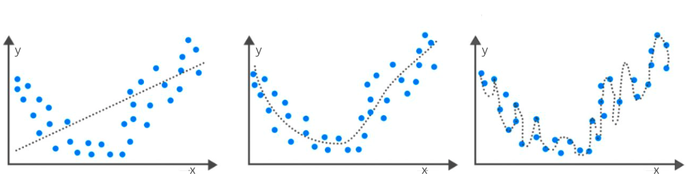

Генерализација, потприлагођавање и преприлагођавање
===================================================

.. infonote::

 У овој свесци упознаћемо појмове генерализације, преприлагођавања и потприлагођавања који се често сусрећу у причи о машинском учењу. 

Замисли да се Пера, Ана и Лука припремају за контролни из математике и да сви користе исту збирку. Пера је забушавао и само је овлаш провежбао 
задатке, Ана је била вредна и целе недеље пажљиво и са разумевањем вежбала, док се Лука одлучио да задатке научи напамет. Да ли можеш да 
погодиш ко је најбоље прошао на контролном? Наравно, Ана!

|

На збирку задатака можемо да гледамо као на неки апстрактни скуп података који се састоји од улаза (текстова задатака) и излаза (решења). 
Модел машинског учења може, попут Пере, да научи тек по неку везу у подацима и пуно греши у пракси. Такво својство модела зовемо **потприлагођавање** (енгл. underfitting). 
Модел може и да претера са нивоом детаља, попут Луке, и изгуби моћ да се снађе са неким новим подацима. Такво својство модела зовемо 
**преприлагођавање** (енгл. overfitting). Најбоље би било када би модел усвојио праве информације и могао, као Ана, да успешно реши и познате и неке нове задатке. 
То својство модела зовемо **добра генерализација** (енгл. generalisation). 

|

Пример потприлагођавања и преприлагођавања можемо да илуструјемо и следећом сликом. Замисли да су дуж x-осе наведене вредности неког атрибута, 
дуж y-oce вредности циљне променљиве и да је испрекиданом линијом приказан модел. Модел на левој слици није баш најбољи избор с обзиром на 
распоред тачака, делује превише једноставно. Подаци више личе на неку ”чашу” па би неки квадратни модел, који има ту форму, могао да буде боље решење. 
Њега можемо да видимо на средњој слици. На десној слици видимо модел који доследно прати 
сваку тачку у скупу података и који му је сасвим прилагођен.

*Пример потрпилагођавања и преприлагођавања*

-------

Задатак проналажења оптималног модела и балансирања између потприлагођавања и преприлагођавања није једноставан. Срећом, област машинског учења 
дефинише протоколе и технике које можемо да користимо да испратимо сваку од ових ситуација. Тако, рецимо, велике разлике у успешности модела на 
скупу за тренирање и скупу за тестирање указују да се модел преприлагодио. То је обично последица избора комплекснијег модела него што је потребно 
(као на горњој десној слици) или дужег тренирања модела. Са друге стране, мале вредности мера квалитета и на скупу за тренирање и на скупу за 
тестирање указују да модел није научио довољно на основу података, да је превише једноставан (као на горњој левој слици) или да му је потребно 
више атрибута. 

|

Добра генерализација је својство које моделима машинског учења омогућава успешну примену у пракси. За њихово обучавање се користи само један 
мали део података који је доступан, а опет, од њих очекујемо у току примене да се добро понашају и над новим подацима које нису никада сусрели. 
Зато је важно да скупови података буду репрезентативни тј. да буду и довољно богати и разноврсни и да одговарају проблему који се решава, као и да 
се пажљиво пропрате могућа потприлагођавања и преприлагођавања модела.

