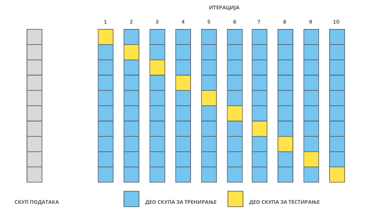

Унакрсна валидација
===================

Много пута до сада смо поновили да се подаци пре примене алгоритма машинског учења деле на скуп за тренирање и скуп за тестирање (валидациони скуп 
укључујемо онда када нам је то неопходно). Поменули смо и да је поступак поделе насумичан. Можда си се питао да ли би неке другачије поделе, 
у односу на оне које смо одабрали, довеле до другачијих резултата рада модела. Можда баш за неку конкретну поделу скупа података добијамо оптимистичније 
резултате или драстично лошије. И то је нека врста прилагођавања. 

|

Кадгод величине скупова података и одабрани алгоритми дозвољавају, пожељно је заправо извршити више подела полазног скупа података на скуп за 
тренирање и скуп за тестирање тако да свака инстанца у скупу података добије прилику да се нађе и у једном и у другом скупу. Један такав 
поступак који ћемо описати се зове **унакрсна валидација** (енг. *cross validation*). У примеру ћемо користити алгоритам линеарне регресије, али је 
прича општа и важи за све алгоритме.

|

Поделимо скуп података на 10 делова као на доњој слици. У првом кораку издвојимо први део скупа за тестирање а преосталих девет делова 
задржимо за тренирање. Да би лакше могао да пратиш, скуп за тестирање је на слици обојен жутом бојом, а скупови за тренирање плавом. 
Обучимо сада први модел линеарне регресије на скупу за тренирање и израчунајмо вредност његове средњеквадратне грешке на скупу за тестирање. 
Добијену вредност можемо обележити са MSE :sub:`1`. У кораку два издвојимо други део скупа за тестирање, а преосталих девет делова за скуп за тренирање. 
Сада је на слици други део обојен жутом бојом, а преостали делови плавом. Поново обучимо модел линеарне регресије на скупу за тренирање 
(то је сада други модел) и израчунајмо вредност његове средњеквадратне грешке на скупу за тестирање. Обележимо сада ову вредност са MSE :sub:`2`. 
Наставимо овај поступак све док не стигнемо до последњег, десетог, дела: сада ћемо њега задржати као скуп за тестирање,  а преостале делове ћемо искористити 
за тренирање модела. Над њиме ћемо обучити десети по реду модел линеарне регресије а потом и израчунати средњеквадратну грешку MSE :sub:`10` на скупу за 
тестирање. 

*Унакрсна валидација са 10 слојева*

-------

Пошто имамо 10 различитих подела скупа података имамо и 10 различитих вредности средњеквадратне грешке. Просек добијених вредности 
(MSE :sub:`1` + MSE :sub:`2` + … + MSE :sub:`10`)/10 заправо најбоље указује како се понаша наш модел и помаже нам да разрешимо дилеме које смо имали у старту 
у вези са утицајем поделе на успешност рада модела. Оно што није баш најјасније је који то од 10 различитих модела којима располажемо треба да одаберемо. 
Да ли онај чија је грешка најмања или неки други? Заправо, сада би требало да обучимо нови модел над целим скупом података и даље га користимо - његово понашање 
смо апроксимирали и оценили понашањима сваког од 10 обучених модела. 

|

Описани поступак се зове унакрсна валидација са 10 слојева (енг. *10-fold cross validation*). У пракси се користе и поделе са 3 и 5 слојева, а 
избори зависе од величине скупа података и врсте алгоритама који се користе. Такође, постоји и подела у којој број слојева одговара броју инстанци у 
скупу података, такозвана *изостави једну инстанцу* унакрсна валидација (енг. *leave-one-out cross validation*).
