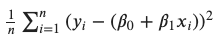

Регуларизација
==============

Регуларизације представљају још једaн скуп техника које се могу користити за контролу преприлагођавања модела. Њихов основи циљ je да 
спрече комплексне моделе, који нам помажу да научимо богатији скуп зависности у подацима, да се се превише прилагоде. 

Регуларизацију ћемо увести на примеру модела линеарне регресије. Претпоставимо да смо обучили модел и да смо добили вредности параметара 
чији графички приказ изгледа као на слици. 

.. image:: ../../_images/reg1.png
    :width: 450
    :align: center

Параметри који су по својој (апсолутној) вредности највећи су и најзначајнији за предикције модела. На слици су то атрибути 3 и 5. 
У том смислу, неколико атрибута са највећом вредношћу пратећих параметара може да занемари утицај преосталих атрибута на вредности предикција. 
Ово можемо да протумачимо и као вид преприлагођавања подацима.  

Зато је пожељно, у некој мери, ограничити вредности параметара - желимо да модел научи параметре и да они осликавају својства података али 
желимо и да пратимо њихову вредност како би предупредили преприлагођавање. Ова техника се зове регуларизација (енгл. regularisation). 
У контексту линеарне регресије то можемо урадити додавањем суме квадрата параметара срењеквадратној грешци модела: |regf| **+ λ(ꞵ12+... ꞵn2)** **(???)**. 
Вредност λ која фигурише у изразу је хиперпараметар којим утичемо на јачину регуларизације. Ако је његова вредност 0, регуларизације неће имати 
никаквог ефекта. Задавањем неких не-нула вредности балансирамо учење одређено средњеквадратном грешком и преприлагођавање мереном вредностима 
суме квадрата параметара. Квадрати су ту из техничких разлога, прво да би онемогућили да се вредности коефицијената између себе не потиру, а 
потом и да би се очувала својства фунцкије грешке за примену алгоритма оптимизације. Овако проширени облик линеарне регресије допуњен 
регуларизанионим чланом назива се **гребена линеарна регресија** (енгл. *ridge regression*). 

Нешто касније ћемо се вратити на причу о регуларизацији, када будемо увели неуронске мреже. Оне су јако комплексни модели па се често могу преприлагодити подацима. Видећемо и како то можемо да пратимо.  

