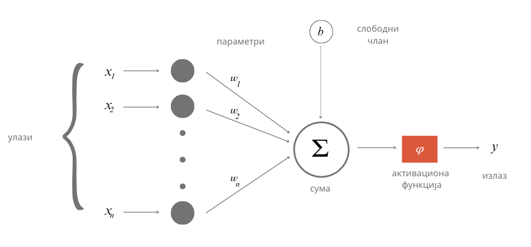

Неуронске мреже
===============

.. infonote::

 У овој лекцији ћемо упознати, неуронске мреже, посебну групу алгоритама машинског учења. Њима дугујемо многе заниљиве пробоје у свету вештачке 
 интелигенције. 

Са часова биологије ти је познато да је ћелија основна јединица грађе и функције свих живих бића. Из угла вештачке интелигенције и учења, 
најзаниљивије су нам ћелије мозга. Оне се зову неурони. Неурони се састоје из тела у којем је језгро и дужих и краћих наставака који се зову 
аксони и дендрити. Наставци неуронима омогућавају да се повежу са другим неуронима. Те тачке повезивања неурона се називају синапсама. Оне 
омогућавају да се сигнали тј. електрични импулси који генерише један неурон пренесу до другог неурона. Занимљиво је да један неурон може бити 
повезан са милионима других неурона. То значи да је он прима и обрађује сигнале који стижу од мноштва других неурона и на основу својих интерних 
механизама фино прорачунава сигнал који даље шаље другим неуроним. Уобичајено је да се ово стање назива стање активације неурона. Оно траје тек 
делић секунде али омогућава да се изврше суптилне калкулације и генерише сигнал који се пренеси кроз цео нервни систем. 

.. figure:: ../../_images/nm1.png
    :width: 500
    :align: center

(слика је преузета са https://www.google.com/url?sa=i&url=https%3A%2F%2Fwww.researchgate.net%2Ffigure%2FSchematic-of-two-interconnected-neurons-Action-potentials-propagate-from-the-pre-neuron_fig6_316534311&psig=AOvVaw0rHwMLQBL7XDGzjvd9vSeK&ust=1691038820418000&source=images&cd=vfe&opi=89978449&ved=0CBMQjhxqGAoTCMjg99OYvYADFQAAAAAdAAAAABCJAQ)

-------

Неурон који сусрећемо у вештачкој интелигенцији је математичка апстракција неурона мозга. Њега описујемо функцијом више променљивих f(x1, x2, …, xn) 
где свака од променљивих x1, x2, …, xn одговара по једном сигналу који стиже до неурона. Како нису сви сигнали подједнако важни за активности 
неурона, придружују им се тежине  w1, w2, …, wn. Веће вредности ових бројева указују да је сигнал важнији, а мање вредности да је сигнал мање 
важан. Тако, укупна стимулација неурона одговара тежинској суми w1x1+w2x2+.....+wnxn. Да би могло да се утиче на додатна понашања неурона, овој 
суми се додаје и један слободан члан b тако да укупна стимулација неурона заправо износи w1x1+w2x2+.....+wnxn + b. Она се даље прослеђује такозваној 
активационој функцији φ која има задатак да израчуна излаз неурона. У зависности од избора активационе функције зависиће и вредности излаза које се 
добијају. Ако сада све систематично запишемо, добијамо да је за примљене сигнале x1, x2, …, xn излаз неурона y = φ(w1x1+w2x2+.....+wnxn+ b). 
Поступак који смо описали можеш да испратиш и на доњој илустрацији.

*Математичка апстракција неурона*

-------

Скривени блок **(???) блок или дугме, који је наслов?**
Приближимо додатно смисао параметра b. Природни неурон карактерише такозвани праг активације - уколико је укупан сигнал који неурон прими већи од 
вредности прага активације, он се активира, обрађује сигнал и прослеђује резултат обраде даље другим неуронима. Сличу улогу у математичком моделу 
неурона има и параметар b. Уколико је укупни сигнал већи од прага активације b тј. ако је  w1x1+w2x2+.....+wnxn >b неурон ће се активирати. 
Стога нам параметар b оставља могућност да утичемо на додатна понашања неурона. Израз w1x1+w2x2+.....+wnxn >b се може записати и као w1x1+w2x2+.....+wnxn - b > 0 
па је у том смислу параметар b и саставни део суме. 

Када неуроне повежемо међу собом добијамо **неуронску мрежу** (енгл. *neural network*). Неуронска мрежа се по правилу састоји од **слојева** (енгл. *layer*), посебно удружених група неурона. 

*Слојеви неуронске мреже*

(слика је преузета са https://medium.com/@b.terryjack/introduction-to-deep-learning-feed-forward-neural-networks-ffnns-a-k-a-c688d83a309d)

-------

**Улазни слој** (енгл. *input layer*)  је слој који се налази на улазу неуронске мреже. Улазне сигнале x1, x2, …, xn овог слоја повезујемо са 
вредностима атрибута које имамо у скупу података и тако прилазимо практичној примени неуронских мрежа. На пример, ако располажемо скупом 
података у којем се налазе три атрибута, температура, влажност ваздуха и атмосферски притисак, улазни слој ће имати три неурона: први ће 
одговарати првом атрибуту, температури, други ће одговарати другом атрибуту, влажности ваздуха, а трећи неурон трећем атрибуту тј. атмосферском 
притиску. За једну конкретну инстанцу скупа података са вредностима температуре, влажности ваздуха и атмосферског притиска који износе, 
редом, 19℃, 77% и 1011.2 mb имаћемо вредности сигнала x1=19 , x2=77 и x3=1011.2. У духу претходне приче, први неурон улазног слоја прима и 
обрађује само сигнал x1 и то тако што га пропушта без било какве модификације (то је могуће за избор активационе функције φ(x)=x и вредност w1=1 и b=0). Слично важи и за преостала два неурона и њихове сигнале x2 и x3. То би значило да нам улазни слој омогућава да подаци уђу у мрежу. 

**Излазни слој** (енгл. *output layer*) је слој који се налази на излазу неуронске мреже. Као што наслућујеш, он нам омогућава да очитамо 
резултате које је неуронска мрежа израчунала за нас. У зависности од задатка који се решава, зависиће и број неурона који се налази у овом слоју. 

.. quizq:: 

    .. mchoice:: p91
        :correct: a
        :answer_a: 1
        :answer_b: 3
        :answer_c: 5
        :feedback_a: Одговор је тачан. 
        :feedback_b: Одговор није тачан. 
        :feedback_c: Одговор није тачан. 

        Шта мислиш, ако користимо неуронску мрежу за задатак регресије, колико неурона имамо у излазном слоју?

У задацима регресије, пошто очекујемо једну бројчану вредност као резултат (количину падавина или нешто слично) довољан нам је један неурон. 
Његов излаз треба да одговара предикцији коју очекујемо. За задатак класификације, размотримо посебно бинарну класификацију и вишекласну 
класификацију. Како код бинарне класификације очекујемо две вредности, 0 или 1, можда ће ти прва помисао бити да су нам потребна два неурона. 
Ипак, ако боље размислиш приметићеш да је довољан чак и један неурон: ако његов излаз пређе неки праг, неку унапред дефинисану вредност, то 
можемо водити као резултат 1, или у супротоном, као резултат 0. У случају вишекласне класификације можемо да имамо више класа па је практично 
да за сваку класу уведемо по један неурон. 

.. fillintheblank:: d91

    Колико неурона у излазном слоју нам је потребно у задатку класификације слика цифара?
    
    Одговор: |blank|

    - :^10|deset|Десет|Deset|DESET|ДЕСЕТ|десет$: Одговор је тачан.
      :x: Одговор није тачан.

Сложићеш се да у задатку вишекласне класификације очекујемо да сви излази неурона излазног слоја буду 0 осим једног који има вредност 1 - тако 
ћемо тачно знати о којој је класи реч.

Слојеве неуронске мреже које се налазе између улазног и излазног слоја називамо **скривеним слојевима** (енгл. *hidden layers*). Уобичајено је да 
се неуронске мреже које имају више од једног скривеног слоја називају **дубоким неуронским мрежама** (енгл. *deep neural networks*). 
Одатле долази и име дубоко учења (енгл. deep learning) за област машинског учења која их изучава и име **плитко учење** (енгл. *shallow learning*) 
за класичније форме учења.

**Потпуно повезане неуонске мреже** (енгл. *fully connected neural networks*) су мреже код којих је сваки неурон претходног слоја повезан за 
сваким неуроном наредног слоја. Слика на којој су приказани слојеви неуронске мреже приказује и једну потпуно повезану неуронску мрежу јер су 
сви неурони улазног слоја повезани са свим неуронима првог скривеног слоја, затим су сви неурони првог скривеног слоја повезани са свим неуронима 
другог скривеног слоја, и на крају, сви неурони другог скривеног слоја су повезани са свим неуроним (на нашој слици само једним) излазног слоја. 
Начини на који су неурони слојева повезани између себе одређује архитектуру неуронских мрежа и нека специфична својства мрежа која даље одређују 
у којим областима могу да се користе. У наредној лекцији упознаћемо неке такве типове. 

Размотримо сада шта смо заправо добили увођењем неурона и неуронских мрежа. Претпоставимо да имамо три атрибута x1, x2 и x3. Линеарну зависност 
између атрибута и циљне променљиве смо математички описивали једначином y = ꞵ0+ ꞵ1x1 + ꞵ2x2 + ꞵ3x3. Уколико уместо параметара ꞵ запишемо w а 
уместо ꞵ0 запишемо  b и пребацимо га на крај, добијамо заправо тежинску суму w1x1+w2x2+w3x3 + b коју израчунава један неурон за сигнале које 
прима. То значи да када не би било активационе функције φ и неурон би моделовао линеарну зависност између атрибута (сигнала) и излаза. Ово 
можемо графички приказати и мрежом која се састоји само од улазног слоја са три неурона и излазног слоја за једним неуроном као на доњој слици. 

-------

Ако активациона функција не би постојала, да ли би из угла моделовања зависности нешто променило додавање новог скривеног слоја? Нека то буде 
слој жуте боје на следећој слици. 

**ТОДО: дорадити слику и додати обележја x и w**
 
-------

Сада сваки неурон скривеног слоја израчунава неку линарну комбинацију атрибута, а неурон излазног слоја неку линеарну комбинацију вредности 
скривеног слоја. То би значило да наш неурон излазног слоја опет израчунава неку линеарну комбинацију атрибута и да се нисмо пуно померили 
од представљања неких сложенијих зависности између атрибута и излаза. Додатно, не би померили чак ни додавањем 100 скривених слојева - увек 
бисмо моделовали линеарну зависност.

Зато укључивање активационе функције у израчунавања неурона значајно мења скуп могућности које имамо. Уколико искористимо неку нелинеарну 
активациону функцију моћи ћемо да моделујемо и неке нелинеарне зависности између атрибута и циљне променљиве. Тако постојање нелинеарне 
активационе функције у скривеном слоју из прехтодног примера омогућава да неурон излазног слоја сада израчунава неку нелинеарну комбинацију 
атрибута. У овом светлу, додавање нових слојева има много више смила. Комбинујући нелинеарности већег броја слојева нам омогућава да моделујемо 
комплексне зависности између атрибута и излаза. 

Да би се све коцкице уклопиле, остаје још да продискутујемо које су то нелинеарне активационе функције које су популарне у машинском учењу. 
То су сигмоидна функција коју смо упознали у причи о логистичкој регресији, тенгес хиперболички, исправљена линеарна јединица и накошена 
исправљена линеарна јединица. Формуле по којима се ове функције израчунавају и њихови графици су приказане на доњој слици. Као што можеш 
да приметиш ове функције заиста нису линеарне - њихови графици нису праве. 

.. figure:: ../../_images/nm6.png
    :width: 780
    :align: center

*Најчешће избори активационих функција*

(слика је преузета са https://www.researchgate.net/figure/Artificial-neural-network-activation-functions-In-this-figure-the-most-common_fig8_344331692
 
-------

Да бисмо употпунили причу о комбиновању различитих активационих функција, посматрајмо функцијe f(x) = 2x и g(x) = 1-x. Можемо да приметимо да су 
обе функције линеарне функције једне променљиве. Њиховим комбиновањем, композицијом функција, добијамо функцију g(f(x)) = 1-2x која је, такође, 
линеарна функција једне променљиве. Графике све три функције можемо да видимо и на доњој слици.

Посматрајмо сада функције  f(x) = ReLU(2x) и g(x) = ReLu(1-x) које се од претходних функција разлику по томе што у њима фигурише активациона функција 
исправљена линеарна јединица. Зато су обе функције нелинеарне. Њиховим комбиновањем тј. њиховом композицијом, добијамо функцију 
g(f(x)) = ReLU(1- ReLU(2x)) која је, такође, нелинеарна и која има нови ”облик”: омогућава нам да изразимо нешто другачију зависност 
између улазне променљиве и излаза.

(слика је преузета из књиге Deep Learning with JavaScript, страна 85)

-------

Избор одговарајуће активационе функције зависи од природе задатка и неких својстава које неуронска мрежа треба да има у току обучавања. 
Како се то ради приближићемо у следећој лекцији. 

