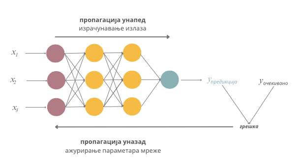
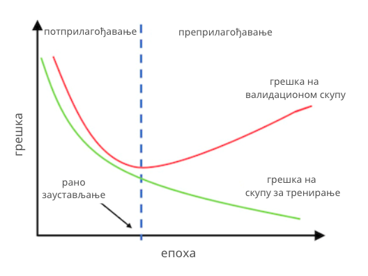

Обучавање неуронских мрежа
==========================

Као што смо видели, сваки неурон неуронске мреже је на неки начин повезан са другим неуронима у мрежи. Те везе су описане тежинама :math:`w` које заправо 
представљају параметре неуронске мреже које је потребно научити у току тренирања. Број параметара у неуронској мрежи је углавном велики. 
Рецимо, за потпуно повезану неуронску мрежу која има 5 неурона у улазном слоју, један скривени слој са 10 неурона  и излазни слој са 3 неурона, 
број параметара које треба научити је 93. У пракси, неуронске мреже имају хиљаде и милионе параметара, чак и милијарде! Зато је потребна велика 
количина података за њихово обучавање. 

.. questionnote::

 Да ли је заиста број параметара у потпуно повезаној неуронској мрежу која има 5 неурона у улазном слоју, један скривени слој са 10 неурона и 
 излазни слој са 3 неурона 93? 

.. reveal:: r92
    :showtitle: Прикажи одговор
    :hidetitle: Сакриј одговор

    Улазни слој не садржи непознате параметре - он само пропушта податке у мрежу. Сваки неурон скривеног слоја је повезан са сваким неуроном 
    улазног слоја, што знaчи да свака од тих веза има по 5 параметара и један слободан члан. То је укупно 10x5 + 10x1 = 60 параметара. 
    Сваки неурон излазног слоја је повезан са сваким неуроном скривеног слоја што значи да свака од тих веза има по 10 параметара и 
    један слободни члан. То је укупно 3x10 + 3x1 = 33 параметра. Када саберемо обе вредности, то је 93 параметра. 

Неуронске мреже се попут других модела обучавају на скупу за тренирање и оцењују на скупу за тестирање. Пошто неуронске мреже представљају 
комплексне моделе који могу да науче сложене зависности између атрибута и излаза, оне се лако могу преприлагодити подацима. Зато у току 
обучавања мрежа увек користимо и валидациони скуп. Он нам помаже да финије испратимо ток тренирања и раније приметимо преприлагођавање и друга 
непожељна својства модела.

|

У уводу курса смо рекли да се непознати параметри модела одређују тако што се дефинише функција грешке, а затим примени нека техника оптимизације 
(у које спада и градијентни спуст) са циљем да се пронађу оне вредности параметра за које је функција грешке најмања. Овај протокол прати и причу 
о неуронским мрежама с тим што се вредности грешке не израчунавају за појединачне инстанце већ за групе инстанци. Мотивација за овакав дизајн је, 
пре свега, рад са великом количином података и потреба да се цео процес паралелизује и убрза. Зато се прво сви подаци у скупу за тренирање поделе 
у **пакетиће** (енг. *batch*) једнаких величина. Пакетићи се даље, један по један, пропуштају кроз мрежу и за њих се израчунава вредност функције грешке 
тако што се упореде очекиване и добијене вредности циљне променљиве. Затим се сразмерно својим доприносима вредности грешке параметри неуронске 
мреже ажурирају проласком кроз мрежу уназад. Описани поступак ажурирања параметара мреже се назива **пропагација уназад** (енг. *backpropagation*) и 
омогућава нам да у итерацијама профинимо вредности параметара и стигнемо до оптималних вредности параметара. Њих, иначе, у старту насумично иницијализујемо.

-------

Један пролазак кроз цео скуп података, тј. једна обрада свих пакетића скупа за тренирање, назива се **епоха**. Неуронске мреже се тренирају у 
више епоха. Након што се заврши једна епоха, подаци се ”промешају”, потом поново поделе у пакетиће и пропусте кроз мрежу. У колико ће се епоха 
тренирати модел зависи од успешности тренирања и расположивих ресурса. Због рада са великом количином података, мрежама је потребан специјализован 
хардвер који може да паралелизује израчунавања (на пример, графичке картице или тензорске картице) па је само тренирање мрежа често и скупо и 
дуготрајно.  

|

Овакав начин тренирања мреже кроз епохе нам омогућава да финије пратимо ток тренирања. На крају сваке епохе се по правилу израчуна грешка модела 
на скупу за тренирање и грешка модела на скупу за валидацију. Затим се ове две вредности прикажу на графику који дуж x-осе приказује редни број 
епохе, а дуж y-осе вредност грешке. Један такав график можеш да видиш на доњој слици. Добро тренирање карактерише упоредни пад ових вредности 
до задовољавајуће вредности грешке - што смо ближи нули, то је модел бољи. Подсетимо се да је овај закључак утемељен на томе што се у валидационом 
скупу налазе подаци који су раздвојени од скупа за тренирање и које мрежа види први пут.

-------

Уколико приметимо да се вредности функције грешке на скупу за тренирање смањују а на валидационом скупу расту, закључујемо да се модел 
преприлагођава и заустављамо обучавање. Даље имамо две опције. Ако су вредности функције грешке модела у епохи пре примећеног преприлагођавања 
модела биле задовољавајуће, можемо да задржимо ту верзију модела за даље тестирање на скупу за тестирање (обично се у току тренирања мреже сачува 
неколико верзија модела са идејом да се искористе за овакве сврхе или да се искористе уколико треба зауставити па наставити процес обучавања). 
У супротном, морамо да опробамо нешто другачију архитектуру мреже или нешто другачији скуп њених хиперпараметара. С обзиром на то да сваки слој мреже 
има своја подешавања (број неурона, активациону функцију, иницијални скуп параметара), да слојеве можемо повезати на различите начине, да упоредо 
морамо пратити сва подешавања оптимизационог алгоритма, рецимо градијентног спуста и његовог корака учења, и да треба задовољити и нека очекивања 
у погледу мера квалитета, тренирање мреже је изазован и комплексан задатак. Зато се за њега каже да представља *уметност тренирања*.  

*Праћење преприлагођавања неуронске мреже на основу графика вредности функције грешке на скупу за тренирање и скупу за валидацију*

