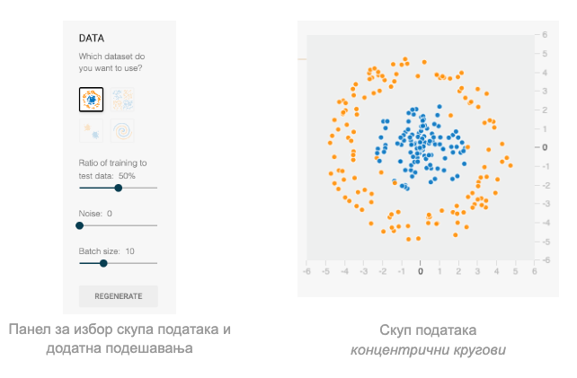

TensorFlow Playground
=====================

.. |tfk2| image:: ../../_images/tfk2.png
            :width: 30px

.. infonote::

 Сада када знаш шта су то неуронске мреже и како се тренирају, можеш и да покушаш да направиш и истренираш своју мрежу! 

TensorFlow Playground је графичко окружење које ће ти приближити како заправо изгледа тренирати једну неуронску мрежу. 
Moжеш му приступити на адреси https://playground.tensorflow.org/ па онда наставити да читаш даље. Није ти потребан посебан налог или додатни 
софтвер, све ће се извршавати у твом прегледачу - у прозору који ће те сачетаки видећеш одмах пуно квадратића који представљају неуроне и веза 
између њих!

*Интефејс окружења TensorFlow Playground*

-------

На врху странице TensorFlow Playground се налази трака која ти омогућава да одабереш тип задатка, а затим и да, када креираш мрежу која решава 
задатак, започнеш њено тренирање. Тип задатка, који може да буде класификациони или регресиони, можеш да одабереш у пољу *Problem type* са крајње 
десне стране. За почетак се можеш опробати у неком од понуђених класификационих задатака. Пре него ли упознаш те задатке, прокоментаришимо и 
значење других поља траке са опцијама. Преко поља *Learning rate* можеш да утичеш на величину корака учења који се користи током одређивања 
најбољих вредности параметара. У пољу *Activation* можеш да одабереш неку од понуђених активационих функција. Поља *Regularization* и 
*Regularization rate* утичу на регуларизацију појединачних слојева неуронске мреже, слично као у лекцији о регуларизацији и примеру линеарне 
регресије. Само тренирање мреже започиње се кликом на стрелицу са леве стране. Број епоха тренирања ће се исписивати у пољу *Еpoch*. 

.. figure:: ../../_images/tf2.png
    :width: 780
    :align: center

*Почетна трака са опцијама за подешавање тренирање*

-------

Класификациони задаци на којима можеш да радиш су задаци бинарне класификације, има их укупно четири и представљени су иконицама које описују 
скупове података. Инстанце које припадају позитивној класи су обојене плавом бојом док су инстанце које припадају негативној класи обојене 
наранџастом бојом. Скупове можеш да одабереш у секцији Data са леве стране. За вежбу ћемо у старту одабрати скуп представљен концентричним 
круговима - преостали скупови су спирала, четири квадранта која одговарају задатку учења ексклузивне дисјункције и два кластера података. 
Подешавањима која се налазе у овој секцији можеш да утичеш и на размеру скупа за тренирање и скупа за тестирање (подразумевано су ова два 
скупа једнаких величина) и ниво преклапања класа (параметар Noise). Величина пакетића за тренирање је подразумевано постављена на вредност 10. 

Секција *Features* се односи на улазни слој и атрибуте мреже. Како су скупови са којима се ради скупови тачака у равни, атрибут x1 представаља 
вредност x координате а атрибут x2 вредност y координате. Могуће је одабрати и атрибуте x12, x22 , x1x2, као и sin(x1) и sin(x2). 

Број слојева неуронске мреже можеш да контролишеш опцијом *Hidden layers*. Кликом на дугме + додаје се нови скривени слој, док се кликом на дугме - 
брише скривени слој. Број неурона у појединачним слојевима контролише се, такође, кликом  на дугмиће + и -. Мрежа која се на овај начин креира је 
потпуно повезана неуронска мрежа. Везе између неурона су приказане испрекиданим линијама и њихова боја и дебљина је усклађена са вредностима 
параметара који их прате. Кликом на сваку од ових линијица се може појединачно подесити вредност параметра. 
 
Када креираш мрежу, потребно је да кликнеш на стрелицу за почетак тренирања. У панелу са десне стране који се зове *Output* моћи ћеш да пратиш 
успешност тренирања визуелно или преко исцртавања кривих функције грешке и приказа њихових вредности. 

Проблем са концентричним круговима података који смо одабрали да вежбу није линеаран - не може се повући права која раздваја скуп плавих и скуп 
наранџастих инстанци. Зато је потребно да научимо неки комплекснији нелинеаран модел. Можемо прво опробати мрежу која има улазе x1 и x2 и један 
скривени слој са два неурона која користе ReLu активациону функцију. Приметићемо да након неке епохе мрежа стагнира са учењем па ако је зауставимо 
после 500 епоха добијамо приказ као на доњој слици. Сам проблем није идеално решен јер нема јасне границе између класа. Видимо да је први неурон 
скривеног слоја научио да класификује инстанце на леве и десне (квадратић |tfk1|) а други неурон на оне испод и изнад главне дијагонале (квадратић |tfk2|) 
тако да комбинујући ова знања добијамо границу као на слици. Задржавањем на два неурона и испробавањем и других активационих функција резултати 
неће бити задовољавајући (то обавезно провери!).

Ако сада креирамо мрежу која има улазе x1 и x2 и један скривени слој са три неурона која користе ReLu активациону функцију, добиђемо приказ као на 
доњој слици. Сада успевамо да финије раздвојимо инстанце - први неурон је научио да уочава оне које су доњем десном углу, други да их хоризонтално 
(благо искошено) раздваја а трећи вериткално (благо искошено). Сва ова знања су условљена и природом активационе функције коју смо користили. 
Кобинујући их свакако можемо да стигнемо до боље границе између класа. 

.. image:: ../../_images/tf6.png
    :width: 780
    :align: center

Опробајмо се сада са истом комбинацијом али уз коришћење сигмоидне активације. У сличном броју епоха смо стигли до овалније границе. Видимо и да су 
сада неурони научили да разликују инстанце и према неким мало другачијим критеријумима и то подједнако успешно.

.. image:: ../../_images/tf7.png
    :width: 780
    :align: center

Постоји још јако пуно мрежа које могу решити овај задатак - настави даље да експериментишеш и откријеш своју мрежу! За крај можеш оставити задатак 
са спиралом јер је он наизазовнији. Ево како може да изгледа једна мрежа која га прати!  

.. image:: ../../_images/tf8.png
    :width: 780
    :align: center

У пракси се за креирање и обучавање неуронским мрежа користе библиотеке као што су `TensorFlow <https://www.tensorflow.org/>`_, 
`Keras <https://keras.io/>`_, `PyTorch <https://pytorch.org/>`_ и друге. Оне кроз свој АПИ нуде 
апстракције којима се описују слојеви мреже, оптимизациони алгоритми, прати процес тренирања, дефинишу технике праћења преприлагођавања, 
врши евалуација, контролишу и распоређују ресурси и деле модели. Ове библиотеке се обично упарују и са библиотекама које цео процес тренирања 
приказују графички. Такве су, рецимо, библиотеке, `TensorBoard <https://www.tensorflow.org/tensorboard>`_ и `Weights&Biasis <https://wandb.ai/site>`_.  Ту су и многобројни алати прилагођени специфичним задацима. 

