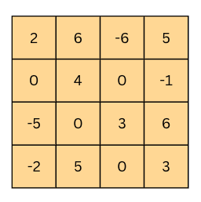

Конволутивне неуронске мреже
============================

.. |open| image:: ../../_images/algk2.png
            :width: 100px

.. infonote::

 Конволутивне неуронске мреже су врста неуронских мрежа које се примарно користе у области рачунарског вида за рад са сликама и видео садржајима. 

Црно-беле слике представљамо матрицама пиксела. Број врста ове матрице одговара висини слике, док број колона ове матрице одговара њеној ширини. 
Појединачне вредности пиксела су бројеви у распону од 0 до 255 где 0 представља црну а 255 белу боју.  Све вредности између представљају неку 
нијансу сиве. Да ли можеш да наслутиш шта се крије иза слике која је представљена доњом матрицом пиксела? Ако се одмакнeш довољно далеко па 
нацрташ контуре дуж тамнијих нијанси, можда ћеш успети да погодиш шта је на слици. Помоћ је да су у заједници која се бави машинским учењем 
слике мачака прилично чест избор.   

Можеш да откријеш и следеће блок и провериш о којој је слици реч. 

.. reveal:: r1023
    :showtitle: Прикажи слику
    :hidetitle: Сакриј слику

    .. image:: ../../_images/knm2.png
        :width: 420
        :align: center

Баш као што је и нама, људима, тешко да разумемо шта се то налази на слици приказаној скупином бројева, тако и је и са конволутивним неуронским 
мрежама. Оне анализу слике започињу тако што прво препознају неке просте елементе као што су хоризонталне и вертикалне лине, а затим их даље 
комбинују и додају комплексност све док не стигну до неких сложених описа слике који им могу помоћи да реше тражени задатак. Сада је природно 
питање како кренути од простих контура и надограђивати их тако да се добију комплексније структуре. Одговор ће нам дати оператор **конволуције**.

|
 
Оператор конволуције је најлакше увести кроз илустрације. Замислимо да имамо на улазу матрицу димензија 6x6 пиксела која представља слику и 
једну малу матрицу, такозвани филтер, димензија 3x3 пиксела. Нека су то баш матрице које су приказане на доњој слици. Над сликом започињемо 
примену оператора конволуције (обележићемо га са ✷) тако што преклопимо део слике у горњем левом углу са филтером, затим помножимо појединачне 
вредности и збир тако добијених вредности упишемо у једну нову матрицу. Та матрица ће заправо представљати резултат примене оператора конволуције. 

.. figure:: ../../_images/knm3.png
    :width: 780
    :align: center

*Конволуција - корак 1*

-------

Наставићемо даље да примењујемо оператор конволуције: преклопићемо филтер са делом слике који се налази у горњем левом углу али тако да је он 
сада померен за један пиксел у односу на леву ивицу тј. у односу на претходни положај. Опет ћемо помножити појединачне вредности, сабрати их и 
уписати у резултујућу матрицу. 

.. image:: ../../_images/knm4.png
    :width: 780
    :align: center

*Конволуција - корак 2*

-------

Филтер овако можемо да померамо за по једну позицију десно све до ивице. Ту је потебно да га спустимо за једну позицију наниже и вратимо тик уз 
ивицу. Затим можемо да наставимо поступак док не стигнемо до доњег десног угла. Као резултат ове операције, добићемо матрицу димензија 4x4 пиксела и 
чије су вредности приказане на доњој слици (обавезно се увери!).

*Конволуција - резултат*

-------

Колико ће филтер бити померен у свакој итерацији дефинише се хиперпараметром који зовемо померај (енгл. *stride*). У нашем случају померај је 
имао вредност 1 јер смо филтер померали за једну позицију удесно тј. када је требало за једну позицију наниже. Да би могли да утичемо и на 
димензије резултујуће матрице приликом примене операције конволуције (обично желимо да очувамо димензије које одговарају улазној матрици), 
можемо да додамо оквир око полазне слике. То је најчешће неки блок нула или јединица или бројева чије вредности одговарају вредностима најближег 
пиксела на слици. Оквир званично називамо проширење (енгл. *padding*) и његову ширину увек наглашавамо приликом примене операције конволуције. 
Он нам је посебно значајан уколико су карактеристике које желимо да наш модел научи близу ивице слике.

|

Доња анимација илуструје цео процес примене филтера над сликом тј. над њеном матрицом. Као што можеш приметити, коришћен је померај величине 1 и 
проширење величине 0.

.. figure:: ../../_images/knm6.gif
    :width: 600
    :align: center

*Анимација операције конволуције*

-------

Ако филтер из примера применимо користећи операцију конволуције над почетном сликом маце, добићемо доњу слику. Можемо да приметимо да су 
на њој наглашене све вертикалне линије које се појављују на слици.

*Издвајање вертикалних ивица*

-------

|

.. questionnote::

 Да ли си изненађен тиме што је горњи филтер детектовао вертикалне ивице? 

.. reveal:: r1021
    :showtitle: Прикажи одговор
    :hidetitle: Сакриј одговор

    Ево  једног појашњења. 

    Посматрај слику с лева на десно. Када први пут пређеш из светлог дела слике у тамни део слике заправо видиш вертикалну ивицу. Применимо 
    сада с лева на десно филтер операцијом конволуције. Највећи резултат једне итерације конволуције биће када је десна страна нашег филтера 
    (колона са бројевима -1) позиционирана баш на вертикалној ивици. Пошто је ивица тамна, вредности које тој боји одговарају су мале јер је 
    црна боја представљена нулом. Вредности лево од ивице су светле па су бројеви који одговарају тим бојама већи (вредност за белу боју је 255). 
    Када мале вредности, које одговарају црној боји ивица, помножимо са -1 тј. десним делом филтера, а велике вредности, које одговарају светлим 
    бојама лево од ивице, помножимо са 0 и 1 тј. преосталим колонама филтера, резултат је већа вредност него када би се филтер нашао било где друго 
    где нема вертикалних ивица (бројеви који множе вредности -1 би били већи па би укупни збир био мањи). Тај контраст у вредностима се осликава и 
    на резултујућој слици - вертикалне линије су ту беле (велике вредности пиксела) док је све остало црно (мале вредности пиксела). На овај начин 
    дајемо способност конволуцији да израчуна оно што људи могу да закључе гледањем. На неки начин, овако јој дајемо вид.

    |

.. questionnote::

 Како би издвојио хоризонталне ивице на слици? Који би филтер искористио?

.. reveal:: r1022
    :showtitle: Прикажи одговор
    :hidetitle: Сакриј одговор

    Довољно је да заротираш филтер који издваја вертикалне ивице! Да ли ти то има смисла?

    |

Сада када знамо како да издвојимо вертикалне и хоризонталне ивице, комбиновањем на разне начине можемо да издвајамо и линије које нису само 
хоризонталне и вертикалне. Даљим комбиновањем тих резултата можемо да издвајамо чак и сферне контуре. На  ово смо мислили када смо рекли да 
крећемо од јасних карактеристика лаких за учење а затим корак по корак градимо на комплексности карактеристика које можемо да научимо. 

|

Слојеви неуронске мреже које карактерише примена опертора конволуције називају се **конволутивни слојеви**. Док су пионири у области рачунарског 
вида креирали филтере ручно, циљ обучавања конволутивних неуронских мрежа је да науче вредности које у њима фигуришу.

|

На доњој слици можеш да видиш приказе научених филтера по слојевима једне конволутивне неуронске мреже која препознаје лица. На најнижем слоју 
то су неке хоризонталне, вертикалне и дијагоналне линије, на другом слоју то су већ обриси који одоговарају деловима лица попут носа, очију и уста, 
док су на трећем слоју то филтери који одговарају контурама лица. 

-------

Уз операцију конволуције, конволутивне мреже карактерише и операција **агрегације** (енгл. *pooling*). Као што само име каже, циљ ове операције да 
агрегира тј. обједини  улазе. На доњој слици можеш да видиш две врсте оператора агрегације: оног који користи максимум и оног који користи 
просек да би агрегирао информације. Баш као и оператор конволуције и овај оператор се примењује над блоковима улаза тако што се уочи блок и 
над њим изврши потребно израчунавање. Овако добијена вредност се уписује у нову матрицу. На слици су оба оператора примењена над блоковима димензије 
2x2. Интуитивно говоређи, максимумима наглашавамо најдоминантнији део, док рачунањем просека узимамо у обзир допринос свих делова. 

Применом операције агрегације добијамо могућност да смањимо димензију улаза али уз истовремено задржавање дела информација које су садржане. 
На слици можеш да видиш да смо применом оператора агрегације свели матрицу са димензије 4x4 на димензију 2x2. Зашто нам је смањење димензије 
потребно? Па, мрежа као резултат треба да нам да неки конкретан одговор, рецимо да ли је на слици мачка или не, за који нам је потребан мали број неурона. 

.. learnmorenote::
    
    Излаз операције агрегације можемо да замислимо и као слику коју добијамо када ставимо наочаре чија диоптрија нам не одговара. 
    Што смо више смањили слику применом операције агрегације, то смо даље од диоптрије која нам одговара. Другим речима, успећемо да 
    видимо обрисе оригиналне слике али уз значајан губитак детаља и све веће коришћење наше маште како бисмо слици дали смисао.

Слојеви неуронске мреже које карактерише примена оператор агрегације се зову слојеви агрегације (енгл. *pooling layers*). У њима нема додатних 
параметара које мрежа треба да научи, али нам, као што смо видели, помажу да контролишемо димензије матрица са којима радимо. 

|

Сада када знамо који су то градивни слојеви једне конволутивне неуронске мреже, хајде да видимо како можемо да их повежемо и добијемо функционалан 
модел који може да нам помогне у решавању задатка класификације. Замислићемо да треба да решимо задатак вишекласне класификације у којем за 
сваку слику цртаног лика треба да одредимо да ли је Твити, Шиља или Патак Дача. Посматрајмо илустрацију архитектуре дубоке конволутивне неуронске 
мреже коју смо одабрали за решавање овог задатка и продискутујмо каква је мотивација за њено креирање.

-------

На почетку мреже се налази улазни слој који садржи пикселе слике. Затим следи конволутивни слој (блок плаве боје). Циљ овог слоја је да применом 
оператора конволуције издвоји неки први скуп апстрактних атрибута. Након тога постављамо слој агрегације (зелени блок) а затим још по један 
конволутивни слој (жути блок) и слој агрегације (наранџасти блок). Слојеви конволуције и агрегације се у пракси комбинују и често налазе 
један до другог јер се слојевима агрегације додатно агрегира тј. сумира оно што су конволутивни слојеви научили. Други конволутивни слој 
нам омогућава примену другог оператора конволуције над атрибутима које је већ издвојио први конволутивни слој и формирање комплекснијих атрибута 
слике. Након овог блока слојева следи слој (сиви блок) који има задатак да ”исправи” матрицу (или презицније тензор) коју смо добили до тог 
тренутка и препакује њене вредности тако да све буду једна до друге у једном низу. Слојеви са овом сврхом се називају слојеви исправљања 
(енгл. *flattening layers*). Након исправљања можемо даље да надовежемо неку потпуно повезану неуронску мрежу. Ова мрежа ће сада као улазе 
имати апстрактне атрибуте које за њу учи комбинација конволутивих слојева и слојева агрегације. Осим исправљеног улазног слоја, на слици 
видимо и један скривени слој као и излазни слој у којем се налазе тачно три неурона - за сваког од цртаних ликова по један. Излазне вредности 
ових неурона одговарају вероватноћи да слика са улаза припада баш класи коју они представљају. За слику Твитија коју имамо на улазу, можемо да 
приметимо да је излазна вредност трећег неурона, који баш одговара тој класи, највећа и да износи 0.7. 

|

Сада можемо да видимо и како изгледа архитектура мреже VGGNet, једне популарне конволутивне мреже која се активно користи у пракси. 

VGGNet представља дубоку конволутивну неуронску мрежу развијену од стране оксфордског тима Visual Geometry Group (отуда и назив VGGNet). 
На престижном такмичењу *Large Scale Visual Recognition Challenge* одржаном 2014. године  ова мрежа се показала као најбоља у решавању проблема 
локализације објеката на слици и као друга по реду у проблему класификације објеката са слике. За задатак класификације коришћено је преко 1,2 
милиона слика скупа ImageNet који смо упознали и класификација у могућих 1.000 класа. Да би се ова мрежа истренирала било је потребно између 15 и 20 
дана користећи 4 графичке картице (најбоље у том тренутку) NVIDIA Titan Black. Пре ње је најбоља у овим задацима била мрежа AlexNet која је 
значајна по томе што је увела праксу коришћења графичких картица за обучавање неуронских мрежа и омогућила даљи развој дубоког учења.

|

Архитектура мреже VGG-16, верзије мреже са 16 слојева, приказа је на доњој слици. Као што можемо да видимо на улазу се очекује слика у боји димензије 
244x244 пиксела, а мрежа комбинује конволутивне слојеве и слојеве агрегације (са максимумом) и завршава потпуно повезаном неуронском мрежом са 
1.000 неурона на излазу где сваки неурон одговара једној конкретној класи скупа ImageNet. Сама мрежа има 138 милиона параметара и за њихово чување 
је потребно око 500МB меморије.

.. figure:: ../../_images/knm10.png
    :width: 600
    :align: center

*Приказ мреже VGG-16*

-------

Повећавање броја слојева конволутивног дела мреже у пракси најчешће даје боље резултате. Ипак број слојева се не може бесконачно повећавати. 
Не само због ограничења ресурса, времена и цене већ и због математичких својстава дубоких неуронских мрежа која даље отежавају примену 
алгоритма пропагације уназад и само тренирање мреже. 

.. suggestionnote::

 Ако те занима овај математички проблем, можеш да пробаш да прочиташ више о нестајућим и експлодирајућим градијентима, а посебно у делу 
 конволутивних мрежа и о резидуалним конекцијама. 

Пре него ли се и практично опробамо у задатку рада са конволутивним неуронским мрежама, осврнимо се на питање рада са сликама у боји. 
Њих до сада нисмо помињали. 

|

Када треба да представимо слику у боји, ону које користи RGB формат боја и све боје приказују као комбинцацује црвене, зелене и плаве боје, 
користимо три матрице. За сваку од боја предвиђена је по једна матрица. Број матрица које користимо за приказ слика називамо **каналима**. 
Тако црно-беле слике имају само један канал, док слике у боји имају три канала. 

.. figure:: ../../_images/knm11.png
    :width: 500
    :align: center

*Приказ слика које користе RGB формат боја*

-------

Присуство боја утиче на извођење операције конволуције тако што број канала филтера треба прилагодити броју канала слике на коју га примењујемо. 
Даље треба упарити сваки од канала филтера са каналом слике (црвени са црвеним, плави са плавим и зелени са зеленим) и извршити операцију 
конволуције као да се ради са једним каналом. Затим треба сабрати матрице које добијамо на овај начин и резултујућу матрицу прогласити финалним 
резултатом.  На доњој слици можемо да видимо два филтера у конволутивном слоју која се примењују над улазном сликом у боју. Као резултат примене 
сваког од ових филтера ћемо добити засебне матрице које када ”спојимо” представљају финални резултат конволутивног слоја. У пракси се на нивоу 
једног конволутивног слоја обично поставља више филтера па се као резултати добијају тензори. Над овим тензорима се даље примењују на исти начин 
операције конволуције - води се само рачуна о томе да број канала филтера одговара димензији тензора (рецимо, за наредну примену у примеру који 
смо разматрали то би био број 2) и да се упари одговарају канал са одговарајућим каналом филтера. 

*Примена оператора конволуције на улазе са више канала*

-------

Што се тиче операције агрегације, она се примењује над сваким каналом улазне слике. На пример, ако улазна слика има 3 канала, операција агрегације 
ће бити примењена над сваким каналом засебно. Ово значи и да операција агрегације чува број канала приликом примене. На доњој слици може се 
видети илустрација овог процеса. 

*Примена оператора агрегације на улазе са више канала*

-------

.. technicalnote::
    
    Ова секција је упарена са Jupyter свеском `10-mreza_VGG-16_i_zadatak_klasifikacije.ipynb <https://github.com/Petlja/specit4_ai_radni/blob/main/10-mreza_VGG-16_i_zadatak_klasifikacije.ipynb>`_. 
    Да би могао да пратиш садржај даље, кликни на линк, а потом и на дугме |open| да би се садржај отворио у окружењу Google Colab. 
    Уколико свеске прегледаш на локалној машини, међу садржајима пронађи свеску са истим именом и покрени је. За детаљније инструкције 
    погледај секцију *Hands-on зона* и лекцију *Jupyter свеске за вежбу*.

Опробајмо сада како конволутивна мрежа VGG-16 заиста ради! Не заборави да упоредо са читањем лекције пратиш свеску са кодом.  

|

Једном истрениран модел неуронске мреже може да се поделити са заједницом тако што се поделе параметри који фигуришу у њему. У овом примеру 
користићемо модел који је доступан у библиотеци *Keras*. Библиотека *Keras* је библиотека отвореног кода са широком употребом у заједници која се 
бави машинским учењем. Да бисмо могли да искористимо модел мреже VGG-16 потребно је да извршимо следеће две наредбе: 

.. code-block:: Python

 from tensorflow.keras.applications import VGG16
 model = VGG16(weights='imagenet')

Информације о моделу који смо учитали можемо да прочитамо користећи функцију ``model.summary()``. Њен резултат је опис слојева мреже праћен информацијом о величинама улаза 
који ти слојеви очекују. Сада можеш да извршиш наредбу:

.. code-block:: Python

 model.summary()

Немој да те збуни ако не разумеш све детаље који се приказују након извршавања ове наредбе. Важно је да знаш да се на улазу очекује слика димензије 
224x224 пиксела у боји (зато је и поред улазног слоја наведено 224, 224, 3) и да на излазу имаш једну од 1.000 класа. Испис можеш да упоредиш и са 
сликом модела VGG-16 коју смо разматрали и тако откријеш више информација.

|

Важно је да нагласимо да мрежу VGG-16 нећемо тренирати - користићемо само истренирани модел. Зато параметре модела у току рада не смемо да мењамо - 
сваки има свој допринос. Укупан број параметара модела који можемо да прочитамо у сажетку мреже је нешто преко 138 милиона. 

|

Идеја је да слика над којом ћемо тестирати модел буде нека произвољна слика са веба. Да бисмо то успели да урадимо користићемо пар стандардних 
Python библиотека. За задати URL функција ``ucitaj_sliku`` ће нам помоћи да превучемо слику коју желимо.

.. code-block:: Python

 def ucitaj_sliku (url_putanja):
    odgovor = request.urlopen(url_putanja).read()
    return Image.open(BytesIO(odgovor))

За тестирање смо одабрали слику златног ретривера са адресе https://unsplash.com/photos/x5oPmHmY3kQ која може слободно да се користи. Ти можеш 
одабрати слику коју желиш! Важно је да имаш на уму да класа објекта на слици мора бити позната моделу. Пошто је модел VGG-16 трениран на преко 1,2 
милиона слика познаје јако пуно класа, чак 1,000 различитих. Златни ретривер је једна од њих. Уколико моделу дамо слику са неким објектом који 
не познаје, он ће нам дати предикције класа чије слике највише подсећају на нашу. Видећемо на крају које све класе наликују на златног ретривера.

.. figure:: ../../_images/knm14.png
    :width: 250
    :align: center

Јунак приче о моделу VGG-16

-------

Пошто слика коју треба да проследимо моделу треба да буде специјално припремљена, урадићемо следеће:

1.	поставити јој димензије на 224x224 и рећи да користи три канала боја RGB

.. code-block:: Python

 test_slika = test_slika.resize((224, 224))
 test_slika = test_slika.convert('RGB')

2.	трансформисати слику у одговарајући матрични формат

.. code-block:: Python

 matricni_oblik_test_slike = image.img_to_array(test_slika)

3.	направити пакетић који садржи нашу слику

.. code-block:: Python

 paketic = np.expand_dims(matricni_oblik_test_slike, axis=0)

4.	извршити нумеричко претпроцесирање слике у виду нормализације

.. code-block:: Python

 test_skup_slika = preprocess_input(paketic)

Тек овако припремљену слику можемо да проследимо моделу за класификацију. Функција која ће нам помоћи се (очекивано) зове ``predict``. 

.. code-block:: Python

 predikcije_modela = model.predict(test_skup_slika)

Променљива ``predikcije_modela`` у којој смо сачували предикције модела је низ дужине 1,000 и садржи вероватноће припадности наше слике свакој од 
1,000 класа које модел распознаје. Да бисмо издвојили класу којој припада наша слика, можемо искорисити функцију ``decode_predictions`` која ће нам 
вратити вероватноће и имена за 5 највероватнијих класа. Ово ће нам дати увид у то колико је модел сигуран приликом класификације. 
Након што извршимо следећу наредбу добићемо информације о највероватнијим класама. 

.. code-block:: Python

 najverovatnije_klase = decode_predictions(predikcije_modela)[0]

Када ове предикције графички прикажемо кодом који је наведен ниже добићемо графикон са стубићима који нам омогућава да лакше анализирамо резултате. 

.. code-block:: Python

 ime_klase = [torka[1] for torka in najverovatnije_klase]
 verovatnoca_pripadnosti = [torka[2] for torka in najverovatnije_klase]
 plt.figure(figsize=(10, 4))
 plt.bar(ime_klase, verovatnoca_pripadnosti, color=['teal', 'yellow', 'green', 'blue', 'orange'])
 plt.title('Пет највероватнијих класа')
 plt.ylabel('Вероватноћа припадности')
 plt.show()

Као што можемо видети, модел је са великом сигурношћу (вероватноћа је 0.804)  предвидео да је слика коју смо одабрали слика златног ретривера. 
Неке од других класа које је модел узео у обзир су неке друге врсте ретривера. Необично је да се у листи резултата појавила и тениска лоптица. 
Вероватно зато што у скупу за обучавање постоји и слике у којима ретривери трче за тениским лоптицама. Овакво понашање модела би у пракси 
требали додатно да испитамо. 

