Рекурентне неуронске мреже
==========================

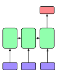

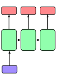

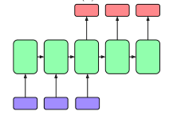

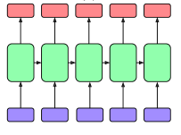

**Рекурентне неуронске мреже** (енгл. *recurrent neural networks*) су тип неуронских мрежа које се примарно користе за обраду секвенцијалних 
података. Секвенцијални подаци или секвенце се састоје из елемената који следе један за другим. Такви су, рецимо, текстуални подаци 
(елементи су појединачне речи), аудио записи (елементи су појединачни семплови), временске серије (елементи су појединачна мерења), 
генетске секвенце (елементи су појединачни нуклеотиди) и многи други. Рекурентне мреже обрађују елемент по елемент секвенце. Да би могао да се 
обради елемент на позицији *t*, морају да се обраде сви елементи који му претходе, а да би елементи секвенце могли да се повежу у једну целину, 
између обраде узастопних елемената улаза деле се вредности скривених слојева. То се обично приказује графички као на доњој слици. 

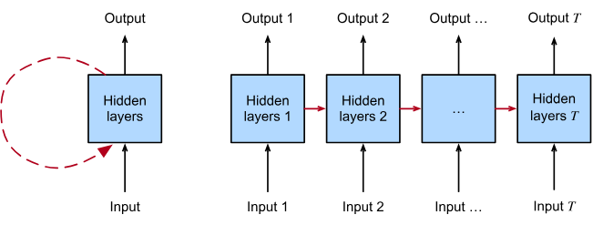

*Рекурентна неуронска мреже*

(слика је преузета са https://d2l.ai/chapter_recurrent-neural-networks/index.html)

-------

Рекурентне неуронске мреже због свог дизајна хипотетички могу да обрађују бесконачно дуге свеквенце: обрађује се елемент по елемент. Ипак, 
приликом обучавања оваквих мрежа примећено је да заборављају. Уколико су секвенце превише дуге, мрежа почиње да заборавља шта је видела на 
почетку и на нивоу скривених слојева чува скорије виђене информације. Ово запажање је довело до дизајнирања специјалних неурона који се зову 
LSTM (енгл. *Long Short Term Memory*) и GRU (енгл. *Gated Recurrent Unit*), а у чије детаље због комплексности нећемо залазити. Још једна досетка 
за решење овог проблема су двосмерне рекурентне неуронске мреже (енгл. *bidirectional recurrent neural networks*): у овим мрежама се, са једне 
стране, секвенца обрађује од почетка ка крају, а са друге стране од краја ка почетку. Репрезентација улаза појединачних елемената представља 
надовезанe репрезентацију ових пролаза, илустративно приказано као на доњој слици. 

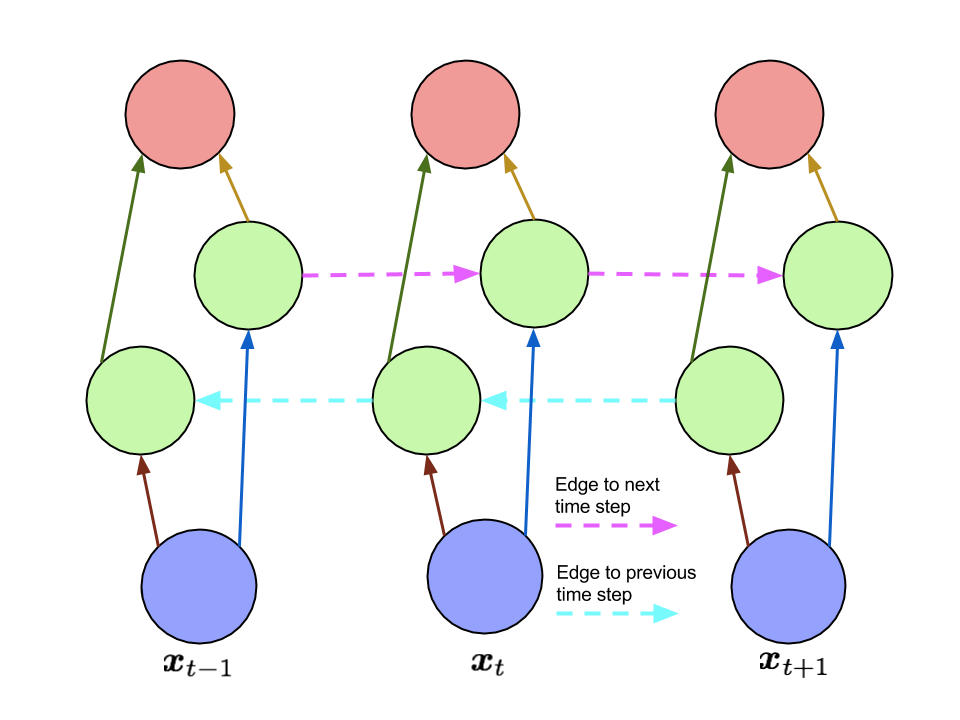

*Двосмерна рекурентна неуронска мрежа - узастопни елементи*

(слика је преузета са https://www.arxiv-vanity.com/papers/1506.00019/)

-------

Постоји неколико популарних архитектура рекурентних неуронских мрежа. У доњој табели ћемо кратко проћи кроз неке најпопуларније примере тако што 
ћемо их приказати графички у левој колони и описати мрежу и области примене у десној колони. 

.. csv-table:: 
   :header: "**АРХИТЕКТУРА**", "**ПОЈАШЊЕЊЕ И ПРИМЕРИ ПРИМЕНЕ**"
   :widths: auto
   :align: left
   
   "|rek3|", "Овај тип мреже одговара задацима у којем је улаз секвенца а излаз векторска репрезентација фиксне дужине. Мреже овог типа називамо **енкодерима** (енгл. *encoders*) а добијене векторе фиксних дужина **контекстом**. Задаци у којима сусрећемо овај тип мрежа су разни задаци класификације попут класификације аудио записа или класификације текста."
   "|rek4|", "За разлику од претходног примера, улаз за овај тип мреже је векторска репрезентација фиксне дужине а излаз секвенца. Овакав тип мрежа називамо **декодерима** (енгл. *decoders*). Задаци у којима сусрећемо декодере су генерисање наслова слика."
   "|rek5|", "Овај тип мреже представља комбинацију претходна два типа и назива се **енкодер-декодер** архитектура. Задатак енкодера је да на основу улазне секвенце креирара репрезентацију (контекст) коју декодер може да искористи за генерисање нове излазне секвенце. Овај тип мрежа сусрећемо у задацима машинског превођења или генерисања сажетака."
   "|rek6|", "Овај тип мреже омогућава генерисање излаза за сваки елемент улаза. Као што можемо да видимо, и на улазу и на излазу су секвенце. Задаци у којима сусрећемо овај тип мрежа су, рецимо, задаци тагирања (обележавања) појединачних елемената."
   "", ""

Један велики недостатак рекурентних неуронским мрежа је немогућност паралелизације: да би се обрадио елемент на позицији *t*, морају се обрадити 
сви елементи који му претходе. Зато тренирање неуронских мрежа изискује много више времена и ресурса него обучавање конволутивних неуронских 
мрежа које смо упознали у претходној лекцији. Ове околности су довеле до појаве механизма пажње и трансформера, типа неуронских мрежа о којима ће 
бити више речи у наредној лекцији. 

.. suggestionnote::

 Аудио записи се могу обрађивати и применом конволутивних неуронских мрежа. Наиме, аудио запис се може поделити на фрагменте, краће делове који 
 трају пар секунди, а затим се за сваки део могу креирати спектрограми. Спектрограм је графички приказ свих фреквенција звука присутних у аудио 
 запису. Овако добијене слике се даље могу прослеђивати као улази конволутивним неуронским мрежама и користити за анализу аудио записа. 

 .. image:: ../../_images/rek7.png
   :width: 350
   :align: center

 *Пример једног спектрограма*

Механизам пажње и трансформери
================================

.. infonote:: 

   Прича о ChatGPT-у те сигурно није заобишла! Програм који може да извршава инструкције на говорном језику је заиста занимљив 
   резултат. У позадини овог програма крије се дубока неуронска мрежа која се назива трансформер. У овој лекцији ћеш сазнати нешто 
   више о трансформерима, као и о самој области која се зове обрада природних језика. Научићеш и како можеш да искористиш неке већ 
   постојеће језичке моделе да би класификовао текст и генерисао код.

Међу примерима архитектура рекурентних неуронских мрежа видели смо да се за задатак машинског превођења користи енкодер-декодер архитектура. 
Енкодер има задатак да обради секвенцу на улазном језику и генерише векторску репрезентацију која може даље да је представља. Ту репрезентацију 
називамо контекстом. Декодер даље има задатак да на основу контекста, реч по реч, генерише одговарајући превод.

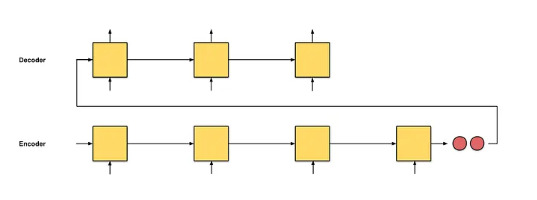

*Архитектура енкодер-декодер*

(слика је преузета са адресе https://towardsdatascience.com/attn-illustrated-attention-5ec4ad276ee3)

-------

Преводиоци-људи овај посао ипак реализују мало другачије, поготово ако су улазне секвенце нешто дуже. Они у процесу превођења не морају одједном 
да запамте целу реченицу, могу да застану, врате се на реченицу, обрате пажњу на осетљиве сегменте, на пример, време у реченици или коришћени предлог, 
и наставе са задатком превођења. Ова идеја која омогућава да се декодер у току генерисања садржаја не ослања само на информације из вектора контекста 
већ да може да се врати на улазну секвенцу и обрати нешто више пажње на важне делове је у основи такозваног **механизма пажње** (енгл. *attention mechanism*). 

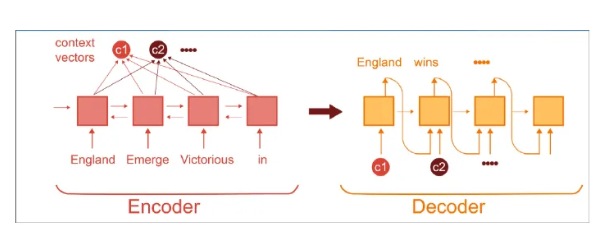

*Енкодер-декодер архитектура са механизмом пажње:* 
*у сваком кораку генерисања декодер може да комбинује различите елементе улаза спрам њиховог значаја*

-------

Истраживачи су приметили да се овај механизам може искористити и за моделовање релација између елемената улаза и генерисање финијих репрезентације улаза. 
Рецимо, у доњој реченици, елемент (придев) *green* више доприноси разумевању својстава елемента (речи) *apple* него разумевању својстава елемента (речи) *eating*. 
Модификација оригиналног механизма пажње која нас доводи до оваквих репрезентација се зове **самопажња** (енгл. *self attention mechanism*). Као резултат самопажње 
се за сваки елемент улаза добија одговарајућа векторска репрезентација - она представља елемент у контексту преосталих елемената улаза и њихових својстава. Зато за овакве
репрезентације кажемо и да су контекстуализоване. Тако ће реч *apple* имати две различите репрезентације у двема различитим реченицама јер ће друге речи у реченицама утицати на
њену репрезентацију. Пракса је и да се комбинује више механизама самопажње тако да сваки механизам самопажње може да моделује неко својство узлаза. На пример, 
један механизам самопажње може да се фокусира више на граматичка својства речи, други на интерпункцију, трећи на семантику и слично. Зато се често може чути да се говори о механизму 
**самопажње са више глава** (енгл. *multihead self attention*).

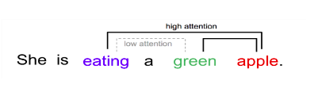

*Мотивација за механизам самопажње*

-------

Механизам самопажње је у основи дубоких неуронских мрежа које се зову **трансформери** (енгл. *transformers*). Трансформер се састоји из енкодера и декодера, а основа 
оба дела мреже су такозвани трансформер слојеви. Ми нећемо залазити у детаље ових блокова, али ћемо приближити смисао и функцију сваког од њих. 

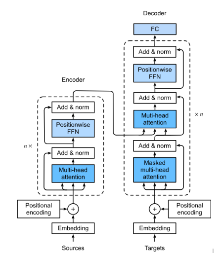

*Трансформер*

-------

Улаз у енкодер део трансформера је фиксне дужине, обично 512 или 1024 елемента. Сваком елементу се засебно придружује вектор који има задатак да представља елемент у мрежи. 
Овај вектор се назива **угњежђенa репрезентација елемента** (енгл. *embedding*) и у старту се насумично иницијализује. У току обучавања мреже ове репрезентације се профињују и уче,  
тако да могу адекватно да представе елемент у контексту других елемената. Уз репрезентацију, за сваки елемент улаза се трансформеру прослеђује и вектор који има задатак да представља 
позицију елемента у улазу. Мотивација за увођење вектора позиције лежи у идеји паралелизације. Због усаглашености израчунавања, важно је да вектора репрезентације 
и вектора позиције буду истих дужина.

|

Након улазног слоја у енкодеру се нижу такозвани трансформер слојеви. Они се састоје од механизма самопажње и једне потпуно повезане мреже са пропагацијом унапред. 
Други елементи који су саставни део ових трансформер слојева служе да одрже проток информација кроз мрежу и учине тренирање мреже стабилнијим. Баш као и у случају 
других мрежа, смисао овако увезених трансформер слојева је да се добије на комплексности апстрактних атрибута који се могу користити за решавање задатака. 
Обично је број трансформер слојева 6, 12 или 24 па трансформери резултирају великим бројем параметара који досежу и милијарде. 

|

И у декодер делу мреже се нижу трансформер слојеви. У њима постоји један механизам самопажње који прати сам ток рада декодера и други механизам самопажње који одржава везу са енкодером. 
Функција преосталих елемената слојева је, баш као и код енкодера, да усагласе демензије између различитих слојева, да одрже проток информација кроз мрежу, а потом и учине тренирање 
мреже стабилнијим. На излазу декодера је једна потпуно повезана мрежа чији излази се даље интерпретирају у складу са задатком. 

|

Због великог броја параметара који треба да се науче, трансформери се обучавају кроз две фазе. У првој фази се користе такозвани **припремни задаци** (енгл. *pre-training tasks*), 
док се у другој фази коиристе **задаци профињивања** (енгл. *fine-tuning tasks*). Рецимо, трансформер BERT који је прославио ову архитектуру, као један од припремних задатака користи 
задатак маскирања речи: у улазу који треба проследити трансформеру насумично се маскира један број речи тако што се замени симболом [MASK], а задатак трансформера је да погоди које речи 
се крију иза маски. Важно је приметити да за овај задатак није потребан лабелиран скуп података па се може направити произвољно велики скуп за обучавање мреже избором насумичних реченица 
текстова и речи за маскирање у њима. 

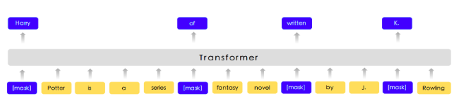

*Задатак маскирања*

-------

Слично, модел GPT који је искоришћен као основа за ChatGPT, као припремни задатак користи погађања наредне речи: за задати низ речи задатак трансформера је да погоди 
наредну реч. Ни за креирање овог скупа података није потребно мануелно лабелирање, довољно је искористити произвољан скуп реченица.

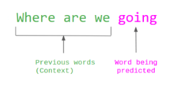

*Задатак погађања наредне речи*

-------

У припремним задацима трансформери стичу нека општа знање. На пример, у случају трансформера који обрађују текст, то су знања о семантици и синтакси језика. 
Ова знања се  даље могу унапредити додатним обучавањем трансформера на неким мануелно припремљеним скуповима података. Тиме се омогућава се они додатно 
прилагоде свом домену примене или неком конкретном задатку. Ова фаза обучавања трансформера се зове **профињивање**. 

|

Први популарни трансформер са именом BERT развио je тим из компаније Google 2018. године за задатке обраде природних језика. Након њега су се појавиле 
варијанте модела које су могле да обрађују дуже улазе, да се брже тренирају, да раде са другим језицима и слично. Први у серији модела GPT настао је, 
такође, 2018. године од стране компаније OpenAI.  И овај модел је био везан за обраду природних језика. Касније су се појавили и трансформери за обраду 
слика, аудио садржаја, мултимодални трансформери и други.

.. suggestionnote:: 
   
   Велики број функционалности у раду са трансформерима нуди истоимена библиотека Transformers компаније Huggingface. Уз развој библиотеке и алата, 
   ова компанија се активно залаже и за отворено дељења модела. Највећи број њих може и да се тестира на званичном сајту https://huggingface.co у 
   секцији *Models*. Ту можеш да испробаш како ради модел BERT, као и нека од доступних верзија модела GPT. Нешто касније ћеш научити и како да 
   користиш ове моделе кроз кôд. 

Обрада природних језика и велики језички модели
-------------------------------------------------

Први изазов са којим се сусрећемо у обради природних језика је представљање текста. Баш као и у случају слика, да би програми могли да обрађују текстуалне 
садржаје потребно је осмислити подесну нумеричку репрезентацију која у идеалном случају задржава сва лингвистичка и семантичка својства текста. Први покушаји 
креирања оваквих репрезентација су се заснивали на разбијању текста у низове речи. Тако се реченица енглеског језика "We like Python!" може разбити у 
низ "Wе", "like", "Python" и "!". Овако издвојене речи називамо **токенима**, а саме програме који раде ова разбијања **токенизаторима**. За одређивање 
граница токена најчешће се користе белине и интерпункцијски карактери, али постоје и језици који не користе белине за раздвајање речи 
(такви су јапански, хинди, арапски и други). Добијену листу токена је могуће даље филтрирати, на пример, тако што се избаце интерпункцијски карактери или 
бројеви. Може се извришити и нормализација токена, на пример, свођењем свих токена на запис малим словима. У општем случају није лако одлучити шта је токен, 
а шта не. На пример, негација "don’t" се може третирати као један токен или као два токена "do" и "not". Са друге стране, можда је природно да име града 
"New Yоrk" буде један токен, а не два. Многи домени попут друштвених мрежа или научних текстова имају и свој специфичан вокабулар па се поставља питање како 
представити неке баш доменски специфичне садржаје као што су скраћеница *LoL* или хемијскo име *4-Dimethylamino-2-hydroxy-benzoyl*. 

|

Сазнање о томе који се то све токени могу појавити у неком језику тј. у неком конкретном домену или задатку, стиче се издвајањем свих токена у некој одабраној 
колекцији текстова (такве колекције називамо и **корпусима**). Овако издвојени токени, уређени лексикографски, представљају **вокабулар**. Сви садржаји се даље 
изражавају у терминима речи вокабулара. На пример, за реченицу ”We like Python!” генерише се репрезентација која представља вектор нула чија дужина одговара дужини 
вокабулара и која само на позицијама које одговарају речима "Wе", "like", "Python" и "!" има јединице. Уместо јединица се на овим позицијама могу уписивати и вредности 
које узимају у обзир фреквенције појављивања речи у улазу, дужине реченица као и статистичке информације из самог корпуса. Овакве репрезентације се једним именом 
зову **вреће речи** (енгл. *bag of words*).

|

Овакве репрезентације су једноставне за креирање и послужиле су у првим данима развоја система за претраживање информације и обраде текста. Ипак, ове репрезентације 
су изразито дуге (број речи у вокабулару може да досеже и неколико десетина хиљада), ретке тј. са малим бројем вредности које су разлучите од нуле и приликом њиховог 
креирања се губи информација о редоследу речи у улазу. Зато се у новије време, када то дозвољавају ресурси и задаци, користе репрезентације које су засноване на 
неуронским мрежама. Ове репрезентације су значајно краће (дужине пар стотина) и компактније, али њихово значење више није лако разумети. Овакве репрезентације зовемо 
**угњежђеним репрезентацијама**. 

|

*Word2Vec* је име технике која је прославила представљање текстуалних садржаја угњежђеним репрезентацијама. У основи ове технике је неуронска мрежа која је креирана 
тако што је на основу суседних речи непознате речи погађала која реч недостаје. Испоставило се да овако добијене репрезентације речи имају врло занимљива семантичка 
својства. Вероватно је напознатији пример у вези са репрезентацијама речи онај који се односи на речи *king* и *queen*: уколико се од репрезентације речи *king* одузме 
репрезентаација речи *man*, а затим се на овако добијену разлику дода репрезентација речи *woman*, добиће се репрезентација која одговара речи *queen*. 

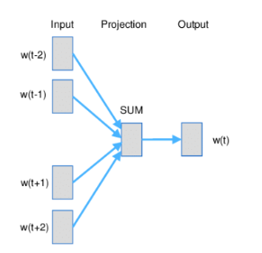

*Word2Vec и архитектура континуална врећа речи (CBOW)*

-------

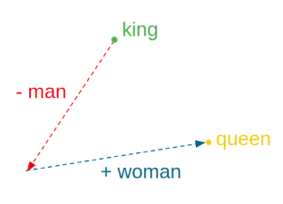

*Пример артметичких операција у простору угњежђених репрезентација*

-------

У раду са трансформерима текст се најчешће представља **парчићима речи** (енгл. *wordpiece tokenization*) или **парчићима бајтова** (енгл. *byte-pair encoding*). 
Парчићи се пажљиво издвајају проласком кроз неку велику колекцију текстуалних садржаја и бирају тако да се њиховим комбиновањем може реконструисати највећи део текста. 
Издвајање и одабир парчића се не ради ручно, већ се за те задатке користе посебни алгоритми. Издвојени парчићи се, без обзира на алгоритам који је коришћен, називају 
токенима и сви скупа представљају вокабулар једног трансформера.

|

Уобичајено је да се трансформери који раде са текстуалним подацима називају **језички модели** (енгл. *language models*). С обзиром да је реч о дубоким неуронским 
мрежама са великим бројем параметара, обично се за ове моделе каже и да су велики па се на њих реферише са **велики језички модели** (енгл. *Large Language Models, LLMs*). 
У наставку ћемо упознати неке такве моделе и опробати се у задацима анализе сентимената у тексту и генерисања кода. 

Анализа сентимената у тексту
------------------------------

**Задатак анализе сентимената** (енгл. *sentiment analysis*) је задатак препознавања емоција или ставова присутних у неком тексту. Само препознавање је доста базичније у 
односу на људе али има своју важну улогу у разумевању кориснички генерисаних садржаја попут коментара или прегледа. Најчеше се сусрећемо са задатком препознавања 
позитивних и негативних садржаја где позитивни садржаји означавају нешто похвално и лепо а негативни садржаји критике и замерке. Самом задатку анализе сентимената 
из угла машинског учења приступамо као задатку бинарне класификације: након што припремимо адекватно репрезентације текстуалних улаза, можемо применити 
било који алгоритам класификације. Садржај се, наравно, може анализирати и на финијој градацији сентимента која уз позитивне и негативне одреднице има и одреднице попут 
врло позитивно, неутрално или јако негативно. 

|

На овом линку  можеш пронаћи Google Colab свеску која садржи кôд кроз који ћемо проћи. Свеска садржи још неке примере који ти могу бити занимљиви и који ти могу појаснити 
процес рада са трансформерима.

|

За задатак анализе сентимената користићемо библиотеку ``transformers`` која обједињује различите врсте трансформера и алате који омогућавају удобнији рад са њима. Да би ова 
библиотека могла да се користи у окружењу Google Colab потребно ју је инсталирати наредбом ``!pip install transformers`` а потом и учитати наредбом ``import transformers``.

|

.. code-block:: Python

   !pip install transformers
   import transformers

Следећи блок кода ће нам омогућити да креирамо функционалност ``analiziraj_sentiment`` која за нас обједињује кораке креирања репрезентације текста а потом и покретања већ обученог 
класификатора за анализу сентимената. За њено креирање искористићемо функцију ``pipeline`` и посебно аргументом ``task`` нагласити да желимо да се бавимо анализом сентимената.

.. code-block:: Python

   analiziraj_sentiment = transformers.pipeline(task='sentiment-analysis')

Учитаној функционалности можемо да задајемо улазе за које желимо да добијемо оцену сентимента. Као излаз ћемо добити име класе *POSITIVE* или *NEGATIVE*, као и вредност *score* 
у интервалу од 0 до 1 која указује колико је модел класификације сигуран у своју одлуку. Следи неколико примера. Изврши их па промисли да ли би се и ти сложио са одлукама класификатора. 

.. code-block:: Python

   analiziraj_sentiment("We are very excited to learn more on sentiment analysis!")
   analiziraj_sentiment("We didn't like the food. It was too salty.")
   analiziraj_sentiment("The movie was super interesting, but the end was quite boring.")

Док је емоција узхићења тј. недопадања била прилично јасно изражена у првим двема реченицама које смо тестирали, у трећој реченици имамо занимљиву мешавину. 
Можеш да наставиш даље да тестираш ову функционалност тако што ћеш проверити како на одлуке класификатора утичу придеви попут *amazing*, *wonderful*, *boring*, *annoying* 
и њихова комбинација. Можеш да провериш и како се класификатор понаша када је у реченици присутна негација, на пример, када кажеш да нешто *није сјајно*.

