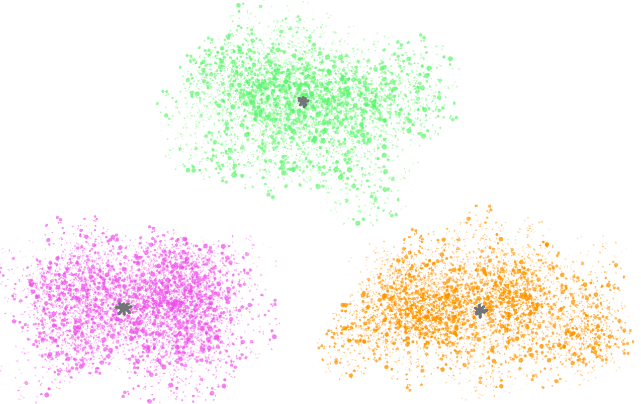
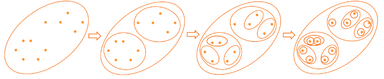
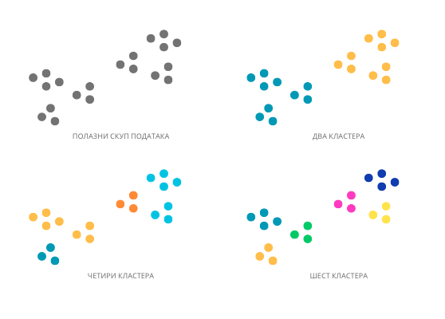
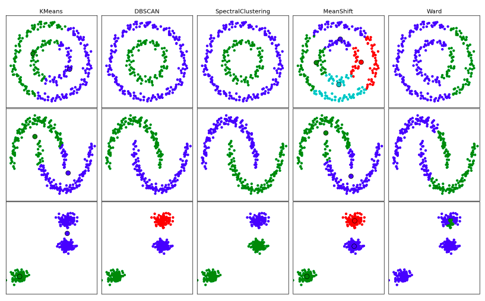

Кластеровање
============

.. infonote::
    
    У овој лекцији ћеш детаљније упознати кластеровање, један од основних задатака ненадгледаног машинског учења. 

Често нам значи да уочимо групе које се слично понашају или објекте који имају слична својства. 
На пример, уочавањем група корисника који воле да слушају сличну музику можемо да унапредимо систем препоручивања музике 
док уочавањем медицинских снимака које су на неки начин другачији од других можемо да унапредимо дијагностичке процедуре и брже реагујемо. 
Видели смо да уочавање група које су на неки начин другачије од других може да буде корисно и у току припреме података, на пример, приликом 
уочавања одударајућих података.

|

Задатак чији је циљ да уочи групе у подацима назива се **кластеровање** (енгл. *clustering*), а уочене групе **кластери**. Можда си се сада збунио јер се и у задатку 
класификације бавимо уочавањем група. Разлика између класификације и кластеровања је у томе што у задатку класификације знамо које групе тражимо 
док у задатку кластеровања и не баш. У задатку класификације за сваку инстанцу знамо атрибуте и обележје које одређује класу којој припада. 
У задатку кластеровања за инстанце познајемо само атрибуте па кластере покушавамо да оредимо пратећи законитости скупа података. Зато је 
кластеровање задатак ненадгледаног машинског учења. 

*Кластери у скупу података*

-------

Постоји преко 100 алгоритама машинског учења који нам могу помоћи да кластерујемо податке. На пример, оне који нам омогућавају да прво уочимо 
грубље кластере, а потом и финије кластере унутар њих, зовемо хијерархијским алгоритмима.  Такав један алгоритам би прво могао да уочи новинске 
чланке на тему спорта, а онда и финије групе које се односе на појединачне спортове као што су тенис, фудбал, кошарка и други. Ми ћемо се 
фокусирати на упознавање алгоритма који се зове **к-средина** (енгл. *k-means*) који нам омогућава да уочимо *к* инстанци у скупу података и кластере 
око њих. 

*Хијерархијско кластеровање*

-------

Број кластера у подацима није једнозначно одређен. На пример, на следећој слици видимо различите могућности кластеровања у два, четири или шест 
кластера. Сложићеш се да су сва груписања реалистична.

*Различити бројеви кластера у скупу података*

-------

Колико тачно кластера треба одабрати, зависи и од тога шта подразумевамо под кластером. Некада очекујемо да то буду сферичнe групе, некада 
групе које су добро раздвојене, а некада обраћамо пажњу на густину кластера. На доњој слици можеш да видиш три скупа података и кластере 
које би у њима пронашло пет различитих алгоритама кластеровања библиотеке *scikit-learn*. Сваки кластер је приказан различитом бојом.

*Резултати различитих алгоритама кластеровања* 

-------

Који ћемо тачно алгоритам кластеровања одабрати зависи од природе података и задатка који треба да се решити.

|

Упознајмо сада алгоритам к-средина. 
