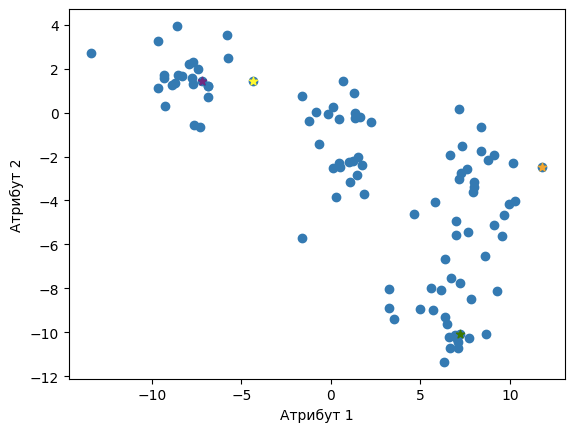
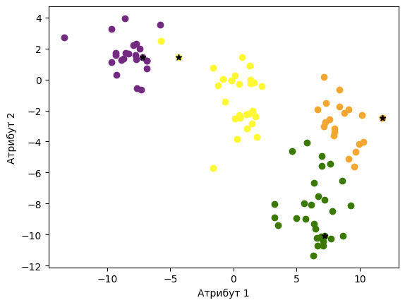
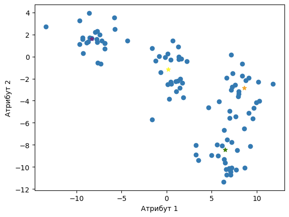
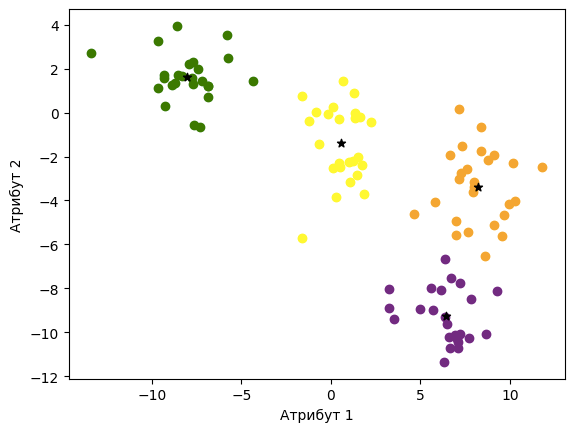

Алгоритам к-средина
===================

.. |open| image:: ../../_images/algk2.png
            :width: 100px

.. infonote::
    
    К-средина је необично име за један алгоритам. Читај даље да би открио шта се крије иза овог избора!

Да би лакше испратили причу о алгоритму к-средина, користићемо скуп података који је приказан на доњој слици. Он се састоји од 100 парова тачака, 
замисли да су то вредности нека два нумеричка атрибута. 

    
-------

.. technicalnote::
    
    Ова секција је упарена са Jupyter свеском `11-k-sredina.ipynb <https://github.com/Petlja/specit4_ai_radni/blob/main/11-k-sredina.ipynb>`_. 
    Да би могао да пратиш садржај даље, кликни на линк, а потом и на дугме |open| да би се садржај отворио у окружењу *Google Colab*. 
    Уколико свеске прегледаш на локалној машини, међу садржајима пронађи свеску са истим именом и покрени је. За детаљније инструкције 
    погледај секцију *Hands-on зона* и лекцију *Jupyter свеске за вежбу*.

У пратећем материјалу можеш да генеришеш све слике и анимације сам. 

|

Алгоритам **к-средина** (енг. *k-means*) треба да пронађе *к* кластера у скупу података. Кластери које тражи овај алгоритам су одређени 
**центроидом**, инстанцом која представља центар кластера.   

|

Почетни корак алгоритма је корак иницијализације. У њему треба да одаберемо насумично *к* центроида. Затим треба да понављамо следеће кораке: 

1.	За сваку инстанцу треба да израчунамо еуклидско растојање до сваке од *к* центроида, а затим да инстанцу придружимо оном кластеру чијој центроиди је најближа. Када распоредимо све инстанце, прелазимо на наредни корак.
2.	За сваки од *к* кластера треба да одаберемо нове центроиде. То радимо тако што за сваки од кластера израчунамо просек инстанци које се у њему налазе и баш ту вредност прогласимо новом центроидом. Након тога се враћамо поново на корак 1. 

Алгоритам кластеровања се завршава када се вредности центроида кластера стабилизују. То би значило да у двема узастопним итерацијама добијамо 
центроиде које се веома мало разликују, мање од неке унапред задате тачности. 

|

Сам алгоритам к-средина није неугодно испрограмирати па ћемо то заједнички и урадити. Пре тога, размотримо неколико  техничких детаља:

- Једна инстанца скупа података је пар бројева, рецимо (2, -3). То значи да ће и центроида бити пар бројева и да ће имати две коориднате;
- Ако су (10, 2) и (4, -4) две инстанце скупа података, инстанцу која представља њихов просек ћемо рачунати као (:math:`\frac{10 + 4}{2}`, :math:`\frac{2 - 4}{2}`) = (7, -1);
- Ако су (0, 0) и (3, 4) две инстанце скупа података, еуклидско растојање између њих ћемо рачунати као :math:`\sqrt{(3-0)^2 + (4-0)^2}`. 

У скупу података ћемо тражити четири кластера. Зашто смо баш одабрали овај број ћемо размотрити нешто мало касније. 
Припремимо се сада за програмирање алгоритма. 

- Променљивом  ``k`` означаваћемо број кластера. Због претходног договора важи ``k=4``.
- Центроиде кластера ћемо означавати променљивом ``centroide``. Како имамо *к* кластера, ово ће бити низ дужине *к*. Једна центроида је, рекли смо, један пар бројева па ће елементи овог низа бити парови бројева.
- У току кластеровања треба да пратимо ком кластеру придружујемо коју инстанцу. Зато ћемо за обележавање кластера користити лабеле, слично као у задацима класификације. То могу да буду вредности 0, 1, 2 и 3. У општем случају неке вредности 0, 1, 2, ..., ``k``-1. Све лабеле кластера чуваћемо у низу ``labele_klastera``.

Уведимо сада функцију ``generisi_centroide(X, k)`` која генерише почетне центроиде. Њени аргументи су скуп инстанци ``X`` и број кластера ``k``,  
а сама функција насумично бира ``k`` бројева из интервала од 0 до 100 и враћа инстанце које се налазе на тим позицијама.

.. code-block:: 

   def generisi_centroide(X, k):
       N = X.shape[0]
       indeksi = np.random.randint(low=0, high=N, size=k)
       return X[indeksi]

-------

На доњој слици су приказане генерисане центроиде. Свака од њих је у боји кластера који представља. 

*Почетне вредности центроида*

-------

Напишимо сада функцију ``podeli_podatke(X, centroide, k)`` којом вршимо поделу скупа инстанци у кластере. Ова функција као аргументе има скуп 
инстанци ``X``, тренутне центроиде ``centroide`` и број кластера ``k``. За сваку инстанцу ћемо израчунати вредност растојања до сваког центроида, затим ћемо 
одабрати ону центроиду која је најближа и закључити да инстанца припада кластеру који она одређује.

.. code-block:: 

    def podeli_podatke(X, centroide, k):

        # inicijalizujemo listu obelezja klastera
        labele_klastera = []

        # prolazimo kroz skup instanci instancu po instancu
        for x in X:

            # inicijalizujemo listu rastojanja do centroida
            rastojanja_do_centroida = []

            # zatim za svaku centroidu ...
            for centroid in centroide:
            
                # ... izracunavamo rastojanje izmedju instance i centroide
                r = izracunaj_rastojanje(x, centroid)

                # ... i dodajemo ga u niz sa rastojanjima
                rastojanja_do_centroida.append(r)

            # kada obidjemo sve centroide,
            # biramo centroidu koja je najbliza instanci x
            labela  = np.argmin(rastojanja_do_centroida)

            # zakljucujemo da instanca pripada klasteru koji
            # odredjuje ta centroida
            labele_klastera.append(labela)

        # rezultat funkcije je niz sa obelezjima klastera
        return np.array(labele_klastera)

-------

На доњој слици можеш да видиш прву итерацију поделе инстанци у кластере. 

-------

Напишимо сада функцију ``izracunaj_nove_centroide(X, labele_klastera, k)`` која на основу текуће поделе инстанци у кластере може да израчуна 
вредности нових центроида. Њени аргументи су скуп инстанци ``X``, текућа обележја инстанци ``labele_klastera`` и број кластера ``k``.  
За сваки од кластера, ова функција треба да издвоји инстанце које му припадају и затим да израчуна њихов просек. 

.. code-block:: 

    def izracunaj_nove_centroide(X, labele_klastera, k):

        # inicijalizujemo listu novih centroida
        nove_centroide = []

        # za svaki klaster
        for i in range(0, k):

            # ... izdvajamo instance koje mu pripadaju
            indeksi_instanci = labele_klastera == i
            instance_u_klasteru = X[indeksi_instanci]

            # zatim izracunavamo novu vrednost centroide
            # tako sto izracunamo prosek svih instanci u klasteru
            nova_centroida = np.average(instance_u_klasteru, axis=0)

            # izracunatu novu centroidu dodajemo u listu svih centroida
            nove_centroide.append(nova_centroida)

        # rezultat funkcije je niz novih centroida
        return np.array(nove_centroide)

-------

Нове центроиде су сада приказане на доњој слици. Приметићеш да су се центроиде жутог и љубичастог кластера ”раздвојиле”.

-------

Остаје још да објединимо задатке појединачних корака  у функцију која ће их поновити довољан број пута. То ће бити функција 
``izvrsi_klasterovanje(X, k, epsilon=1e-4, broj_iteracija=300)`` у којој ``X`` представља скуп инстанци, ``k`` број кластера, 
``epsilon`` блискост коју треба да задовоље центроиде кластера како би се алгоритам зауставио. Ту је и максимални број итерација 
``max_broj_iteracija`` којим додатно обезбеђујемо зауставни критеријум. 

.. code-block:: 

    def izvrsi_klasterovanje(X, k, epsilon=1e-4, max_broj_iteracija=300):

        # korak inicijalizacije centroida
        centroide = generisi_centroide(X, k)

        # u svakoj iteraciji petlje
        for i in range(0, max_broj_iteracija):

            # korak 1: podela instanci u klastera
            labele_klastera = podeli_podatke(X, centroide, k)

            # korak 2: izracunavanje novih centroida
            nove_centroide = izracunaj_nove_centroide(X, labele_klastera, k)

            # provera zaustavnih kriterijuma
            # ukoliko su oni ispunjeni prekidamo algoritam
            if np.linalg.norm (nove_centroide - centroide) < epsilon:
                break
            # dok u suprotnom prelazimo na novu iteraciju
            centroide = nove_centroide.copy()

        # rezultat funkcije su finalne labele klastera i vrednosti centroida
        return labele_klastera, nove_centroide

Извршавање ове функције нас доводи и до финалне поделе скупа инстанци на кластере која је приказана на доњој слици. 

-------

У пратећој свесци са кодом можеш да погледаш и анимацију која прати ову поделу. Неки кораци се наслањају на насумичне одлуке 
(на пример, ако је инстанца подједнако близу већем броју центроида) тако да немој да те збуни ако се неке вредности мало разликују. 

