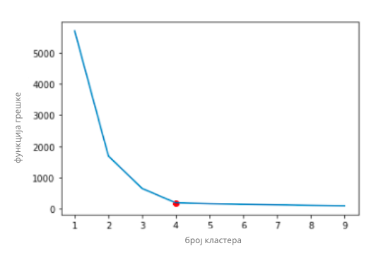

Одређивање броја кластера
=========================

Број кластера ``k=4`` у претходном примеру није сасвим случајно изабран, има везе са начином на који смо генерисали скуп података (можда си то 
и приметио у функцији ``kreiraj_podatke`` која нам је помогла око овог задатка). Када радимо са реалним скуповима података са више инстанци 
и атрибута, није баш интуитивно претпоставити колико кластера треба издвојити. Зато нам је потребан неки прецизнији начин одређивања најбоље вредности 
за број ``k``.

|

У теорији машинског учења је познато да задатак разбијања скупа података у ``k`` кластера на начин који смо описали одговара проналажењу 
најмање вредности функције чија је формула приказана ниже. Иза ове наизглед компликоване суме крије се једноставна идеја: очекивање 
да свака инстанца буде што ближе центроиди свог кластера. Зато се за све инстанце кластера прати колико су удаљене од своје центроиде 
(прва сума) а затим се те вредности саберу за све кластере (друга сума).  

*Функција грешке алгоритма к-средина*

-------

Оптималан број кластера ``k`` одређујемо тако што пратимо понашање алгоритма за различите вредности параметра ``k``. Ако бисмо за скуп података из 
претходног примера испробали вредности броја ``k`` од 1 до 10 и приказали вредности ове функције грешке графички, добили бисмо график као на 
доњој слици. 

*График функције грешке*

-------

Екстремни случајеви кластеровања (и неупотребљиви у пракси) су да све инстанце буду у једном кластеру и да свака инстанца буде у свом кластеру. 
Када су све инстанце у једном кластеру, грешка је највећа, а када број кластера одговара броју инстанци, вредност функције грешке је нула. 
Зато приликом претраге оптималног броја ``k`` треба да се позиционирамо негде између, где је и број кластера задовољавајући и где је грешка довољно 
мала. На графику је та тачка приказана црвеном бојом и одговара вредности параметра ``k=4``. За веће вредности броја ``k`` вредности грешке су сличне, 
док су за мање вредности броја ``k`` вредности грешке непожељније. Овакве тачке се обично виде у форми ”лакта” на графику овог типа па се цео метод 
одређивања оптималне вредности зове **метода лакта** (енг. *elbow method*).

|

С обзиром на функцију грешке која прати кластеровање алгоритмом к-средина, кластери који се на овај начин проналазе су сферични и осетљиви на 
присуство одударајућих података. 

