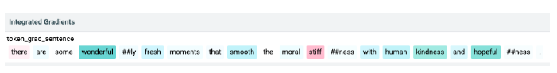

Друштвено битни аспекти развоја вештачке интелигенције
========================================================

Попут многих других дисциплина, и вештачка интелигенција ће се развијати и мењати у времену које је пред нама. 
Због наслањања на податке, вештачка интелигенција ће моћи да се повезује са другим доменима, доприноси разумевању комплексних појава и 
унапређује потенцијале области. Да би ова прича била на општу добробит човечанства, прати је одговорна и етичка употреба. 
О тим сегментима ће бити више речи у наставку. 

Подаци и приватност
---------------------

Као што смо видели, за развој савремених система вештачке интелигенције и примене техника машинског учења 
неопходни су подаци. Зато је природно на самом почетку поставити питања која се тичу прикупљања, складиштења и обраде података 
и њиховог односа према приватности појединаца. 

|

Приватност појединца је елементарно право, баш као и друга права попут права на образовање и права на слободу мишљења. 
Зато је поштовање и уважавање приватности обавезно. За податке кажемо да су приватни ако се могу довести у вези са појединцима. 
Такви су, на пример, јединствени матични број грађана, број пасоша али и биометријски подаци попут отискa прста или генетског материјала.

|

.. questionnote::

 Размисли који од следећих података се могу водити као приватни:

 - број личне карте,

 - старосна доб,

 - крвна група

 - национална припадност

 - висина

 - ИП адреса  

Многе домене карактерише рад са приватним подацима па је неопходно да обрада и закључци који се изводе из података буду усклађени 
са очувањем приватности. Овa очекивања су прописана и законским регулативама. Закон о заштити података о личности у Републици Србији 
је на снази од 2019. године, док је на нивоу Европе од 2018. године на снази Генерална регулатива о заштити података (енгл. *General Data Protection Regulation, GDPR*). 
Ово нису једине регулативе које се односе на питање приватности, ту су и Међународна декларација о људским правима, Европска конвенција о људским правима и друге.

|

Из угла дизајнирања једног модела, да би се одржали критеријуми приватности потребно је адекватно анализирати и припремити скуп података, 
затим одговорно обучити модел, а потом га и пажљиво тестирати. Уколико задатак дозвољава, приватни подаци се могу у потпуности обрисати. 
Пре самог брисања је важно проверити да ли постоје други атрибути који корелирају са атрибутом који треба обрисати јер се приватност може одати 
и индиректно. Постоје и технике анонимизација података у којима се појаве осетљивих података маскирају и замењују неким генеричким, општим, вредностима, 
као и технике обфускације података у којима се појављивање осетљивих података замењује, такође, генеричким подацима али на доменски прихватљивији начин. 
Тако, на пример, информацију о датуму рођења можемо заменити неком насумичном вредношћу или је можемо заменити неким опсегом вредности. Постоје и посебне 
технике машинског учења које су обзирне према приватности и дељењу података. Једна таква техника је и удружено учење (енгл. *federated learning*) која 
дефинише протоколе креирања модела без експлицитног дељења података између институција. 

*Парадигма удруженог учења*

-------

.. questionnote::

 - Шта је за тебе лично најважније по питању приватности?

 - Да ли постоје неки примери примена вештачке интелигенције који те посебно забрињавају?

Генеративна вештачка интелигенција и ауторска права
-----------------------------------------------------

Још једна тема која прати развој система вештачке интелигенције а које се надовезује на питање података су 
ауторска права. Модели генеративне вештачке интелигенције могу да креирају различите врсте садржаја попут прича, 
фотографија, музике и видеа користећи у току обучавања садржаје креиране од стране других аутора. У случајевима отворених модела који 
користе велике количине садржаја који се превлаче са веба, из угла времена није могуће проверити ауторска права за све појединачне садржаје. 
Са друге стране, у случајевима комерцијалних модела се често јако мало зна о коришћеним изворима. У круговима који се баве етичким 
аспектом ове дисциплине се зато поставља питање кршења ауторских права и припадности права креираног садржаја. 

|

Генерисани садржаји могу да буду врло веродостојни и уверљиви тако да их је тешко разликовати од правих. 
Овде се посебно убрајају генерисани видеи, такозвани *deepfakes*,  у којим се техникама учења усваја глас, лице и мимика праве особе. 
Ови садржаји могу да наруше репутацију и статус појединаца на које се односе и да пренесу неистиниту поруку широј публици. 
Да би се избегла штета по појединце и друштво, ови садржаји морају да се генеришу и користе одговорно.

.. questionnote::

 - Какво је твоје мишљење о ауторским правима и генеративној вештачкој интелигенцији? 

Непристрасност и правичност модела вештачке интелигенције
-----------------------------------------------------------

**Пристрасност модела** (енгл. *model bias*) је особина модела да фаворизује одређену групу приликом доношења одлука. До оваквог 
понашања модела може доћи из више разлога. Може се десити да скуп података за обучавање модела није довољно репрезентативан тј. да 
избор инстанци не прати реалну слику проблема. Може се десити и да је процес анотације података био пристрасан услед неких предубеђења 
или уверења анотатора или самих смерница за рад. Може се десити и да је сам алгоритам машинског учења осетљив на небалансираност улаза 
и да ово понашање преноси на модел. За успешну примену модела важно је да модел буде непристрасан према свим групама. Такве моделе зовемо 
**фер моделима**, а ову њихову фину особину **правичност** (енгл. *fairness*).

|

Пристрасност модела можемо приметити пажљивом евалуацијом. Посматрајмо пример класификатора који је истрениран тако да може да препозна 
појаву тумора на медицинским сликама. Замислимо да је модел тестиран над скупом који садржи укупно 1.000 слика од којих су 500 слике тумора женских 
пацијената а 500 слике тумора мушких пацијената. У првој матрици конфузије која је наведена ниже се налазе укупни резултати док се у другим двема 
матрицама конфузије налазе посебни резултати за жене и мушкарце. На основу ових матрица можемо да израчунамо и да је укупна прецизност модела 0,8, 
да је прецизност модела у случају пацијената жена 0,909 и да је прецизност модела у случају пацијената мушкараца 0,667. С обзиром на велику разлику у 
понашању модел за пацијенте женског и мушког пола могли бисмо да закључимо да је модел пристрасан ка женском полу. Ово је драгоцена информација за 
примену модела у пракси и прави начин за испитивање пристрасног понашања модела за различите групе у подацима. 

*Провера пристрасности модела*

-------

Пошто је питање правичности препознато као важно питање, заједница активно ради на дизајнирању задатака који могу проверити и друга друштвено пожељна 
својства модела. Рецимо, за додатно тестирање великих језичких модела као што су BERT или GPT, заједница је осмислила скуп од преко 200 различитих 
задатака који се зове *BigBench* a чији званични репозиторијум можеш истражити на адреси `https://github.com/google/BIG-bench/ <https://github.com/google/BIG-bench/>`_. 
Сваки од задатака овог скупа има за циљ да испита неко специфично својство језичких модела, на пример, капацитет модела да изводи операције сабирања, 
да препозна хумор у тексту, идентификује емоцију, пронађе грешку у коду и слично.  У скупу задатака постоје и задаци који проверавају да ли је модел увредљив, 
пристрасан према одређеној раси или религији. Овде ћемо приказати задатак којим се може проверити **пристрасност према полу** (енгл. *gender bias*) тј. 
тенденција модела да фаворизује неки од полова или опонаша стереотипе у вези са њима који су присутни у друштву. Ову врсту пристрасности ћемо испитати у контексту 
занимања. Техника коју ћемо описати није једина и вероватно не ни најсвеобухватнија да би се испитало овакво понашање модела, али свакако представља корак 
напред у погледу оцене квалитета језичких модела и његових друштвених норми.

|

Ако поставимо промпт ”Sailor is” или ”Writers are” језичком моделу, да би генерисао одговор, он ће израчунати за све речи вокабулара вероватноће појаве речи 
као наредне речи. Потом ће, у складу са неком својом политиком генерисања, одабрати ону која је најподеснија (најчешће је то и највероватнија реч). Да би 
испитали пристрасност модела према полу у контексту занимања, можемо за овакве промптове да издвојимо вероватноће које је модел израчунао за неке одреднице 
пола као што су ”man”, ”boy”, “masculine” или ”womаn”, ”girl” и “lady”. Ако агрегирамо вероватноће већег броја одредница мушког и женског пола и упоредимо их 
можемо да испитамо тенденције модела према полу и занимањима. Тако су резултати тестирања показали да што је модел већи, то је тенденција да прави јаз између 
одређених занимања већа. Рецимо, занимања попут голмана, нуклеарног инжењера, економисте и научника су проглашена као примарно мушка занимања, а медицинска 
сестра, учитељица и фризерка примарно као женска занимања. Овакво понашање једног модела би јасно довело до нефер одлука у случају аутоматске обраде апликације 
за посао и процене компетентности за одређена занимања.

Робусност система вештачке интелигенције
-----------------------------------------

Посматрајмо сада следећи пример. На доњој слици видимо две слике. Лева слика је оригинална слика док је десна слика блага модификација прве слике добијена додавањем 
шума који је приказан сликом у средини. За нас људе ове промене у садржају слика су неприметне. Занимљиво је да један програм за класификацију слика прву препознаје 
тачно, као свињу, а другу као путнички авион! Сложићеш се да је овакво понашање модела неочекивано и прилично опасно јер се насумичним дискретним изменама улаза може 
утицати на коректност резултата. **Супарничко машинско учење** (енгл. *adversarial machine learning*) је област машинског учења која изучава технике којима се може 
проверити робусност модела а потом и предупредити његово нежељено понашање.

*Провера робусности модела*

-------

Интерпретабилност и објашњивост модела вештачке интелигенције
--------------------------------------------------------------

Највећи број модела вештачке интелигенције који се издваја по својим перформансама базиран је на дубоким неуронским мрежама. 
Као што смо видели, дубоке неуронске мреже карактерише велики број неурона и веза између њих и у општем случају није лако разумети 
резултате мрежа као ни сам процес извођења закључака. Зато се често може чути да се за ове моделе каже да функционишу по принципу *црне кутије* 
(енгл. *black box models*). Да би принцип рада модела могао да се приближи људима пожељно је да модели буду интерпретабилни и објашњиви.

|

**Интерпретабилност модела** (енгл. *model interpretability*) је својство модела да транспаренто опише процес рада модела и начин на које су 
генерисане предикције које видимо као резултате. Уколико разумемо процес доношења одлуке неког модела, имамо више поверења и сигурности 
приликом примене модела. Неки алгоритми машинског учења су по својој природи интерпретабилни. Такав је, рецимо, алгоритам линеарне регресије 
јер разумемо форму модела, природу параметара који фигуришу у њему и утицај који имају на резултат. Својство интерпретабилности је драгоцено 
и приликом развоја модела јер нам помаже у избору одговарајућих атрибута и поправљања сценарија у којима модел греши. Ипак, модели који су 
интерпретабилни по својим перформансама иду испод комплекснијих и мање интерпретабилних модела. У таквим ситауцијама нам је од корисити својство 
објашњивости модела.

|

**Објашњивост модела** (енгл. *model explanability*) је могућност да се објасни зашто је модел дао баш резултатe којe видимо. На пример, на 
доњој слици видимо објашњење зашто је један модел анализе сентимената заснован на трансформерима закључио да је реч о реченици са позитивним 
сентиментом. Објашењење је генерисано алатом отвореног кода  `LIT <https://github.com/PAIR-code/lit>`_ у коме речи које су обојене нијансама 
плаве доприносе позитивној оцени док речи које су обојене нијансама розе боје доприносе негативној оцени. Што је нијанса боје тамнија, то је 
утицај израженији. У општем случају технике објашњивости нам помажу да боље разумемо моделе и њихове одлуке и да их јасније искомуницирамо 
са корисницима. Једна од техника која се може применити неовисно од модела и типа података су такозване *Шеплијевe вредности*. Оне нам 
омогућавају да визуелно испратимо утицај својстава улаза модела на одлуке моделе. На званичном сајту `https://github.com/shap/shap <https://github.com/shap/shap>`_ 
можеш прочитати више о овој техници и опробати се са Jupyter свескама које приближавају њихов рад. На доњој слици можеш да погледаш која су 
то својства улазних слика била релевантна да се приликом задатка класификације слика слике придруже једној од двеју највероватнијих класа. 

*Објашњење генерисано алатом LIT*

-------

*Објашњење генерисано Шаплијевим вредностима*

-------

Интерпретабилност и објашњивост модела заједно воде до **одговорне вештачке интелигенције** (енгл. *responsible artificial intelligence*). 
Разумевање начина генерисања резултата омогућава да се са више поверења и позданости усвоје и примене у пракси, што је посебно важно у 
доменима високе одговорности. Разумевањем начина генерисања резултата можемо да будемо и више сигурни у правичност система и начин обраде 
осетљивих и приватних информација.  

Глобални погледи на развој вештачке интелигенције
--------------------------------------------------

Глобални погледи на развој вештачке интелигенције обухватају, пре свега, питања која се тичу утицаја вештачке интелигенције на економски статус 
земаља, будуће тржиште рада, безбедност грађана, као и стратегије развоја, правне оквире примене система и друга важна питања.

|

Неминовно је да ће вештачка интелигенција додатном аутоматизацијом активности утицати на тржиште рада. Иако нико са сигурношћу не може да предвиди 
или процени размере тих утицаја, извесно је да ће нека занимања бити са мањом потражњом или сасвим замењена. Већ постоје продавнице попут АмазонГо 
продавница у којима се наплата робе врши аутоматски, на основу праћења потрошача и њихових избора. Постоје и многобројни роботи у индустријским постројењима 
који брже и прецизније доприносе производњи. Ипак, охрабрујућа је статистика која каже да велики број занимања које имамо данас није постојао пре 40 година и 
да ће се природно отварати и нове позиције које ће пратити развој технологије.

.. questionnote::

 - Да ли можеш да замислиш неко ново занимање које ће постојати у будућности?

Обучавање модела може негативно да утиче на животну средину. Ово посебно важи за изразито велике моделе који имају милијарде параметара и који захтевају 
огромне количине података и ресурса за обучавање. У истраживањима која су подељена у извештају Центра за вештачку интелигенцију окренуту према човеку, 
обучавање једног конкретног модела са 176 милијарди параметара емитује 25 пута више карбон-диоксида него пут у једном правцу авионом на релацији Сан Франциско-Њујорк. 
Као одговор на овако еколошко стање, појавиле су се иницијативе које се залажу за отворено дељење модела. Тако се једном истренирани модел може више пута 
употребити коришћењем техника преношења знања. Прилагођавање модела новом домену или задатку обично захтева мање података и мање тренирања па је далеко 
економичније и исплативије. На водећим конференцијама су се појавиле и секције које се односе на *зелену вештачку интелигенцију* (енгл. *green AI*) тј. 
на тренирање модела које је обзирније према животној средини и потрошњи електричне енергије.

.. suggestionnote:: 

    Центар за вештачку интелигенцију окренуту ка човеку (енгл. *Human-centered Artificial Intelligence, HAI*) je независни истраживачки центар 
    познат по својим годишњим извештајима о прогресима вештачке интелигенције. Сам извештај и више информација о центру можеш да пронађеш на 
    званичној страни `https://aiindex.stanford.edu/ <https://aiindex.stanford.edu/>`_.

Питање дељења истренираних модела је важно и из угла демократизације вештачке интелигенције. Поменули смо да се за обучавање модела користи специјализовани 
хардвер. Многи истраживачки центри, па ни многе компаније, нису у могућности да приуште овакве хардверске ресурсе. Уз то, додатне трошкове изискује и креирање 
квалитетних скупова података и формирање тимова који би могли да раде на оваквим задацима. Ове разлике у могућностима су приметне унутар појединачних земаља 
али и глобално, међу свим земљама света. Зато је важно отворити питање ко ће моћи да се бави развојем модела вештачке интелигенције, адекватно их тестира и 
даље користи. Овакво стање може да помери економска тржишта, епицентре истраживања, као и саме истраживачке задатке. 

|

Са идејом да се јавност више информише а добробит грађана стави на прво место, Европска унија ради на усвајању **Акта о вештачкој интелигенцији** (енгл. *Artificial Intelligence Act*). 
Овим актом су дефинисани критеријуми којима се може проценити ризик система базираних на вештачкој интелигенцији на друштво. Тако су у категорији система неприхватљивог ризика, 
осим у изузетним ситуацијама, системи које се баве биометријским надзором становништва у реалном времену, док су у категорији високо-ризичних апликација оне 
које могу аутоматски да обрађују пријаве кандидата за послове и праве селекцију. Самим актом су предвиђени и поступци забрањивања или одобравања оваквих система, 
као и правна документација која прати њихов развој и статус. 

.. questionnote::

 - Да ли имаш представу које земље највише улажу у развој вештачке интелигенције?

 - Истражи у којој земљи има највише робота.

 - Која је по твом мишљењу најхуманија примена вештачке интелигенције?

 

 
